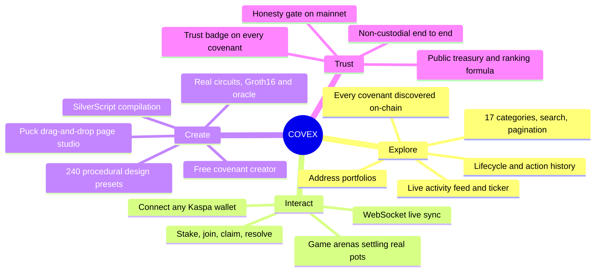
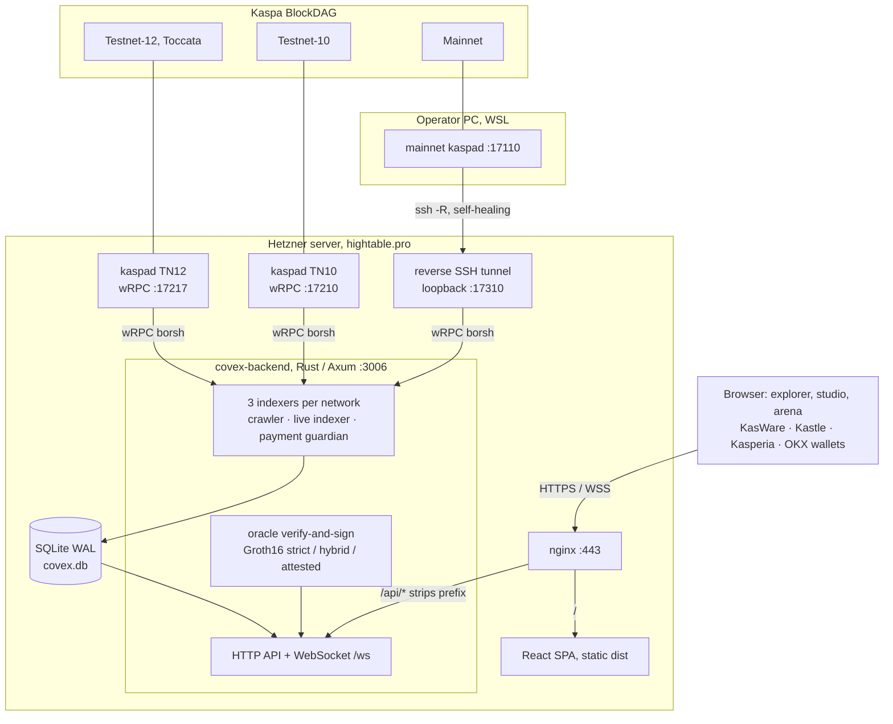
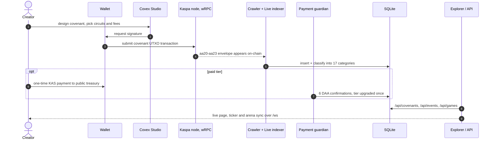
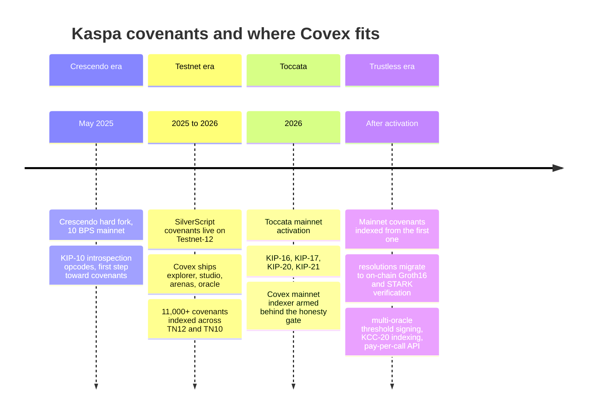
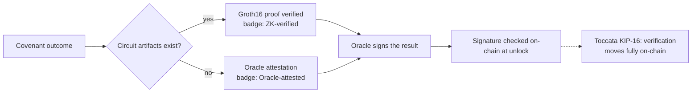

<div align="center">

  

  <br><br>

  <a href="https://hightable.pro"></a>
  
  
  
  

  <h3>The Covenant Explorer &amp; Studio for Kaspa Mainnet</h3>

  <p><strong>Index every covenant · Make every covenant interactive · Design, verify, and monetize covenants. Built for the Toccata mainnet era.</strong></p>

  <p>
    <a href="https://hightable.pro"><b>hightable.pro</b></a> ·
    <a href="https://hightable.pro/docs">API docs</a> ·
    <a href="https://hightable.pro/whitepaper">Whitepaper</a> ·
    <a href="https://hightable.pro/treasury">Treasury</a> ·
    <a href="#7-whitepaper">Whitepaper (below)</a>
  </p>
</div>

---

> **Status (2026-06-15):** Kaspa mainnet has run at 10 BPS since the **Crescendo** hard fork (May 2025), which brought the **KIP-10 introspection opcodes** live on L1. Native scriptable **covenants** arrive with the **Toccata** hard fork (KIP-16/17/20/21), scheduled for mainnet activation in **2026**. Covex runs a real mainnet node today: **the mainnet covenant explorer is honestly empty until the first real covenant lands — no placeholder data, ever.** Covenants are live now on the Toccata **Testnet-12** network, where Covex indexes 8,000+ and where every primitive below is verified against the real consensus transaction-script engine before any value moves.

**What's new (2026-06-15)**
- **Unified Sandbox** — one window where a free, searchable circuit library drives a live preview (enforcement reality, resolution flow, an accurate dual-reality payout simulator, and the actual SilverScript) and the builder, then deploys it non-custodially. See **[How it Works](https://hightable.pro/readme)** for the full, factual blueprint.
- **Real, verifying zero-knowledge** — `merkle_membership`, `age_verification`, and `escrow_2party` now have Groth16 proofs that generate and verify end-to-end (the backend verifies fail-closed before the oracle co-signs the 2-of-2 the chain requires). Other catalog circuits stay honestly labelled oracle-attested until their keys ship; the setup is a dev ceremony, not yet a production MPC.
- **Trustless in-app wallet generation** — new users can generate a fresh Kaspa wallet in the browser (24-word phrase, fund it from any exchange) and use it non-custodially. The private key is generated client-side and **never transmitted to the server**.

---

## 1. What Covex is

Covex is the place where **Kaspa covenants live**. A covenant is a SilverScript program embedded in a Kaspa UTXO that constrains how that UTXO may be spent: escrows, vaults, prediction markets, on-chain games, vesting, multisig, atomic swaps, and more. Today these are programmable UTXOs; with Toccata they become a first-class L1 smart-contract surface.



| Pillar | What it means | Free? |
|--------|---------------|-------|
| **Explore** | Every covenant on the chain, discovered on-chain by independent indexers. Paginated API, keyword search, 17 categories, live activity feed, per-covenant lifecycle and action history, address portfolios. | Free forever |
| **Interact** | Connect a Kaspa wallet and act on any covenant directly: stake, join, claim, resolve. On-chain game arenas (chess and 7 more) settle real pots with oracle-signed or ZK-verified outcomes, syncing live over WebSockets. | Free forever |
| **Create** | A free covenant creator plus paid Studio tiers: a Puck drag-and-drop page builder, 240 procedural design presets plus a design-code terminal, real circuits (Groth16 and oracle), fee/payout config, background images, and SilverScript compilation. | Free + paid tiers |
| **Trust** | Every covenant page shows its lifecycle, resolution-trust badge (ZK-verified / Oracle-attested / On-chain script), receiving addresses, fees, and creator portfolio. The platform treasury, ranking formula, and payment history are public. | Always on |

**Non-custodial, end to end.** Keys never leave your wallet. The platform reads UTXOs and verifies payments on-chain; it never holds funds and cannot move them.

### Live numbers

Real indexed data as of **2026-06-13**. Nothing here is seeded, simulated, or projected; every figure is queryable from the public API right now.

| Network | Covenants indexed | Provably paid | TVL |
|---------|------------------:|--------------:|----:|
| Testnet-12 (Toccata) | 8,471 | 2 | 38.08M KAS |
| Testnet-10 | 6,417 | 0 | 39,155 KAS |
| Mainnet | 0 (gated until Toccata activation) | 0 | 0 |

```bash
# verify these numbers yourself, live:
curl "https://hightable.pro/api/covenants?network=testnet-12&limit=1" | jq .stats
```

"Provably paid" means a covenant deployed through the Covex paid flow with an on-chain treasury payment confirmed at 6 DAA. It is never inferred from chain heuristics.

---

## 2. Architecture

Covex is a Rust indexing/oracle backend, a React explorer/studio frontend, and the Kaspa nodes it reads. This is the real production topology on `hightable.pro`, not an aspiration diagram.



### From deploy to display



On mainnet, bare P2SH commitments are **not** counted as covenants until Toccata activation. That is the honesty gate: the explorer stays empty rather than inflating numbers.

### Stack

- **Frontend:** React 19 + Vite, Tailwind v4, React Router 7, route-level code splitting, `@measured/puck` page builder, `react-chessboard` + `chess.js`, in-browser `snarkjs`, `@kasflow/wallet-connector`.
- **Backend:** Rust, Axum 0.7, `kaspa-wrpc-client` (Borsh wRPC), vendored `kaspa-consensus-core` with the TN12 sighash fix, SQLite WAL, Tokio background tasks, `secp256k1` Schnorr signing.
- **ZK/Oracle:** circom + circomlib circuits, `snarkjs` verification via a Node child process, a pluggable oracle registry (strict Groth16 / hybrid / attested per circuit).
- **Infra:** Hetzner + systemd + nginx; mainnet node on the operator PC via a self-healing reverse SSH tunnel; nightly verified database backups with a weekly restore drill; triple-synced deploys (GitHub = server = hightable.pro).

---

## 3. Public API

The same API that powers the explorer. No key required for reads. Paginated (max 200/page). Rate-limited on writes.

```bash
# List covenants (per network)
curl "https://hightable.pro/api/covenants?network=mainnet&limit=20"

# Keyword search (pipe = OR)
curl "https://hightable.pro/api/covenants?q=escrow|vesting&limit=10"

# One covenant, full detail + lifecycle
curl "https://hightable.pro/api/covenants/<txid>"
curl "https://hightable.pro/api/covenants/<txid>/actions"

# Live activity feed
curl "https://hightable.pro/api/events?network=mainnet&limit=20"

# Address portfolio
curl "https://hightable.pro/api/address/<kaspa_address>"

# Compile Covex DSL / SilverScript to bytecode
curl -X POST https://hightable.pro/api/compile \
  -H "Content-Type: application/json" -d '{"source":"contract T { ... }"}'
```

Interactive docs: **[hightable.pro/docs](https://hightable.pro/docs)** · OpenAPI: [/api/openapi.json](https://hightable.pro/api/openapi.json)

---

## 4. Tiers &amp; visibility

One-time KAS payment **per covenant**, verified on-chain (6 DAA confirmations to the public treasury). A covenant is "paid" only if it was deployed through the Covex paid flow, never inferred. Higher tier = better tools + higher placement, by a **public, deterministic** ranking formula (`tier_weight, then locked value, then recency`), documented at [/treasury](https://hightable.pro/treasury).

| Tier | Price | Unlocks |
|------|-------|---------|
| FREE | 0 | Browse, interact, basic covenant creation |
| BUILDER | 100 KAS | Studio, custom page, fee configuration |
| PRO | 500 KAS | Featured placement, full circuit catalog |
| MAX | 1000 KAS | Top placement, TVL-weighted boost, custom slug |

Verification is a fact, not a purchase: the VERIFIED badge means an on-chain tier payment was confirmed. Nothing else grants it.

---

## 5. Run it

```bash
# Backend (Rust 1.80+); needs a Kaspa wRPC node
cd backend && cargo build --release
#   BIND_ADDR=0.0.0.0:3006  KASPA_NETWORK=testnet-12
#   KASPA_WRPC_URL=ws://127.0.0.1:17217  DB_PATH=./covex.db
#   KASPA_WRPC_URL_MAINNET=ws://127.0.0.1:17310  (mainnet, via tunnel)
#   COVEX_ORACLE_KEY=<hex>  (REQUIRED on mainnet; testnet has a dev default)

# Frontend
cd frontend && npm install && npm run dev   # Vite proxies /api -> :3006
```

Mainnet refuses to start without `COVEX_ORACLE_KEY`. The compiled-in oracle key is testnet-only.

---

## 6. Roadmap



The full phased plan lives in [docs/COVEX_MASTER_BUILD_PLAN.md](docs/COVEX_MASTER_BUILD_PLAN.md).

---

<a name="whitepaper"></a>
## 7. Whitepaper

### Covex: A Covenant Explorer and Studio for Kaspa Mainnet

**Abstract.** Kaspa's Toccata hard fork turns a 10 BPS proof-of-work BlockDAG into a covenant-capable L1: native, stateful, multi-transaction programs over UTXOs, with on-chain zero-knowledge verification. The missing layer is human: a place to *see* every covenant, *interact* with any of them safely, and *create* them without writing raw script. Covex is that layer. This paper describes the problem, the design, the trust model, and the path from oracle-assisted resolution today to fully on-chain proof verification under KIP-16.

#### 7.1 Background: covenants on Kaspa

Kaspa is a proof-of-work BlockDAG using the GHOSTDAG/DAGKNIGHT ordering protocol. Since the **Crescendo** hard fork (mainnet, ~May 2025) it produces **10 blocks per second** while preserving Nakamoto-style security, with a roadmap toward 100 BPS. Crescendo also shipped **KIP-10** transaction-introspection opcodes, the first step toward covenants.

The **Toccata** hard fork completes the covenant story. Scheduled to activate on Kaspa mainnet in **2026** (no confirmed calendar day), it bundles four improvement proposals:

- **KIP-17**: extended script-engine opcodes, the covenant backbone.
- **KIP-20**: covenant IDs, stable identity and lineage across a covenant's spends.
- **KIP-16**: zero-knowledge verification opcodes with precompiles (Groth16 and RISC Zero STARK verifiers) for on-chain proof checking.
- **KIP-21**: partitioned sequencing commitments, enabling "based" ZK applications whose proving cost scales only with their own activity.

**SilverScript**, a CashScript-inspired language and compiler, lets developers author covenants and compile them to Kaspa script. It is currently experimental and valid on **Testnet-12**; mainnet validity arrives with Toccata. Covex builds directly on this stack.

#### 7.2 Problem

A programmable UTXO is invisible without infrastructure. At the moment covenants reach mainnet, three gaps appear at once:

1. **Discovery.** Covenants are not contract accounts; they are spend conditions on outputs. Finding them means walking the DAG and recognizing script envelopes, not reading an account list.
2. **Interaction.** A covenant is only useful if counterparties can act on it: fund it, join it, prove an outcome, claim a payout. That requires a UI bound to a wallet and to the covenant's real on-chain parameters.
3. **Authorship.** Writing correct script is hard and unforgiving; one mistake locks funds forever. Most people who want a covenant should never touch raw opcodes.

#### 7.3 Design

**Indexing.** Three independent background workers per network give defense in depth: a *crawler* that walks the selected-parent chain recognizing `aa20` to `aa23` covenant envelopes; a *live indexer* polling seed addresses every 10 seconds for fresh UTXOs; and a *payment guardian* watching the treasury to confirm tier payments at six DAA confirmations. Discovered covenants are classified by opcode signature into 17 categories (escrow, vesting, atomic swap, multisig, prediction, governance, community pool, skill and verifiable-skill games, P2SH commitments, and more). On mainnet, a bare P2SH commitment is indistinguishable from an ordinary output and is *not* counted as a covenant until Toccata activation: the explorer stays honest rather than inflating numbers.

**Interaction.** Every covenant has a page bound to its on-chain address. Visitors connect any Kaspa wallet (KasWare, Kastle, Kasperia, OKX, and more) and act non-custodially, and **any** on-chain P2SH covenant can be redeemed by supplying its redeem script, even ones not created on Covex. Game covenants are the proof of concept: two players stake into a covenant and play a real game (chess and seven others) in a premium client, with moves persisted and synced live over WebSockets. The result is **computed by the server, not asserted by a client**: deterministic games are settled by replaying the public move log, and quitting or letting the clock run out is a server-timed loss. The winner's unlock spends the pot on-chain and the platform never custodies the stake.

**Authorship and the Studio.** Creators compose a covenant's public page from a fixed catalog of platform-authored blocks using a drag-and-drop builder (Puck), or type a theme directly in a design-code terminal; 240 procedural presets give instant, professional starting points. Because pages serialize to validated JSON rendered through an allow-listed component set, **no user-authored HTML or JavaScript ever reaches a visitor's DOM**, eliminating the phishing/XSS surface that plagues open page builders on financial sites. Circuit selection (Groth16 and oracle-attested), fee and payout configuration, background images, and SilverScript compilation complete the authoring surface.

#### 7.4 Trust model

Covex is explicit about what is trustless and what is not.



The north star is **trustless-by-removal**, measured by one acid test: *if hightable.pro vanished tomorrow, could every user still recover or settle their funds using only their own wallet and the published script?* Where the answer is yes, the feature is simultaneously launch-safe (nothing to steal), legally defensible (a tool, not an operator), and honest.

- **Custody:** fully trustless. The platform reads UTXOs and verifies payments; it holds no keys and cannot move funds. Every value-moving action is signed by the user's wallet.
- **Script-enforced primitives: trustless today.** Covex builds seven real on-chain covenant types where the **chain itself** enforces the spend condition and the user's own wallet redeems, with no Covex key in the path: single-sig, hashlock, absolute timelock (CLTV), N-of-M multisig, HTLC, plus two-party oracle escrow. Each is engine-tested against the real `kaspa-txscript` interpreter before any value is locked, then verified on-chain on Testnet-12. These pass the acid test.
- **Interact with any covenant, even non-Covex ones.** Given a covenant's redeem script, Covex derives its P2SH address (a wrong script simply fails the lookup), assembles the spend, and the **caller's own key** signs it. Covex is removable from the interaction path.
- **Discovery and display:** trustless in substance. Every listed covenant is a real on-chain object; nothing is fabricated. The honesty gate on mainnet enforces this, and both testnet indexers tail the tip so new covenants appear the moment they land.
- **Resolution:** *currently oracle-assisted, and frozen for value on mainnet until it is trustless.* For the games that are deterministic, the **result is computed server-authoritatively** by replaying the public move log (tic-tac-toe, connect-four, chess) or by a server-timed timeout/forfeit, not asserted by a client; the oracle signs only that verified result, and the on-chain escrow pays only the side the chain itself can prove won. Oracle-enforced covenants are refused on mainnet (GATE 2) until the trustless rebuild lands. Each covenant page states which mode applies via a trust badge. This trusted component is disclosed, not hidden.
- **Visibility:** the ranking formula is public and deterministic; paid placement is labeled, never disguised as organic.

#### 7.5 Roadmap to trustlessness

Trustlessness is earned per covenant type by **removing Covex from the money path**, not by adding more cryptography. The ladder, honestly:

- **Deterministic primitives** (timelock/vesting, hashlock/HTLC, multisig escrow): trustless today. The chain enforces them and the user's wallet redeems. Remaining work is product, not crypto: make the enforced builder the default deploy, ship mainnet wallet-side signing, and publish the redeem-script builders so anyone can reconstruct a spend without Covex.
- **Deterministic two-player games** (chess, checkers, connect-four, reversi): reachable via **state channels**. The pot locks in a 2-of-2 between the two players (not Covex); every move is co-signed off-chain with a sequence number; the cooperative close is both players signing the winner and spending the pot with no oracle; abandonment resolves by publishing the last co-signed state plus a CLTV timeout default. This replaces the server-writes-the-winner model entirely and is the next major build.
- **Poker and blackjack**: reach **trust-minimized**, not trustless. Mixing both players' entropy with a public randomness beacon (drand or a commit-reveal VRF) removes the operator's ability to grind the deck; fully trustless hidden-card dealing needs mental-poker / threshold encryption, which is labeled as the ceiling.
- **Prediction markets**: cannot be made trustless (something off-chain must attest the real-world fact); the honest target is k-of-n independent oracle signers with an on-chain multisig release, labeled oracle-attested.

A Kaspa reality check: there is no pairing precompile, so full on-chain ZK verification is **not** the trustlessness path at Toccata. The path is script-enforced custody plus Schnorr, CLTV, hashlocks, multisig, and state channels, which is exactly the toolkit already built. KIP-16 on-chain proof checking is complementary, not the enforcement. Live Groth16 circuits (Merkle membership, range, timelock, escrow, VRF, nullifier, and more) verify real proofs today and fail closed on a bad one, ready to migrate onto KIP-16 when it lands.

#### 7.6 Why now

The platform that indexes mainnet covenants best at the moment they appear becomes the default explorer for the category. Covex already indexes 13,000+ covenants across its testnets and runs a real mainnet node today, ready for the Toccata activation window. The goal of this codebase is to be ready, correct, honest, and complete, on day one of covenants on Kaspa mainnet.

---

## 8. Documentation

- [Master Build Plan](docs/COVEX_MASTER_BUILD_PLAN.md): the phased roadmap
- [Current Audit](docs/COVEX_AUDIT_AND_IMPROVEMENT_PLAN_2026-06-12.md): full platform audit
- [Building on Covex](docs/BUILDING_ON_COVEX.md): integrate the API
- [Operations Runbook](docs/OPERATIONS_RUNBOOK.md): backups, restore drills, monitoring

## Sources

Toccata outlook and KIPs: [Michael Sutton, Medium](https://medium.com/@michaelsuttonil/kaspa-covenants-toccata-hard-fork-outlook-a4d81a40900c) · KIPs: [github.com/kaspanet/kips](https://github.com/kaspanet/kips) · Crescendo / 10 BPS: [Michael Sutton, Medium](https://medium.com/@michaelsuttonil/unveiling-the-crescendo-hard-fork-roadmap-10bps-and-more-6072329e177f) · SilverScript: [kasmedia](https://kasmedia.com/article/hail-the-silverscript), [github.com/kaspanet/silverscript](https://github.com/kaspanet/silverscript) · Mainnet activation window: [kas.live](https://kas.live/) · Node and SDK: [github.com/kaspanet/rusty-kaspa](https://github.com/kaspanet/rusty-kaspa)

---

Built on [Kaspa](https://kaspa.org) · [rusty-kaspa](https://github.com/kaspanet/rusty-kaspa) · [SilverScript](https://github.com/kaspanet/silverscript)
