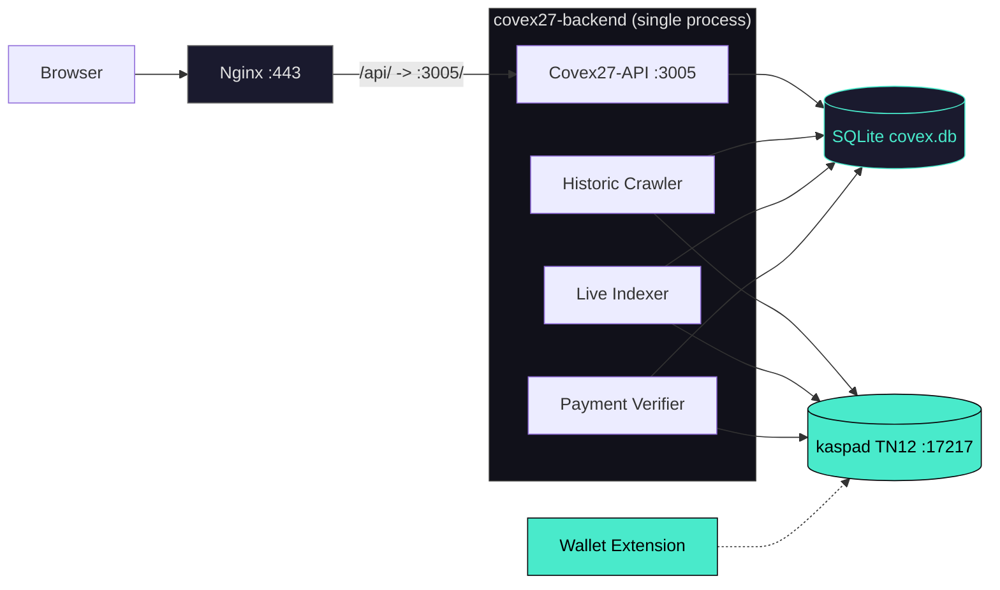
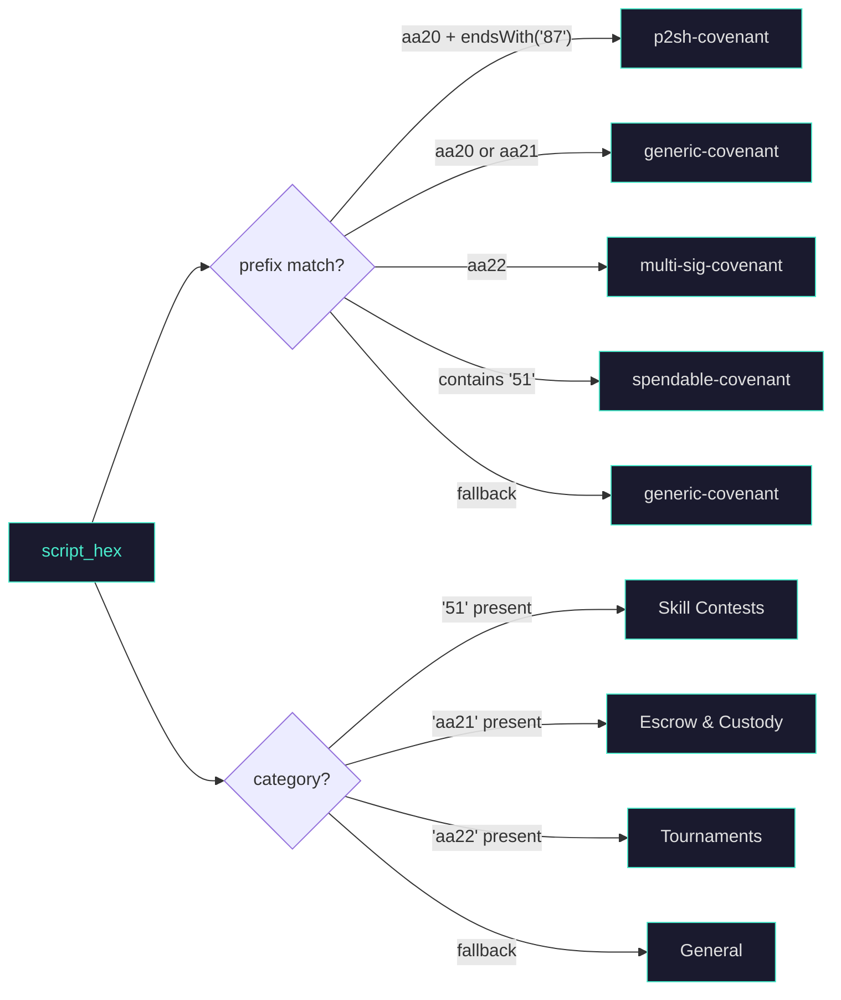

<div align="center">
  <br>
  <br>
  <pre style="color:#49EACB">
██████╗ ██████╗ ██╗   ██╗███████╗██╗  ██╗
██╔════╝██╔═══██╗██║   ██║██╔════╝╚██╗██╔╝
██║     ██║   ██║██║   ██║█████╗   ╚███╔╝
██║     ██║   ██║╚██╗ ██╔╝██╔══╝   ██╔██╗
╚██████╗╚██████╔╝ ╚████╔╝ ███████╗██╔╝ ██╗
 ╚═════╝ ╚═════╝   ╚═══╝  ╚══════╝╚═╝  ╚═╝
  </pre>
  <h3 style="color:#49EACB;letter-spacing:0.3em;margin-top:-8px">KASPA COVENANT INDEXER</h3>

  <br>

  <p>
    <a href="https://github.com/THTProtocol/Covex27/blob/master/LICENSE"></a>
    <a href="https://hightable.pro"></a>
    <a href="#"></a>
    <a href="https://hightable.pro/api/status"></a>
    <a href="#"></a>
  </p>

  <br>

  > **[Live Demo → hightable.pro](https://hightable.pro)**
  >
  > Non-custodial indexing and interactive UI layer for native Kaspa SilverScript covenants. One Rust binary. One SQLite database. Direct wRPC to your kaspad node. No middleware, no custodians, no compromise.

  <br>

  <br>

  ---

  **Built by HIGH TABLE PROTOCOL**

  <br>
</div>

---

<!-- ANIMATED HERO — Replace with actual screenshot/GIF -->
<p align="center">
  <em>Animated preview of the live explorer: glowing MAX-tier cards, stagger-animated grid, live BlockDAG background</em>
  <br>
  <sub>→ Place a GIF at <code>/screenshots/hero-explorer.gif</code> showing the explorer with at least one MAX-tier covenant pulsing neon green</sub>
</p>

---

## Overview

Covex is a single-process Rust indexer that crawls the Kaspa Toccata Testnet-12 BlockDAG for SilverScript covenants — native UTXO smart contracts identified by the `aa20`–`aa23` opcode family. It discovers, classifies, and exposes them through a tier-weighted REST API, then renders interactive UIs in a React/Tailwind cyberpunk frontend.

**What it does**: historic BlockDAG crawling, live UTXO indexer, on-chain payment verification, auto UI generation, and tier-weighted covenant ranking — all in one binary.

**What it doesn't do**: it never holds keys, never signs transactions on behalf of users, and never modifies on-chain covenant data. The BlockDAG is the source of truth; Covex is the window.

**Where it runs**: live at [hightable.pro](https://hightable.pro), backed by a `kaspad` Toccata TN12 full node with `--utxoindex` on port 17217. 76 covenants indexed and counting.

### Network Support

| Network | Status | Port | Address Prefix |
|:---|:---|:---|:---|
| Testnet-12 (Toccata) | **Live** | `17217` | `kaspatest:` |
| Testnet-10 | **End of life** | `17110` | `kaspatest:` |

---

## Features & Tiers

Covex operates a four-tier SaaS model. Tier is determined **on-chain** by the amount of KAS sent to the treasury address in `tx.outputs[1]`. The payment verifier waits for 6 BlockDAG confirmations, then upgrades the covenant record and regenerates its UI.

<br>

| | FREE | CREATOR | PRO | MAX |
|:---|:---:|:---:|:---:|:---:|
| **Price** | `0 KAS` | `100 KAS` | `500 KAS` | `1,000 KAS` |
| **Badge** | · | ▫ | ◈ | ◆ |
| **Listing** | Standard | Standard | Featured | Top placement |
| **Card glow** | — | — | Neon border | Neon + pulse |
| **Expanded panel** | — | — | Partial | Full detail |
| **Interactive UI** | — | ✓ | ✓ | ✓ |
| **Custom forms** | — | ✓ | ✓ | ✓ |
| **Trust builder** | — | — | ✓ | ✓ |
| **Verified open-source badge** | — | — | ✓ | ✓ |
| **Developer notes** | — | — | ✓ | ✓ |
| **Interaction buttons** | — | — | ✓ | ✓ |
| **Custom branding** | — | — | — | ✓ |
| **Custom domain** | — | — | — | ✓ |

<br>

Treasury address: `kaspatest:qpyfz03k6quxwf2jglwkhczvt758d8xrq99gl37p6h3vsqur27ltjhn68354m`

**Trust & Verification Builder** (PRO/MAX): Covenant creators can link a verified GitHub source, publish developer safety notes, and define interactive button schemas — proving their covenant is auditable and not a scam. Each configured badge renders on the Explorer card, and the full builder is integrated directly into the covenant detail page.

---

## Architecture

One Rust process. Three background tasks sharing one wRPC connection. All state in SQLite.



### Subsystem Detail

**Historic Crawler** (`crawler.rs`): Walks the selected-parent chain backward from the virtual tip, calling `get_block(hash, true)` for each block to include full transaction data. Scans `tx.payload` — not output scripts — for `aa20`/`aa21`/`aa22`/`aa23` opcodes. Tier is determined from `tx.outputs[1]` position: the second output must match the treasury P2PKH script and exceed tier thresholds (≥100/500/1,000 KAS). Checkpointed via `crawler_state.last_scanned_daa` per batch — resume on restart with no rescan.

**Live Indexer** (`indexer.rs`): Polls `get_utxos_by_addresses()` every 10 seconds for configured seed addresses. Classifies each UTXO by script opcodes, inserts into the `covenants` table, and spawns a `tokio::spawn` for auto UI generation — the polling loop is never blocked.

**Payment Verifier** (`payment_verifier.rs`): Monitors treasury UTXOs every 15 seconds. Matches `from_address` to `creator_addr` in the covenants table. After 6 DAA confirmations, upgrades the covenant record and regenerates the enhanced UI. All tier upgrades are **on-chain truths** — no off-chain payment simulation.

**UI Generator** (`ui_generator.rs`): Produces self-contained HTML with embedded wallet integration. FREE tier gets a red danger banner with limited disclosure. CREATOR/PRO/MAX tiers get green verified banners with full logic summaries and receiving addresses.

**Native Visibility Engine** (`db.rs`): Server-side SQL `CASE` expression sorts covenants before they reach the frontend:

```sql
ORDER BY
  CASE verified_tier
    WHEN 'MAX' THEN 100 WHEN 'PRO' THEN 50
    WHEN 'CREATOR' THEN 10 ELSE 0
  END DESC, timestamp DESC
```

The React `Explorer.jsx` renders in the exact order the backend returns. **No frontend re-sorting.**

---

## Covenant Classification

Every UTXO is classified by its script public key hex. The indexer runs a prefix-matching pipeline:



Four categories actively detectable from opcode patterns (Skill Contests, Escrow & Custody, Tournaments, General), with five reserved for future SilverScript features.

---

## Technology Stack

| Layer | Technology | Purpose |
|:---|:---|:---|
| Node | `kaspad` v0.15 + `--netsuffix=12` | wRPC Borsh-encoded WebSocket — Toccata full node with `--utxoindex` |
| Backend | Rust 1.80 · Axum 0.7 · Tokio 1 | Async HTTP server, three concurrent `tokio::spawn` background tasks |
| wRPC | `kaspa-wrpc-client` 0.15 | Borsh-encoded WebSocket RPC to kaspad on `ws://127.0.0.1:17217` |
| Database | SQLite via `rusqlite` 0.31 | 6 tables, 15 indexes, `Mutex<Connection>` shared via `Arc` |
| Tier Sort | SQL `CASE` expression | DB-level weighted rank: MAX=100, PRO=50, CREATOR=10, FREE=0 |
| Hashing | SHA-256 (sha2 0.10) | Script hash for covenant deduplication |
| Frontend | React 19 + Vite 8 | Static SPA — cyberpunk covenant explorer with premium tier styling |
| Styling | Tailwind CSS + custom neon CSS | `#49EACB` glow borders, neon card effects, glassmorphism panels |
| WASM | `@onekeyfe/kaspa-wasm` | TN12 mnemonic dev mode — local key derivation and tx signing |
| Reversing | Nginx + Let's Encrypt | TLS termination, `/api/` proxy to backend, SPA fallback routing |
| Deploy | systemd + bash | Two service units, idempotent deploy scripts |

<!-- TECH STACK VISUAL — Place an icon-grid screenshot here -->
<p align="center">
  <sub>→ Place a clean tech-stack icon grid at <code>/screenshots/tech-stack.png</code></sub>
</p>

---

## How It Works

### 1. Historic Crawler

Walks the selected-parent chain one block at a time, scanning `tx.payload` for `aa20`–`aa23` opcodes. Tier determined by `tx.outputs[1]` amount against treasury thresholds. Only the crawler writes covenant records to the DB — the broadcast endpoint only relays signed transactions.

### 2. Live Indexer

Polls every 10 seconds. Gates every UTXO through `is_standard_output()` to filter faucet dust and Schnorr P2PK deposits, then through `looks_like_covenant()` for opcode detection. Auto-generates basic UI on insert.

### 3. Payment Verification

Monitors treasury UTXOs every 15 seconds. Waits 6 confirmations. Upgrades the covenant record and regenerates enhanced UI with full disclosure. Idempotent — re-upgrading the same covenant is harmless.

### 4. Auto UI Generation

FREE tier: red danger banner, limited to tx_id + script_hash + amount. CREATOR/PRO/MAX: green verified banner, full logic summary, creator address, receiving addresses. Both include wallet detection and `kaspa_sendTransaction` integration.

### 5. Native Tier Sorting

SQL `CASE` expression runs at query time. The frontend receives a pre-sorted array and renders it directly — no `.sort()` in JavaScript.

<!-- EXPLORER SCREENSHOT — Replace with actual image -->
<p align="center">
  <em>The live covenant explorer: stagger-animated grid, neon tier badges, trust verification signals</em>
  <br>
  <sub>→ Place an explorer screenshot at <code>/screenshots/explorer-grid.png</code> showing MAX tier card glowing</sub>
</p>

<!-- DEPLOY SCREENSHOT -->
<p align="center">
  <em>SilverScript deployment engine with tier selector and WASM transaction builder</em>
  <br>
  <sub>→ Place a deploy screenshot at <code>/screenshots/deploy-form.png</code></sub>
</p>

<!-- TRUST BUILDER SCREENSHOT -->
<p align="center">
  <em>Trust & Verification Builder: GitHub source linking, safety notes, interactive button schema</em>
  <br>
  <sub>→ Place a trust-builder screenshot at <code>/screenshots/trust-builder.png</code></sub>
</p>

---

## Wallet Integration

Covex detects 8 wallet providers directly via `window.*` globals — no adapter library required:

| Wallet | Detection | Platform |
|:---|:---|:---|
| KasWare | `window.kasware` | Desktop |
| Kastle | `window.kastle` | Desktop |
| Kasperia | `window.kasperia` | Desktop |
| OKX | `window.okxwallet.kaspa` | Desktop + Mobile |
| KaspaCom | `window.kaspa.connect` | Desktop + Mobile |
| Kasanova | `window.kasanova` | Mobile |
| Kaspium | `window.kaspium` | Mobile |
| Tangem | `window.tangem` | Mobile |

A 5-second retry loop at 200ms intervals handles the wallet injection race condition — providers appear after React mounts.

### TN12 Mnemonic Dev Mode

Built-in developer testing that derives Kaspa keys locally from a BIP39 mnemonic via `@onekeyfe/kaspa-wasm`. Completely bypasses browser extensions. Derivation chain: `Mnemonic.fromPhrase()` → `.toSeed('')` → `new XPrv(seed)` → `derivePath("m/44'/111111'/0'/0/0")` → `toAddress('testnet-12')`.

---

## Quick Start

### Prerequisites

- Rust 1.80+ toolchain
- Node.js 20+ and npm
- kaspad Toccata node synced to Testnet-12

### One-command deploy

```bash
sudo bash deploy/deploy-hetzner.sh
```

Installs system dependencies, builds the Rust backend (release) and React frontend, creates systemd service units.

### Production update

```bash
sudo bash deploy/deploy_all.sh
```

Resets to `origin/master`, rebuilds both backend and frontend, reconfigures services, runs a health report. Idempotent.

### Environment

```bash
KASPA_NETWORK=testnet-12
KASPA_WRPC_URL=ws://127.0.0.1:17217
BIND_ADDR=0.0.0.0:3005
DB_PATH=/mnt/HC_Volume_105579109/Covex27/covex.db
COVENANT_TREASURY_ADDRESS=kaspatest:qpyfz03k6quxwf2jglwkhczvt758d8xrq99gl37p6h3vsqur27ltjhn68354m
RUST_LOG=covex27_backend=info,kaspa_wrpc=warn
```

### Toccata node

```bash
kaspad --testnet --netsuffix=12 --utxoindex \
  --appdir=/mnt/covex-data/kaspa-data/tn12 \
  --rpclisten-borsh=0.0.0.0:17217
```

Bootstrap takes ~6–8 minutes from cold start. The crawler starts discovering covenants after IBD completes.

---

## API Reference

All endpoints return JSON. `/covenants` returns natively tier-sorted results.

| Method | Path | Description |
|:---|:---|:---|
| `GET` | `/` | Status: `{"status":"ok","app":"Covex v1.0.0","network":"testnet-12"}` |
| `GET` | `/health` | `OK` — plain text for uptime monitors |
| `GET` | `/covenants` | All active covenants, tier-sorted. Each record includes `tx_id`, `address`, `amount_kaspa`, `script_hash`, `script_hex`, `covenant_type`, `category`, `creator_addr`, `verified_tier`, `full_logic_summary`, `block_daa_score`, `timestamp`, `ui_config`, `trust_config`, `has_verified_source` |
| `GET` | `/status` | `{"total_covenants":76,"active_covenants":76,"verified_covenants":0,"network":"testnet-12","node_connected":true}` |
| `GET` | `/tiers` | Tier definitions with pricing, features, and styling configs |
| `POST` | `/covenants/:id/ui-config` | **Secured** — saves trust-verification config (verified source URL, developer notes, interaction schema). Verifies wallet address matches on-chain `creator_addr`. PRO/MAX only |
| `GET` | `/covenants/:id/trust-config` | Returns saved trust configuration for a covenant |
| `POST` | `/broadcast` | Broadcast signed transaction hex via wRPC. Returns `tx_id`. No DB writes |
| `GET` | `/utxos/:address` | Fetch UTXOs for an address from kaspad |
| `GET` | `/balance/:address` | Fetch balance for an address |

Nginx proxies `/api/` to `http://127.0.0.1:3005/` (trailing slash strips the prefix). All requests arrive at the backend as bare paths (`/covenants`, not `/api/covenants`).

---

## Repository

```
Covex27/
├── backend/
│   ├── Cargo.toml                       # Rust deps, vendored kaspa-consensus-core patch
│   └── src/
│       ├── main.rs                      # Entry point, Axum router, 9 endpoints
│       ├── covenant_types.rs            # Enums, tiers, pricing, UI config structs
│       ├── crawler.rs                   # Historic BlockDAG walker (selected-parent chain)
│       ├── db.rs                        # SQLite schema, CRUD, tier-weighted sort, trust config
│       ├── indexer.rs                   # Live UTXO poller + auto basic UI generation
│       ├── payment_verifier.rs          # Treasury monitor + tier upgrades (6-confirmation gate)
│       ├── ui_generator.rs              # Basic & enhanced HTML UI with wallet integration
│       ├── signer.rs                    # Rust-native tx builder + signer (covenant payloads)
│       ├── broadcast.rs                 # Tx relay — broadcast only, zero DB writes
│       └── dev_wallets.rs              # Dev wallet identities for testing
├── frontend/
│   └── src/
│       ├── pages/
│       │   ├── Explorer.jsx             # Covenant browser — native sort, neon tier styling, trust badges
│       │   ├── CovenantInteractive.jsx  # Detail view — interact/trust/builder tabs, upgrade flow
│       │   ├── Deploy.jsx               # SilverScript deployment — WASM tx builder, tier selector
│       │   ├── Pricing.jsx              # Tier pricing page with payment flow
│       │   ├── Dashboard.jsx            # Creator dashboard
│       │   └── Terms.jsx                # Terms of service
│       └── components/
│           ├── WalletContext.jsx         # Wallet state management + TN12 mnemonic dev mode
│           ├── WalletButton.jsx          # Multi-wallet detection + connection UI
│           ├── DevWalletModal.jsx        # BIP39 mnemonic + hex key derivation UI
│           ├── UiBuilder.jsx             # Trust-verification builder (verified source, notes, buttons)
│           ├── PremiumBuilder.jsx        # Gated UI customization tool
│           ├── DagBackground.jsx         # Live BlockDAG iframe background
│           └── WhatIsKaspa.jsx           # Educational Kaspa overview
├── deploy/
│   ├── deploy-hetzner.sh                # Fresh deployment script
│   ├── deploy_all.sh                    # Unified production update
│   └── covex-backend.service            # systemd unit template
├── scripts/
│   └── generate_covex_health_report.sh  # Production health diagnostic
├── .env                                  # Local environment
└── README.md
```

---

## Database

SQLite at `covex.db`. Six tables, auto-created on first startup.

```
covenants                    generated_uis              visibilities
├─ tx_id (PK)                ├─ id (PK, AUTO)           ├─ covenant_id (PK)
├─ address                   ├─ covenant_id             ├─ tier
├─ amount_kaspa              ├─ owner_address           ├─ featured
├─ script_hash               ├─ tier                    ├─ priority
├─ script_hex                ├─ ui_html                 └─ custom_domain
├─ covenant_type             ├─ ui_config
├─ category                  ├─ slug (UNIQUE)           crawler_state
├─ creator_addr              ├─ is_published            ├─ id (PK, CHECK=1)
├─ description               ├─ featured                └─ last_scanned_daa
├─ verified_tier             └─ ui_generated_at
├─ verified_payment_tx
├─ verified_at               payments
├─ custom_ui_enabled         ├─ id (PK, AUTO)
├─ full_logic_summary        ├─ tx_id (UNIQUE)
├─ receiving_addresses       ├─ from_address
├─ is_active                 ├─ to_address
├─ block_daa_score           ├─ amount_sompi
└─ timestamp                 ├─ tier
                             ├─ confirmations
                             ├─ status
accounts                     ├─ covenant_id (FK)
├─ address (PK)              └─ timestamp
├─ tier
├─ payment_tx_id
├─ paid_at
├─ expires_at
├─ is_active
└─ created_at
```

Crawl state is checkpointed to `crawler_state` (single row, id=1) after each batch — restart picks up where it left off.

---

<p align="center">
  <br>
  <a href="https://hightable.pro">
    <strong>LIVE DEMO → hightable.pro</strong>
  </a>
  <br>
  <br>
</p>

<!-- STAR HISTORY — Add once there's enough data -->
<!--
<p align="center">
  <sub>→ Place star-history chart at <code>/screenshots/star-history.png</code></sub>
</p>
-->

---

## License

MIT

---

<div align="center">
  <br>
  <strong>Covex</strong> — Built by <strong>HIGH TABLE PROTOCOL</strong> for the Kaspa ecosystem.
  <br>
  <em>Toccata is coming. The window is open.</em>
  <br>
</div>
