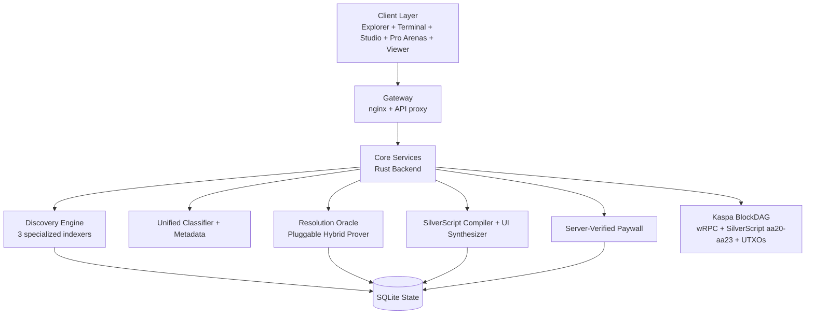
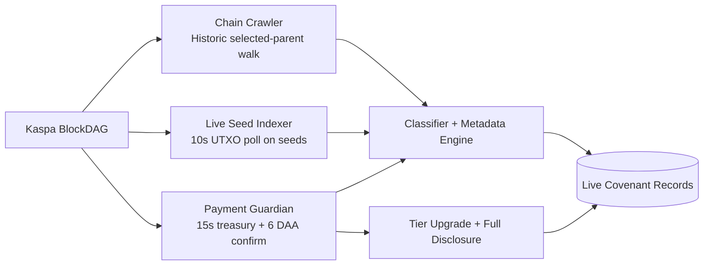
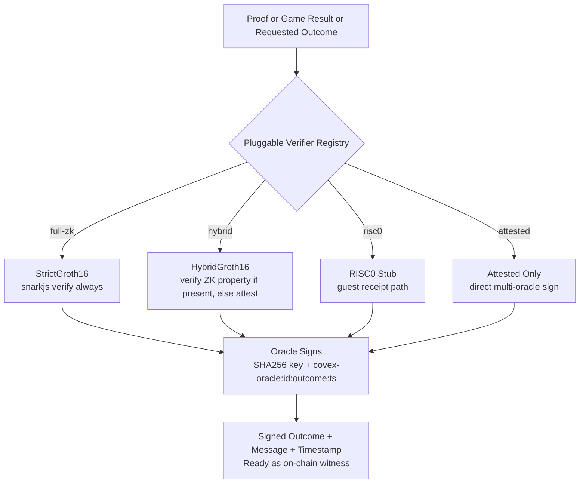
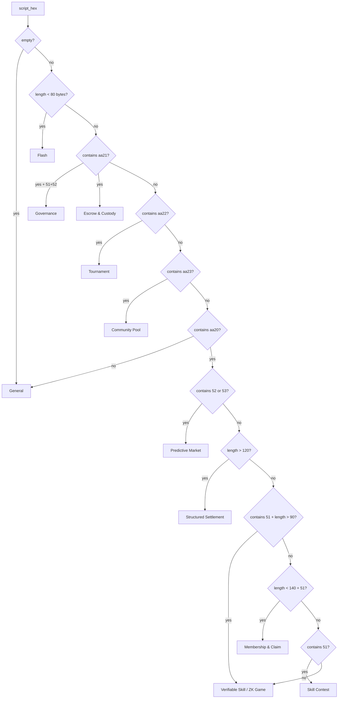
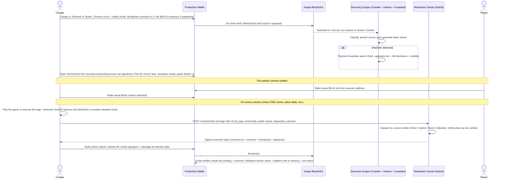

<div align="center">
  <br>

  <pre>
 ██████╗ ██████╗ ██╗   ██╗███████╗██╗  ██╗
██╔════╝██╔═══██╗██║   ██║██╔════╝╚██╗██╔╝
██║     ██║   ██║██║   ██║█████╗   ╚███╔╝ 
██║     ██║   ██║╚██╗ ██╔╝██╔══╝   ██╔██╗ 
╚██████╗╚██████╔╝ ╚████╔╝ ███████╗██╔╝ ██╗
 ╚═════╝ ╚═════╝   ╚═══╝  ╚══════╝╚═╝  ╚═╝
  </pre>

  

  <h3>The Production Platform for Verifiable Interactive Covenants on the Kaspa BlockDAG</h3>

  <p><strong>Complete indexing • Intelligent classification • Rich interactive interfaces • Hybrid ZK + Oracle resolution • Full on-chain transparency</strong></p>

  <br>

  <a href="https://hightable.pro"></a>
  <a href="https://hightable.pro"></a>
  <a href="https://github.com/THTProtocol/Covex27/blob/master/LICENSE"></a>
  <a href="https://github.com/THTProtocol/Covenant-Studio"></a>

  <br><br>

  <p><strong>Every SilverScript covenant (aa20-aa23) on the Kaspa BlockDAG is discovered, classified, enriched with metadata, given a rich interface, and equipped with a spectrum of verifiable resolution paths - from full Groth16 ZK to hybrid property proofs to multi-oracle attested outcomes. All covenant data and disclosures live on-chain. $KAS payments, $KAS stakes, $KAS resolutions.</strong></p>

</div>

**The Kaspa BlockDAG moves at incredible speed. Covex makes sure every covenant born on it is instantly found, deeply understood, given a beautiful interface, and settled with the right balance of cryptography and truth.**

You do not need to trust a company to hold your $KAS. You do not need to hope the outcome is fair. The three engines watch the chain. The Classifier gives everything a name and a place. The Oracle only signs what it can honestly verify or attest. The signature then becomes the on-chain key.

This is the most advanced public covenant platform on any BlockDAG today.

### What Makes It Different

- **Complete visibility by default** - Every covenant (free or paid) carries disclosed wallets, its circuit reality label, and on-chain metadata. Paid ones rise to the top with full transparency.
- **Honest proving spectrum** - Not every problem needs a 10,000 constraint Groth16 proof. Some need a fast hybrid property proof + oracle. Others need real-world data. Covex supports all three paths without lying about which one was used.
- **One paywall to rule them all, enforced on-chain** - BUILDER, PRO, and MAX are not marketing tiers. They are 100 $KAS, 500 $KAS, and 1000 $KAS payments the Payment Guardian watches with 6 DAA eyes. Server tokens are only issued after the chain confirms it. One payment, one elevated deployment.

---

## Architecture Overview - The Complete System

Covex turns raw SilverScript covenants on the Kaspa BlockDAG into living, interactive, and fairly resolvable agreements - all without custody.

You create a covenant. The engines find it in seconds. The Classifier understands what it is. Paid tiers unlock power and visibility through real $KAS. When the moment of truth arrives, the Oracle helps settle it with the right mix of zero-knowledge proof and honest attestation. The signature then becomes the on-chain key that releases the pot.

Here is how the pieces lock together.

### High-Level Layers

<div align="center">



</div>

**Tip:** Click any mermaid diagram on GitHub to focus it. On desktop you can often pan and zoom the rendered diagram for detail.

### The Discovery Engine Close-Up

The three indexers never sleep. They run in parallel so nothing slips through.

<div align="center">



</div>

### Resolution Oracle - The Hybrid Brain

This is where the magic of honest proving happens.

<div align="center">



</div>

The Oracle is deliberately built to grow. New circuits just register their preferred proving style. No giant match statements to edit.

The three indexers run in parallel for complete coverage. The Classifier is the single source of truth. The Oracle is deliberately pluggable so every circuit can declare its honest reality label with pride. Every diagram above is meant to be studied - click to focus and explore the connections.

---

## The Discovery Engine - Three Specialized Production Indexers

Covex never misses a covenant. Three complementary engines run continuously in the background.

### 1. Chain Crawler - Historic Completeness
Walks the selected-parent chain backward from the current virtual tip (up to 1M blocks of history).  
Scans every transaction’s `payload` for the SilverScript covenant opcodes (`aa20`, `aa21`, `aa22`, `aa23`).  
Extracts script, amount, creator, classifies immediately, records tier from treasury payment in Output[1] when present.  
Triggers basic UI generation on first sight.  
Persists `last_scanned_daa` so it resumes exactly where it left off across restarts.

### 2. Live Seed Indexer - Real-Time Birth Detection
Polls configured seed addresses every 10 seconds.  
Filters out ordinary wallet outputs using `is_standard_output` + `looks_like_covenant` heuristics.  
Any new covenant UTXO is classified, inserted, and immediately given a generated interface.  
Complements the crawler for covenants created after the current crawl tip.

### 3. Payment Guardian - Tier Verification & Visibility Upgrades
Polls the official covenant treasury address every 15 seconds.  
Matches incoming $KAS payments to the covenant creator address.  
Waits for 6 DAA confirmations on the Kaspa BlockDAG before acting.  
Upgrades `verified_tier` (BUILDER / PRO / MAX), sets visibility priority, enables full disclosure, and regenerates enhanced UIs.  
Also powers the server-side paywall (see below).

Together the three engines guarantee:

- Historic covenants are never lost.
- New covenants appear within seconds of on-chain confirmation.
- Tiered visibility and disclosure are always backed by confirmed $KAS treasury payments.

See the "Discovery Engine Close-Up" diagram in the Architecture section above for the visual flow. The engines are deliberately redundant on purpose - one watches history, one watches the present, one watches the money. Nothing escapes.
---

## Covenant Intelligence - The Unified Classifier

Both the Crawler and the Live Indexer feed the exact same classification logic (`backend/src/covenant_types.rs`).

Two outputs are produced for every covenant:

- `CovenantCategory` (user-facing, shown in Explorer cards and filters)
- `covenant_type` (granular, used for Terminal suggestions, UI generation, and API)

### Category Decision Tree

<div align="center">



</div>

### Production Category Table

| Category              | Detection Rule                          | Primary Use Cases                              | Typical Resolution Style      |
|-----------------------|-----------------------------------------|------------------------------------------------|-------------------------------|
| Verifiable Skill      | aa20 + 51 + >90 bytes                   | Chess, poker, skill games with proofs          | Hybrid / Full ZK + Oracle     |
| Skill                 | aa20 + 51                               | Classic one-winner contests                    | Oracle-attested               |
| Predictive            | aa20 + 52/53                            | Binary/ternary outcome markets                 | Oracle-attested / Hybrid      |
| Membership & Claim    | aa20 + specific length + 51             | Merkle proofs, range proofs, eligibility       | Full ZK / Hybrid              |
| Structured            | aa20 + >120 bytes                       | Complex timelock / conditional settlements     | Hybrid + Timelock circuits    |
| Escrow                | aa21 (no multi-outcome markers)         | 2-party or multi-party time-locked custody     | Timelock + Oracle             |
| Governance            | aa21 + 51 + 52                          | DAO-style multi-outcome voting                 | Multi-oracle / Governance ZK  |
| Tournament            | aa22                                    | Threshold multi-sig tournaments                | Multi-sig + Oracle            |
| Community Pool        | aa23                                    | Lotteries, shared funds, prize pools           | VRF + Oracle                  |
| Flash                 | Any aa2x + <80 bytes                    | Simple one-shot logic                          | Direct / Oracle               |
| General               | Fallback                                | Unclassified or novel patterns                 | Attested                      |

BUILDER+ users can supply a free-form `custom_category` in the Terminal that overrides the auto-detected label everywhere while the underlying classification remains for internal routing.

---

## Transparency by Design - Every Covenant Carries Its Truth

Every indexed covenant (free or paid) stores and surfaces:

- `disclosed_wallets`: creator address, covenant treasury address, oracle public keys - always visible for top-tier covenants.
- `reality`: explicit label (`full-zk` | `hybrid` | `oracle-attested` | `risc0-stub`) for the chosen circuit.
- `has_artifacts`: whether real circom/RISC0 artifacts exist for this circuit.
- `custom_circuit_def`, `theme`, `name`, `description` (set at creation or via Terminal/Studio).
- `verified_tier` and visibility priority derived strictly from confirmed $KAS treasury payments.

Paid covenants receive “PAID VERIFIED • TOP VISIBILITY” placement and a complete disclosure section. Free covenants remain fully interactive (claim, timeout resolve, state viewer, basic visuals) but sit lower in sort order with limited disclosure.

No misleading claims. Reality labels are honest and machine-readable.

---

## The Verified Paywall - One-Pay-One-Deploy with $KAS

Free basic covenant deployment is always available.

BUILDER (100 $KAS), PRO (500 $KAS), MAX (1000 $KAS) payments are sent to the official covenant treasury on the Kaspa BlockDAG.

The Payment Guardian detects these payments, waits for 6 DAA confirmations, and records the tier against the creator address.

When a user with a verified payment calls `POST /api/auth-session`:

- The server checks the on-chain record for that exact address.
- A short-lived, single-use auth token is issued (never stored in localStorage).
- The token is consumed on first deploy via `/api/auth-session/consume`.
- Deployment capacity is tracked server-side (`accounts.deployments_used`).

This is cryptographically enforced at the point of deploy. Only addresses that have actually paid on-chain can obtain the elevated capabilities (Terminal access, custom UI, pro arenas, higher visibility).

---

## The Resolution Oracle - Pluggable Hybrid Proving Engine

The single most advanced component of the platform.

`POST /api/oracle/verify-and-sign`

Accepts a circuit identifier + proof object (or requested outcome) and returns a signed outcome usable directly as a witness in a Kaspa spend transaction that unlocks the covenant.

### The Hybrid Model - Three Honest Paths

| Reality Label      | What the Prover Must Supply                          | What the Oracle Does                                      | When Used                                      | Example Circuits                     |
|--------------------|------------------------------------------------------|-----------------------------------------------------------|------------------------------------------------|--------------------------------------|
| full-zk            | Complete Groth16 proof (pi_a, pi_b, pi_c + public signals) | Strict snarkjs verification of the proof                  | Small, auditable statements with real artifacts | merkle_membership, range_proof, relative_timelock, hash_preimage |
| hybrid             | ZK proof of a critical property + requested outcome  | Verify the property proof (if present) then attest the remaining outcome | Games with on-chain rules + complex state     | chess_v1 (dual mode), basic_utxo_ownership, script_constraint, vrf_dice_roll, pot_split_math, turn_timer, collateral_liquidation |
| oracle-attested    | requested_outcome only (or light attestation data)   | Sign the attested outcome (multi-oracle threshold supported) | External data, heavy compute, long-tail logic | price feeds, election results, complex game adjudication, black_scholes_approx (stub) |
| risc0-stub         | RISC0 receipt / guest output (when available)        | Accept or verify receipt (stub path today)                | General-purpose verifiable compute            | risc0_chess_eval, risc0_defi_liquidation, risc0_connect4_eval |

The oracle is deliberately pluggable (`backend/src/oracle_verifier.rs`):

```rust
// Simplified view of the registry
StrictGroth16 { script, prefix }   // always run snarkjs
HybridGroth16 { script, prefix }   // Groth16 if proof body present, else attested
Risc0Stub   { guest }
Attested                           // pure oracle signature
```

Adding a new circuit is a one-line registry insert + (optional) verify script + frontend label.

### Signing Construction (verifiable by anyone)

```text
message = "covex-oracle:<covenant_id>:<outcome>:<timestamp>"
signature = SHA256(oracle_private_key || message)
```

The signed outcome + message + timestamp are returned to the UI. The covenant unlock transaction includes this data as witness data. The on-chain SilverScript can verify the oracle public key and the message binding.

Multi-oracle federation (threshold + weighted signatures) is supported in the input schema and liveness endpoints for future decentralized oracle networks.

### Chess Dual Proving Modes (Production Example of Hybrid Strength)

- Mode 0 (Hybrid - recommended for UX): Fast path. Witness supplies a small set of candidate moves and attack data. Circuit checks the claimed terminal condition against the witnessed set.
- Mode 1 (Full ZK - maximum security): Stricter. For “no legal moves” claims the prover must supply a non-empty exhaustive candidate list and the circuit proves the search was complete.

The proving mode is committed inside the public signals so the oracle and any on-chain verifier see exactly which security level was used.

---

## Production ZK Circuit Inventory - Simple Names, Honest Labels

Covex maintains a living registry (`zk/circuit_registry.json`) of 200+ circuits plus a frontend catalog of 207+ entries. Reality and artifact status are explicit.

### Core Full-ZK (real Groth16 artifacts + strict verification today)

- merkle_membership - prove key/value membership in a committed tree
- range_proof - prove a committed value lies inside [min, max] without revealing it
- relative_timelock - prove a DAA-relative timelock on the selected-parent chain
- hash_preimage - classic preimage knowledge

### Kaspa-Native Primitives (Phase 1 - mostly hybrid, real artifacts)

- basic_utxo_ownership - Schnorr + commitment proof that a wallet controls a specific UTXO
- script_constraint - prove that a SilverScript fragment (exact aa* opcode pattern + timelock) exists
- vrf_dice_roll / vrf_random - verifiable randomness for games and lotteries
- nullifier_set - double-spend prevention + privacy set membership
- pot_split_math - prove correct fee / pot_return / winner split math
- turn_timer - per-turn DAA timer enforcement for state machines
- onchain_sig_verify - prove possession of a valid prior oracle signature (on-chain evolution prep)

### Games & Interactive (mostly hybrid - chess is the flagship)

- chess_v1 (dual modes - Hybrid fast + Full ZK exhaustive)
- poker_equity, poker_vrf_deal, verifiable_poker_solver
- tictactoe_v1, connect4_v1, FullScreenReversi, RPS, etc.
- turn_timer + pot_split_math combination for timed pot games

### DeFi & Structured (hybrid + oracle-attested)

- collateral_liquidation, collateral_ltv
- black_scholes_approx, financial_formula, loan_health
- auction_clearing

### Privacy & Gating

- private_transfer_nullifier, anon_credential, multi_sig_gating, privacy_mixer_v1

### Compute & Advanced Oracles (RISC0 stubs + attested feeds)

- risc0_chess_eval, risc0_chess_endgame, risc0_defi_liquidation, risc0_connect4_eval
- price_btc, weather_feed, election_feed, decentralized_liveness, multi_oracle_v2

All circuits declare `category`, `reality`, `artifacts`, and `use_cases`. The Terminal surfaces only appropriate circuits for the chosen covenant type. The Explorer can surface reality badges.

---

## The Covenant Journey - From First Byte to On-Chain Payout

This is the full story, start to finish. Follow a covenant from the moment someone dreams it up until the $KAS moves for real.

<div align="center">



</div>

**The journey in plain steps:**

1. **Design** - You open Covenant Studio or the Covex Terminal. You pick a circuit, decide if you want full-zk, hybrid, or straight oracle attestation, set your fee and pot-return percentages, choose a theme, and write a clear name and description. Paid users also fill out the full disclosure fields.

2. **Compile & Broadcast** - The Terminal turns your choices into Covex DSL, hands it to the compiler for SilverScript, then silverc produces the real Kaspa bytecode. You (or your counterparty) sign and broadcast from a real production wallet. Optional but powerful: you already sent the tier $KAS to the treasury from the same address.

3. **Instant Discovery** - Within seconds the Live Seed Indexer or the Chain Crawler sees the new aa20-aa23 payload. The unified Classifier tags it (Verifiable Skill, Predictive, Membership Claim, etc.). A basic interactive viewer appears automatically in the Explorer.

4. **Tier Awakening (6 DAA later)** - If you paid, the Payment Guardian spots the treasury UTXO from your address, waits for six DAA confirmations on the BlockDAG, then promotes the covenant. Higher visibility, full disclosed wallets (you + treasury + oracles), "PAID VERIFIED" treatment, and Terminal access for you.

5. **Configuration with Proof of Ownership** - You return to the Covex Terminal for this specific covenant. A quick cryptographic challenge (Schnorr signature over a fresh nonce or exact address match) proves you are the creator. You choose the exact ZK circuit, resolution mode, custom UI code from Studio, game type, and percentages. Everything is saved server-side.

6. **Real Interaction** - Others connect their production wallets. Everyone sees the reality label, the disclosed wallets, and the current state. Free covenants are already fully playable for basic claims and timeouts. Paid ones feel premium.

7. **Stake & Unlock the Arena** - For head-to-head experiences, both sides send equal $KAS into the covenant. The moment the amounts match, the full-screen professional arena appears: smooth chess board with real FIDE clocks and PGN, poker table, blackjack, connect4, whatever the covenant was built for.

8. **Play + Generate Proof** - The game or logic runs. When a ZK circuit is selected the client produces the Groth16 proof (or the hybrid witness data). For complex real-world or heavy compute cases the final outcome is simply prepared for attestation.

9. **Submit to the Oracle** - One click sends everything to `/api/oracle/verify-and-sign`. The pluggable engine looks at the circuit's declared reality, runs the right verifier (snarkjs for real artifacts, hybrid check, RISC0 stub, or pure attestation), and - only if it passes - signs the outcome using the deterministic construction.

10. **On-Chain Settlement** - The winner (or either side on draw) pulls the signed outcome + message + timestamp and uses them as witness data in a normal Kaspa spend transaction. The SilverScript covenant on-chain checks the oracle key and the outcome value, then executes the pot math: winner share goes to the victor, platform fee to the treasury, pot return stays in the covenant for reuse if it is marked reusable.

11. **Aftermath** - The Explorer updates. Analytics reflect the resolution. Reputation signals improve for the creator. If the covenant was built to be reusable, new participants can stake into it again.

This loop - from imagination to cryptographic or attested finality to actual $KAS movement - is what Covex makes reliable, transparent, and repeatable at production scale.
---

## Covex Terminal & Pro Game Experiences

The Terminal is the command center for every paid covenant.

Capabilities:
- Live covenant state + pot viewer
- Resolution mode selector (full-zk / hybrid / oracle-attested) with honest circuit suggestions
- ZK circuit picker (filtered by category + reality)
- Fee % and pot_return % configuration (enforced by pot_split_math proofs when selected)
- Custom UI code paste area (generated by Covenant Studio)
- Pro full-screen arena launcher (stake matching required)
- Ownership-protected save (Schnorr challenge or address match)

Flagship arena: **Chess**
- 680 px smooth board (react-chessboard)
- Complete FIDE ruleset (chess.js): castling, en passant, 50-move, threefold, insufficient material, etc.
- Dual synchronized 10-minute clocks (100 ms ticks)
- Full PGN move list with navigation
- Resign and draw offer flows
- Direct “Submit to Oracle” that carries PGN + FEN + proving_mode into the hybrid/full-zk chess_v1 path

Additional arenas (FullScreenPoker, FullScreenBlackjack, Connect4, Reversi, RPS, TicTacToe) follow the same stake-match → arena → oracle-submit pattern.

---

## Covenant Studio - Visual Editor for the Next Generation

https://github.com/THTProtocol/Covenant-Studio

Professional visual composer that outputs:
- Ready-to-paste custom UI HTML/JS for the Terminal
- Structured circuit + parameter definitions with reality labels
- Full disclosure metadata
- Theme and branding tokens

Paid users paste the output directly into the Covex Terminal. The system treats Studio-generated UIs as first-class custom interfaces.

---

## Data Model - What Gets Stored

Core tables (SQLite, WAL mode for concurrent readers):

- `covenants` - the source of truth for the Explorer (tx_id PK, script, amounts, creator, verified_tier, disclosed metadata, reality, category, timestamps, network-scoped)
- `generated_uis` - Terminal and auto-generated UI HTML + full config JSON (fee, circuit, resolution_mode, custom code, owner)
- `payments` - every detected treasury payment with confirmations and matched covenant
- `accounts` - per-address tier state and deployment credit consumption
- `auth_tokens` - short-lived, single-use tokens for the paywall
- `crawler_state` - per-network last scanned DAA for exact resume

All reads are network-scoped. The backend can run multiple network indexers in one process when additional wRPC endpoints are configured.

---

## Key Production APIs

- `GET /covenants?network=...&creator=...` - tier-sorted list with custom UI and config joined
- `GET /status`, `/tiers`, `/analytics`
- `POST /auth-session` + `POST /auth-session/consume` - server-verified paywall
- `GET/POST /terminal-config/:covenant_id` - ownership-protected configuration
- `POST /oracle/verify-and-sign` - the heart of resolution (pluggable)
- `POST /sign-and-broadcast` - covenant creation and general transaction submission
- `POST /covenant/:id/compute-payout` - client-side payout preview + unlock witness builder (verifies oracle signature locally)
- Marketplace template endpoints for published Studio configurations

---

## Production Characteristics

- All background engines are fire-and-forget Tokio tasks that survive transient wRPC disconnects with exponential backoff.
- Tier upgrades and disclosure are driven exclusively by confirmed on-chain $KAS flows (6 DAA).
- Configuration changes require cryptographic ownership (Schnorr over a fresh nonce or exact address match).
- Oracle signatures are publicly verifiable with only the published oracle public key.
- Reality labels and disclosed wallets are part of the covenant record and shown to every visitor on paid covenants.
- The compiler pipeline (DSL → SilverScript → bytecode) is available both in the Terminal and via the backend `/sign-and-broadcast` path.
- Multi-wallet support is production-only: extension wallets (KasWare and peers) are the primary path; dev hex paths are blocked in signer/UI for the live environment.

---

## Using the Platform - From Zero to Resolved Covenant

1. Visit https://hightable.pro
2. Browse the Explorer - every covenant is already interactive.
3. (Optional) Send 100/500/1000 $KAS to the treasury from your production wallet to unlock BUILDER/PRO/MAX.
4. Connect your wallet → enter the Terminal for a paid covenant or create a new one.
5. Configure resolution, pick a circuit with the desired reality level, paste Studio UI if desired, save (ownership proven).
6. Share the covenant link. Counterparties connect, stake, play or claim.
7. Submit the outcome (or proof) to the Oracle.
8. Use the returned signature in the unlock transaction - funds move according to the configured pot math.

Everything is observable on the Kaspa BlockDAG block explorer and inside the Covex Explorer.

---

## Technology Foundations

- **Kaspa** - BlockDAG, wRPC Borsh, SilverScript (aa20-aa23 payload covenants), DAA scoring, native Schnorr.
- **Backend** - Rust, Tokio, Axum 0.7, rusqlite (WAL), kaspa-wrpc-client + consensus-core 0.15, snarkjs via Node child process for Groth16.
- **Frontend** - Vite + React 19, Tailwind v4, shadcn primitives, chess.js + react-chessboard, @react-three/fiber for 3D, multi-provider wallet connector.
- **ZK** - circom + snarkjs (Groth16), dev PTAU (pot10_final) for new circuits, RISC0 guest stubs, pluggable verifier dispatch.
- **Oracle** - SHA256-based signatures today, multi-oracle threshold schema ready, liveness endpoints.
- **Compiler** - Covex DSL → SilverScript source → silverc bytecode.

---

## Current State - Radical Honesty

- 200+ circuits inventoried with explicit reality labels.
- ~10-15+ circuits have real compiled artifacts (r1cs + wasm + vkey) and wired verify paths (core full-zk + Kaspa Phase 1 primitives + chess dual-mode + a few DeFi).
- The vast majority of the inventory starts as honest hybrid or oracle-attested and can graduate as ceremonies complete and more artifacts are produced.
- Pluggable oracle covers every registered circuit out of the box.
- Chess dual proving modes are fully end-to-end (Hybrid for speed, Full ZK for maximum guarantees).
- On-chain SilverScript examples exist for oracle-signed outcomes and hybrid circuits.
- All metadata (disclosed wallets, reality, artifacts flag) is persisted and surfaced.
- Production paywall, three indexers, Terminal, pro arenas, and payout math are live and in daily use.

“100% of the vision” means exhaustive coverage of the architecture and inventory with a working pluggable foundation - not that every single circuit already has a production MPC ceremony zkey today.

---

## Resources

- **Live Platform**: [hightable.pro](https://hightable.pro)
- **Covenant Studio**: [github.com/THTProtocol/Covenant-Studio](https://github.com/THTProtocol/Covenant-Studio)
- **Full ZK + Oracle Vision & Inventory**: `docs/ZK_ORACLE_FULL_STACK_VISION_AND_ROADMAP.md`
- **On-Chain Evolution Path**: `docs/ONCHAIN_EVOLUTION_PATH.md`
- **Circuit Registry**: `zk/circuit_registry.json`
- **Examples** (chess modes, collateral, VRF, pot split, nullifiers, on-chain sig, etc.): `examples/`

---

**Covex** - Verifiable covenants. Honest resolution. Production on the Kaspa BlockDAG.

Built by HIGH TABLE PROTOCOL.

All covenant data lives on-chain. All resolution paths are explicit. Everything is designed to be understood from A to Z.

---

*This document describes the complete, operating production architecture. The three indexers, the pluggable hybrid oracle, the classifier, the paywall, the Terminal, and the full circuit registry are all active in the live system.*
