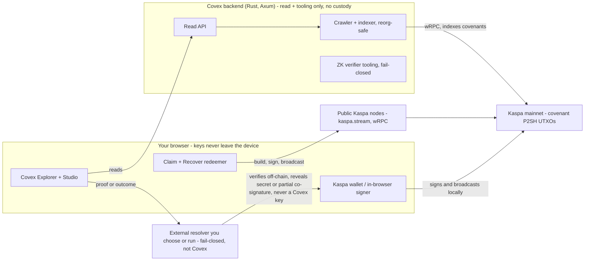
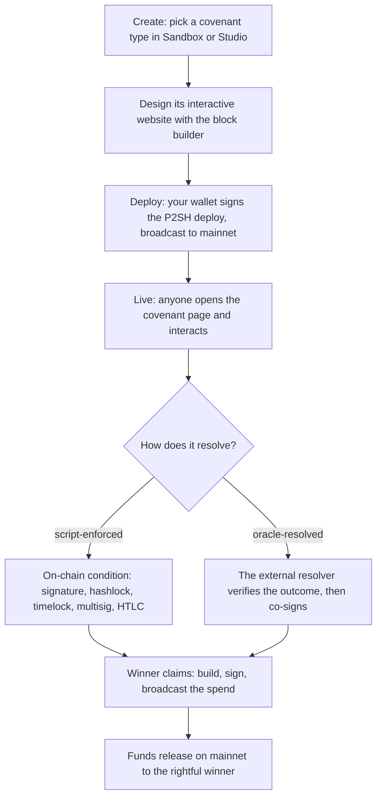
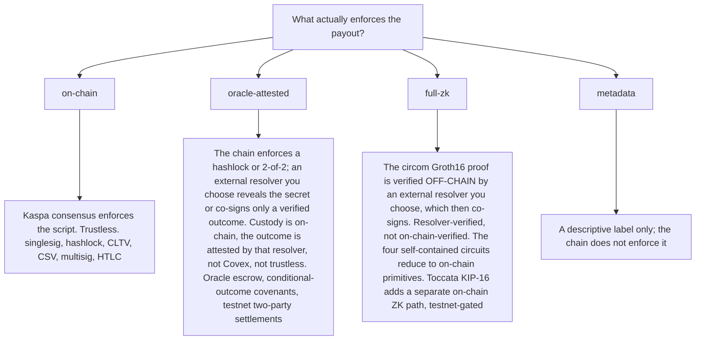
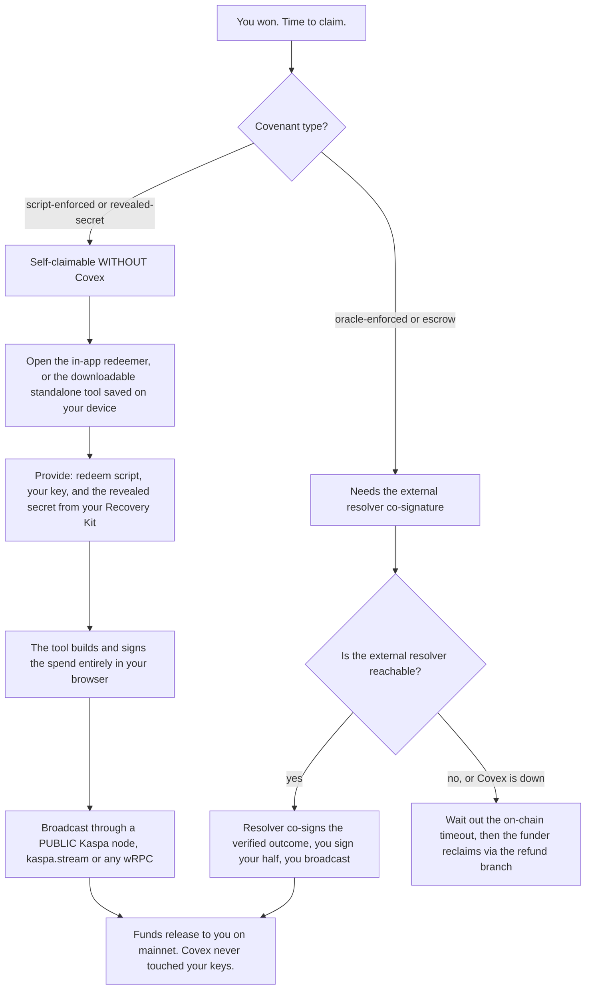
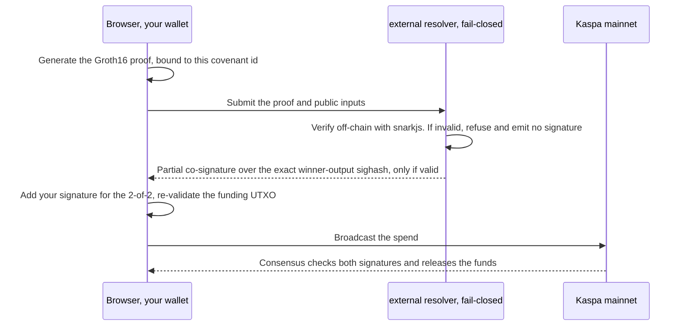

<div align="center">

  

  <br><br>

  <a href="https://hightable.pro"></a>
  
  
  
  

  <h3>The Covenant Explorer &amp; Studio for Kaspa Mainnet</h3>

  <p><strong>Index every covenant. Make every covenant interactive. Design, verify, and ship covenants and the beautiful websites people use to act on them. Built for the Toccata mainnet era.</strong></p>

  <p>
    <a href="https://hightable.pro"><b>hightable.pro</b></a> ·
    <a href="https://hightable.pro/docs">API docs</a> ·
    <a href="https://hightable.pro/whitepaper">Whitepaper</a> ·
    <a href="https://hightable.pro/treasury">Treasury</a> ·
    <a href="docs/BUILDING_ON_COVEX.md">Building on Covex</a>
  </p>
</div>

---

> **Status.** Kaspa mainnet has run at 10 BPS since the **Crescendo** hard fork (May 2025), which brought the **KIP-10 introspection opcodes** live on L1. Native scriptable **covenants** arrive with the **Toccata** hard fork (KIP-16/17/20/21), scheduled to activate on Kaspa mainnet on **30 June 2026**, when Covex launches with real funds. The covenant indexer is armed behind the honesty gate today and the mainnet node is being synced ahead of launch. **The mainnet explorer is honestly empty until the first real covenant lands. No placeholder data, ever. A zero is the correct, expected reading.** With Toccata, Kaspa gains an on-chain ZK path: the KIP-16 OpZkPrecompile (opcode 0xa6) verifies a RISC0-Groth16 proof in consensus (live on testnet-10/12, activating on mainnet at the Toccata DAA). That on-chain path is testnet-gated until proven live. The circom proof suite Covex ships is still verified **off-chain** by an external resolver you choose or run (never by Covex), and for those the only thing the chain checks at unlock is that resolver's Schnorr co-signature (plus whatever the script itself enforces); the four self-contained circuits reduce to pure on-chain primitives.

---

## 1. What Covex is

Covex is the place where **Kaspa covenants live, get used, and get built**. A covenant is a script program embedded in a Kaspa UTXO that constrains how that UTXO may be spent: escrows, vaults, vesting, fundraisers, multisig, atomic swaps, conditional payments, custom logic, and more. With Toccata they become a first-class L1 smart-contract surface.

Covex has three jobs, and a fourth that ties them together:

| Pillar | What it means | Free? |
|--------|---------------|-------|
| **Explore** | Every covenant on the chain, discovered on-chain by independent indexers. Paginated API, keyword search, categories, a live activity feed and ticker, per-covenant lifecycle and action history, and address portfolios. | Free forever |
| **Interact** | Connect a Kaspa wallet and act on any covenant directly: deposit, claim, resolve, settle, contribute, join. Any on-chain P2SH covenant can be redeemed by supplying its redeem script, even covenants not created on Covex. Conditional-outcome covenants take real orders and settle on-chain. | Free forever |
| **Create** | A free covenant creator plus paid Studio tiers. Build the covenant itself (real circuits, fee and payout config, and a SilverScript terminal that compiles to a declared-logic payload, not payout-enforcing script - the funds are locked by the engine-tested on-chain primitives, not the DSL), then build the **interactive website that lives on its covenant page** with a drag-and-drop visual builder. | Free + paid tiers |
| **Trust** | Every covenant page shows its lifecycle, finality, and an honest enforcement-reality badge (on-chain / oracle-attested / full-zk / metadata). The platform treasury, ranking formula, and payment history are public. | Always on |

**The big idea: covenants become websites.** A covenant on Covex is not a raw row in an explorer. Its creator designs a full, interactive website that renders directly on the covenant page, and *other* users interact with that website: deposit into an escrow, contribute to a fundraiser, claim a payout, act on a conditional-outcome covenant. The builder is a visual, drag-and-drop studio (Puck) with light-mode parity, starter templates, and rich blocks (hero images, galleries, video, progress meters, data panels, an honest enforcement badge, and more). In the Studio (Puck) builder, no creator-authored HTML or JavaScript reaches a visitor's DOM: pages serialize to validated JSON rendered through an allow-listed component set, which removes the phishing and XSS surface that plagues open page builders on financial sites. (A legacy raw-HTML terminal, where a creator uses it, renders creator markup only inside a cross-origin sandboxed iframe with no same-origin access, so creator code cannot read the page or touch funds, but it is not the no-creator-code Puck path.)

**Non-custodial, end to end (enforced on mainnet).** On mainnet, private keys never leave the browser and the server fails closed if one is supplied; a key is never displayed or transmitted. The platform reads UTXOs and verifies payments on-chain. It never holds funds and cannot move them. Every value-moving action is signed by the user's own wallet. (On testnet only, an in-browser dev wallet offers a server-signing convenience for test funds; that path is hard-rejected on mainnet.)

### Mainnet status

Covex is built for Kaspa **mainnet**. The covenant indexer is armed behind the honesty gate today, and the mainnet node is being synced ahead of the 30 June 2026 launch. The mainnet explorer is **intentionally empty until the Toccata hard fork activates covenants**. Nothing here is seeded, simulated, or projected, and no placeholder data is ever shown.

| Mainnet | Status |
|---------|--------|
| Covenant indexer | Live, armed behind the honesty gate |
| Mainnet node | Being provisioned and synced ahead of the 30 June 2026 launch |
| Covenants indexed | 0 until the first real covenant lands |
| Provably paid covenants | 0 |
| Total value locked | 0 KAS |
| Toccata activation | 30 June 2026 |

```bash
# verify mainnet live (0 until Toccata is the honest, expected state):
curl "https://hightable.pro/api/covenants?network=mainnet&limit=1" | jq .stats
```

On mainnet, a bare P2SH commitment is indistinguishable from an ordinary output and is **not** counted as a covenant until Toccata activation. That is the honesty gate: the explorer stays empty rather than inflating numbers. ("Provably paid" always means a covenant deployed through the Covex paid flow with an on-chain treasury payment confirmed at the configured confirmation depth, never inferred from chain heuristics.)

---

## 2. The honest enforcement-reality model

Covex labels every covenant by **who actually enforces its outcome**. This vocabulary is exact and never inflated. Read it before trusting anything.

| Label | What it means | Trust assumption |
|-------|---------------|------------------|
| **on-chain** | The Kaspa script itself enforces the spend condition. The user's own wallet redeems. No Covex key is in the payout path. | Trustless for custody and enforcement. If Covex vanished, the funds still settle from the published script and the user's wallet. |
| **oracle-attested** | An external resolver's Schnorr co-signature is consensus-required to release the funds, alongside the user's signature. The chain enforces both signatures, but the resolver key sits in the payout path. | No Covex trust; trust sits with the disclosed external resolver you chose or run, to co-sign only a verified result. Not trustless. Never call it "on-chain", "trustless", "guaranteed", or "verified on-chain". |
| **full-zk** | A real Groth16 proof is generated (client-side where supported) and verified fail-closed by an external resolver you choose or run **off-chain** before that resolver co-signs the 2-of-2 the chain requires. | For the circom suite the proof is verified off-chain, so only the external resolver's Schnorr co-signature is checked at unlock. The four self-contained circuits (merkle_membership, age_verification, escrow_2party, range_proof) reduce to pure on-chain primitives; every other circom circuit is off-chain-verified by the resolver, not trustless. Toccata's KIP-16 OpZkPrecompile adds a separate on-chain path that verifies a RISC0-Groth16 proof in consensus; that path is testnet-gated until proven live on mainnet. |
| **metadata** | Discovery and display only. The covenant is a real on-chain object, but Covex is describing it, not enforcing it. | Trust nothing beyond "this is a real UTXO on the chain". |

### Which covenant types are genuinely on-chain vs oracle-attested

**Genuinely on-chain (the chain enforces the spend; the user's wallet redeems; no Covex key in the path):**

- **Single-sig** spend conditions.
- **Hashlock** (reveal a preimage to spend).
- **Absolute timelock** (CLTV): funds unlock at or after a block height.
- **Relative timelock** (CSV): funds unlock a number of blocks after confirmation. Verified end-to-end against the live BIP68 relative-locktime enforcement.
- **N-of-M multisig**.
- **HTLC** (hashed timelock contract), the atomic-swap and channel-funding primitive.

Each of these is engine-tested against the real `kaspa-txscript` interpreter before any value is locked. These pass the acid test: *if hightable.pro vanished tomorrow, every user could still recover or settle their funds using only their own wallet and the published script.*

All nineteen ZK circuits in the Covex circom registry verify a **real Groth16 proof** off-chain, fail-closed, by an external resolver you choose or run (never by Covex). The four self-contained circuits (merkle_membership, age_verification, escrow_2party, range_proof) reduce to pure on-chain primitives and so are genuinely trustless end-to-end; every other circuit's proof is verified off-chain by the resolver, where trust sits with that disclosed resolver, not Covex and not the chain. Beyond those four, none of the circom circuits is chain-enforced: there is no proof-to-hashlock binding (the circuits use MiMC7/range/timelock math, Kaspa's hashlock is blake2b256, `escrow_2party` has no hash at all, and `backend/src/covenant_builder.rs` contains no circuit-output to hashlock binding). For those, the only on-chain check is the resolver's Schnorr co-signature. Separately, Toccata's KIP-16 OpZkPrecompile (opcode 0xa6) verifies a RISC0-Groth16 proof in consensus, which is the on-chain path the settlement covenant targets; it is testnet-gated until proven live on mainnet. The canonical circom set lives in `frontend/src/lib/zk/circuits.js` (`VERIFIED_FULL_ZK`).

**Oracle-attested (a resolver co-signature is consensus-required in the payout path until the chain-enforced rebuild lands):**

- **Two-party oracle escrow**: the redeem script requires an external resolver's Schnorr co-signature alongside the winner's. The resolver co-signs only a verified result. Labeled oracle-attested, never on-chain. The rebuild is a 2-of-2 off-chain state channel between the two parties, with no Covex key.
- **Conditional-outcome covenants**: built as on-chain `binary_oracle_select` bundles where the funds genuinely sit on-chain, but the real-world fact ("did outcome A happen?") is never attested by Covex. You connect or create an external resolver (provider-agnostic, self-hostable); a real-value covenant binds to that resolver's published hashlock, and the chain enforces blake2b(revealed_secret) plus a timelock refund. The honest target for richer outcomes is k-of-n independent resolver signers. Labeled oracle-attested for resolution.
- **Two-party outcome covenants**: two parties stake into a covenant and the result is decided from a publicly-replayable, signed log. On testnet today, settlement happens when Covex re-derives the result from that log and co-signs the payout (`oracle_escrow`); Covex does not decide the result, it recomputes one anyone can recompute, and the chain still requires the winning party's own signature. A no-show or timeout is a derived loss from that same log. The chain-enforced, no-Covex-key path (the same external-resolver hashlock the conditional covenants use) is rolling out; until then this is oracle-attested.

The roadmap to trustlessness is earned per covenant type by **removing Covex from the money path**, not by adding more cryptography: deterministic primitives are trustless today; deterministic two-party covenants reach trustless via state channels; randomness-dependent covenants reach trust-minimized via a public randomness beacon; conditional-outcome covenants stay oracle-attested by nature and target k-of-n signers.

---

## 3. How to build a covenant and its interactive website

The full step-by-step guide, with worked examples (escrow, vesting, fundraiser, conditional-outcome covenant, two-party covenant, and a generic covenant), lives in **[docs/BUILDING_ON_COVEX.md](docs/BUILDING_ON_COVEX.md)**. The short version:

1. **Create the covenant.** Open the creator at [hightable.pro/deploy/enforced](https://hightable.pro/deploy/enforced) (or the Sandbox at [/sandbox](https://hightable.pro/sandbox)). Pick a covenant type, set its parameters (lock height, hash, signers, fee and payout, circuit), and deploy. On-chain primitives deploy non-custodially: your own wallet signs and the chain enforces the result.
2. **Design its website.** Open Covenant Studio for that covenant. Start from one of the starter templates (Escrow, Vesting, Fundraiser, Conditional Outcome, Two-party, Generic) so you never face a blank canvas. Drag in blocks (hero images, galleries, video, feature grids, progress meters, data panels, testimonials, an honest enforcement badge, and more), bind live on-chain data with `{{tokens}}` (name, status, amount locked, pools, creator, and more), and add action buttons that post a typed intent. The destination address and script hash are always derived from the indexed covenant record, never from the button, which is the fund-safety guardrail.
3. **Preview in dark, light, and mobile.** The builder has a device-preview toggle and a page-theme picker. Every block has light-mode parity and is tested at 375px wide with zero horizontal overflow.
4. **Deploy the website.** Saving requires a server-issued single-use nonce signature from the covenant creator. The page serializes to validated JSON and renders to all visitors on the covenant page.
5. **Others interact.** Anyone who opens the covenant page sees the full, interactive website and acts on it with their own wallet: deposit, contribute, join, claim, resolve. Funds move on-chain; the enforcement-reality badge tells them exactly who enforces the outcome.

---

## 4. The ZK and oracle model, honestly

- **The circom suite is verified off-chain; Toccata adds a separate on-chain ZK path.** Covex ships the prover and verifier tooling (the circuits and the ZK Studio); for the circom suite the proof itself is verified **off-chain** by an external resolver you choose or run, fail closed on a bad proof, and then that resolver co-signs the 2-of-2 the chain requires. The four self-contained circuits (merkle_membership, age_verification, escrow_2party, range_proof) reduce to pure on-chain primitives and are trustless end-to-end. The rest of the circom set is not chain-enforced: there is no proof-to-hashlock binding (`covenant_builder.rs` binds no circuit output to a consensus-checked hashlock), so the chain never verifies those proofs, and trust sits with the disclosed resolver, not Covex. Toccata's KIP-16 OpZkPrecompile (opcode 0xa6) does verify a RISC0-Groth16 proof in consensus, which is the on-chain path the settlement covenant targets; it is testnet-gated until proven live on mainnet, so it is not yet relied on for real-value settlement.
- **In-browser proving where supported.** The verified circuits generate their proof client-side (snarkjs over served artifacts; `age_verification` computes its MiMC commitment in dependency-free pure JS, with the birth year never leaving the browser). An external resolver then verifies it fail-closed off-chain before co-signing.
- **Honest labeling of unproven circuits.** Every other catalog circuit is compiled but stays honestly **oracle-attested** until its proving key ships and a proof actually verifies. The platform never labels a circuit full-zk on the strength of a key that does not yet exist.
- **The trusted setup is disclosed.** It is a single-contributor developer ceremony, not a production multi-party MPC ceremony. This is stated, not hidden.
- **The resolver fails closed.** A resolver refuses to sign when a proof does not verify, and a verifier runs the proof check under a timeout and a concurrency cap, so a hung or malicious proof cannot pin a worker. Covex operates no oracle for real-value settlement: oracle-co-signed covenant kinds are frozen on mainnet, and the legacy Covex co-sign survives only on testnet two-party settlements (see section 2) while the chain-enforced rebind rolls out.

---

## 5. The non-custodial guarantee

- **Keys never leave the browser.** Wallet generation (a fresh 24-word phrase) happens client-side; the private key is never transmitted to the server. On mainnet, a key is never displayed or transmitted.
- **Covex holds no funds and cannot move them.** It reads UTXOs and verifies payments on-chain. Every value-moving action is signed by the user's own wallet.
- **Destination is always derived on-chain.** When a creator-placed button on a covenant website triggers a spend, the destination address and script hash are derived server-side from the indexed covenant record, never from the button payload. A creator cannot redirect another user's funds.
- **Any covenant is redeemable without Covex.** Given a covenant's redeem script, Covex derives its P2SH address (a wrong script simply fails the lookup), assembles the spend, and the caller's own key signs it. Covex is removable from the interaction path.

---

## 6. Architecture and stack

Covex is a Rust indexing and verification backend, a React explorer and studio frontend, and the Kaspa mainnet node it reads. Off-chain attestation, where a covenant needs it, comes from an external resolver you connect or run, never from a Covex key.

- **Frontend:** React 19 + Vite, Tailwind v4 (light mode via the `light:` variant), React Router 7, route-level code splitting, `@measured/puck` page builder, `react-chessboard` + `chess.js`, in-browser `snarkjs`, framer-motion.
- **Backend:** Rust, Axum, `kaspa-wrpc-client` (Borsh wRPC), SQLite WAL, Tokio background tasks, `secp256k1` Schnorr signing. Three independent background workers per network give defense in depth: a *crawler* that walks the selected-parent chain recognizing covenant envelopes and reconciles reorgs every cycle (fail-safe, never deletes), a *live indexer* polling seed addresses for fresh UTXOs, and a *payment guardian* watching the treasury to confirm tier payments. Finality is derived honestly at read time (final / confirming / pending) from the live virtual tip.
- **ZK / resolvers:** circom + circomlib circuits, `snarkjs` verification via a Node child process under a timeout and concurrency cap, a pluggable resolver registry (full-zk Groth16 / hybrid / oracle-attested per circuit) that an external resolver runs off-chain, fail-closed signing. Covex provides the tooling; the attesting key is the resolver's, not Covex's.
- **Infra:** Hetzner + systemd + nginx; the mainnet node provisioned on the data volume and synced ahead of launch; nightly verified database backups with a weekly restore drill; triple-synced deploys (GitHub = server = hightable.pro). Graceful shutdown drains in-flight HTTP and WebSocket connections on restart.

### How it all works (Kaspa mainnet, Toccata active)

These diagrams assume Kaspa mainnet with the Toccata covenant hard fork live (the launch state). The throughline: Covex never holds your keys or your funds. It indexes the chain and helps you build and sign, an external resolver you choose attests any off-chain outcome, and Kaspa consensus enforces every payout.

**System map.** Your keys stay in your browser. Covex reads the chain; an external resolver attests off-chain; consensus enforces.



**Covenant lifecycle.** Create, design its website, deploy on-chain, others interact, it resolves, the winner claims.



**Enforcement-reality model.** Every covenant is labeled by what actually backs the payout, never overclaimed.



**Claiming what you won, even if Covex is down.** Script-enforced and revealed-secret covenants are fully self-claimable with just your key and public data. Resolver-attested covenants depend on the external resolver's liveness, with an on-chain timeout refund as the backstop.



**ZK and resolver co-sign, step by step.** Verification is off-chain and fail-closed; the chain enforces the 2-of-2. The external resolver contributes a partial signature, never a Covex key.



---

## 7. Public API

The same API that powers the explorer. No key required for reads. Paginated (max 200 per page). Rate-limited on writes.

```bash
# List covenants
curl "https://hightable.pro/api/covenants?network=mainnet&limit=20"

# Keyword search (pipe = OR)
curl "https://hightable.pro/api/covenants?q=escrow|vesting&limit=10"

# One covenant, full detail + lifecycle
curl "https://hightable.pro/api/covenants/<txid>"
curl "https://hightable.pro/api/covenants/<txid>/actions"

# Live activity feed
curl "https://hightable.pro/api/events?network=mainnet&limit=20"

# Address portfolio
curl "https://hightable.pro/api/address/<kaspa_address>"

# Compile the Covex DSL to bytecode
curl -X POST https://hightable.pro/api/compile \
  -H "Content-Type: application/json" -d '{"source":"contract T { ... }"}'
```

Interactive docs: **[hightable.pro/docs](https://hightable.pro/docs)** · OpenAPI: [/api/openapi.json](https://hightable.pro/api/openapi.json)

---

## 8. Tiers and visibility

One-time KAS payment **per covenant**, verified on-chain to the public treasury. A covenant is "paid" only if it was deployed through the Covex paid flow, never inferred. Higher tier means better tools and higher placement, by a **public, deterministic** ranking formula (tier weight, then locked value, then recency), documented at [/treasury](https://hightable.pro/treasury).

| Tier | Price | Unlocks |
|------|-------|---------|
| FREE | 0 | Browse, interact, basic covenant creation |
| BUILDER | 100 KAS | Studio, custom website, fee configuration |
| PRO | 500 KAS | Featured placement, full circuit catalog |
| MAX | 1000 KAS | Top placement, value-weighted boost, custom slug |

Verification is a fact, not a purchase: the VERIFIED badge means an on-chain tier payment was confirmed. Nothing else grants it.

---

## 9. Run it

```bash
# Backend (Rust); needs a Kaspa mainnet wRPC node
cd backend && cargo build --release
#   BIND_ADDR=0.0.0.0:3006
#   KASPA_NETWORK=mainnet
#   KASPA_WRPC_URL_MAINNET=ws://127.0.0.1:17310
#   DB_PATH=./covex.db
#   COVEX_ORACLE_KEY=<hex>  (REQUIRED. No baked-in default. The oracle fails closed if unset.)

# Frontend
cd frontend && npm install && npm run dev   # Vite proxies /api -> :3006
```

There is no compiled-in oracle key. `COVEX_ORACLE_KEY` is required in every environment: a mainnet indexer refuses to start without it, and on any network the oracle fails closed (refuses to sign) when it is unset.

---

## 10. Documentation

- [Building on Covex](docs/BUILDING_ON_COVEX.md): build the best covenants and the best interactive covenant websites, with worked examples
- [Master Build Plan](docs/COVEX_MASTER_BUILD_PLAN.md): the phased roadmap
- [Operations Runbook](docs/OPERATIONS_RUNBOOK.md): backups, restore drills, monitoring

## Sources

Toccata outlook and KIPs: [Michael Sutton, Medium](https://medium.com/@michaelsuttonil/kaspa-covenants-toccata-hard-fork-outlook-a4d81a40900c) · KIPs: [github.com/kaspanet/kips](https://github.com/kaspanet/kips) · Crescendo and 10 BPS: [Michael Sutton, Medium](https://medium.com/@michaelsuttonil/unveiling-the-crescendo-hard-fork-roadmap-10bps-and-more-6072329e177f) · SilverScript: [kasmedia](https://kasmedia.com/article/hail-the-silverscript), [github.com/kaspanet/silverscript](https://github.com/kaspanet/silverscript) · Node and SDK: [github.com/kaspanet/rusty-kaspa](https://github.com/kaspanet/rusty-kaspa)

---

Built on [Kaspa](https://kaspa.org) · [rusty-kaspa](https://github.com/kaspanet/rusty-kaspa) · [SilverScript](https://github.com/kaspanet/silverscript)
