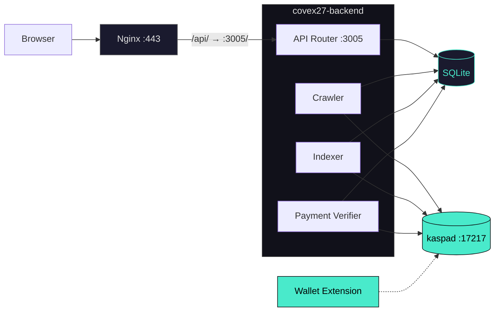
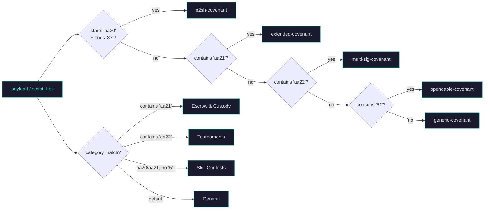

<div align="center">
  <br>
  <pre>
██████╗ ██████╗ ██╗   ██╗███████╗██╗  ██╗
██╔════╝██╔═══██╗██║   ██║██╔════╝╚██╗██╔╝
██║     ██║   ██║██║   ██║█████╗   ╚███╔╝
██║     ██║   ██║╚██╗ ██╔╝██╔══╝   ██╔██╗
╚██████╗╚██████╔╝ ╚████╔╝ ███████╗██╔╝ ██╗
 ╚═════╝ ╚═════╝   ╚═══╝  ╚══════╝╚═╝  ╚═╝
  </pre>

  <h3>Kaspa SilverScript Covenant Indexer — Toccata TN12</h3>

  <br>

  <p>
    <a href="https://github.com/THTProtocol/Covex27/blob/master/LICENSE"></a>
    <a href="https://hightable.pro"></a>
    <a href="https://hightable.pro/api/status"></a>
    <a href="#"></a>
  </p>

  <br>

  > **Live: [hightable.pro](https://hightable.pro)**
  >
  > Non-custodial indexing and interactive UI layer for native Kaspa SilverScript covenants.
  > One Rust binary. One SQLite database. Direct wRPC to your kaspad node.

  <br>

  ---

  **Built by HIGH TABLE PROTOCOL**

  <br>
</div>

---

## Overview

Covex crawls the Kaspa Toccata Testnet-12 BlockDAG for SilverScript covenants — native UTXO smart contracts identified by `aa20`–`aa23` opcodes embedded in transaction payloads. It discovers, classifies, and exposes covenants through a tier-weighted REST API with an interactive React/Tailwind frontend.

**Covex never holds keys, never signs on behalf of users, and never modifies on-chain covenant data.** The BlockDAG is the source of truth. Covex is the window.

Live at [hightable.pro](https://hightable.pro) backed by a `kaspad` Toccata TN12 full node on port 17217. Currently indexing 76 covenants.

---

## Architecture

A single Rust binary (Axum 0.7, Tokio 1) runs four concurrent tasks sharing one `KaspaRpcClient` wRPC connection and one SQLite database.



### Subsystems

**Historic Crawler** (`crawler.rs`): Walks the selected-parent chain backward from the virtual tip, up to 2,000 blocks per tick. Calls `get_block(hash, true)` for each parent to include full transaction data. Scans `tx.payload` (not output scripts) for `aa20`/`aa21`/`aa22`/`aa23` opcodes. Tier is determined from `tx.outputs[1]` — the second output must match the treasury P2PKH script and exceed threshold amounts (100/500/1,000 KAS). Checkpointed via `crawler_state.last_scanned_daa` per batch so restarts don't rescan.

**Live Indexer** (`indexer.rs`): Polls `get_utxos_by_addresses()` every 10 seconds for configured seed addresses. Filters out standard wallet outputs (P2PKH, Schnorr P2PK, P2SH) via `is_standard_output()`, then checks for covenant opcodes via `looks_like_covenant()`. Automatically triggers basic UI generation on each new covenant insert.

**Payment Verifier** (`payment_verifier.rs`): Monitors treasury UTXOs every 15 seconds. Matches `from_address` to `creator_addr` in the covenants table. After 6 DAA confirmations, upgrades the covenant record (sets `verified_tier`, `verified_payment_tx`, `full_logic_summary`, `custom_ui_enabled = 1`) and regenerates the enhanced UI with full disclosure fields.

**UI Generator** (`ui_generator.rs`): Produces self-contained HTML pages with embedded Kaspa wallet integration. Basic mode (FREE tier): red danger banner, limited disclosure. Enhanced mode (CREATOR/PRO/MAX): green verified banner, full logic summary, creator and receiving addresses.

**Native Visibility Engine**: The `get_all_covenants()` query uses a SQL `CASE` expression to sort covenants server-side:
```sql
ORDER BY CASE verified_tier
  WHEN 'MAX' THEN 100 WHEN 'PRO' THEN 50 WHEN 'CREATOR' THEN 10 ELSE 0
END DESC, timestamp DESC
```
The React frontend renders in the exact order returned — **never re-sorts**.

---

## Covenant Classification

Both the crawler and indexer classify every detected covenant. The crawler scans `tx.payload` hex; the indexer scans output script public key hex. Their classification logic is isomorphic:



| Classification | Detection Rule | Source |
|:---|:---|:---|
| `p2sh-covenant` | Payload starts `aa20` AND ends `87` | Crawler + Indexer |
| `extended-covenant` | Payload contains `aa21` | Crawler + Indexer |
| `multi-sig-covenant` | Payload contains `aa22` | Crawler + Indexer |
| `spendable-covenant` | Payload contains `51` | Indexer only |
| `generic-covenant` | No opcode match (fallback) | Crawler + Indexer |

Categories (stored in the `category` column):

| Category | Trigger | Status |
|:---|:---|:---|
| Escrow & Custody | Payload contains `aa21` | Active |
| Tournaments | Payload contains `aa22` | Active |
| Skill Contests | Payload contains `aa20`/`aa21` without `51` | Active |
| General | No match (fallback) | Active |
| Predictive Markets, Community Pools, Flash, Structured, Governance | — | Reserved |

---

## Pricing Tiers

Tier is determined **on-chain** by the amount in `tx.outputs[1]` sent to the treasury address. The payment verifier waits 6 DAA confirmations before upgrading the covenant record.

| | FREE | CREATOR | PRO | MAX |
|:---|:---:|:---:|:---:|:---:|
| **Price** | `0 KAS` | `100 KAS` | `500 KAS` | `1,000 KAS` |
| **Card neon glow** | — | — | Border | Border + pulse |
| **Expanded detail panel** | — | — | Partial | Full |
| **Interactive UI** | — | Yes | Yes | Yes |
| **Trust builder** | — | — | Yes | Yes |
| **Verified source badge** | — | — | Yes | Yes |
| **Developer notes** | — | — | Yes | Yes |
| **Interaction buttons** | — | — | Yes | Yes |
| **Custom branding** | — | — | — | Yes |

Treasury: `kaspatest:qpyfz03k6quxwf2jglwkhczvt758d8xrq99gl37p6h3vsqur27ltjhn68354m`

**Trust-verification builder**: PRO/MAX creators can link verified GitHub source URLs, publish developer safety notes, and define interactive button schemas — proving their covenant is auditable. The backend strictly enforces `wallet_address == on-chain creator_addr` before accepting configuration. Trust badges render on each covenant card in the Explorer.

---

## Technology Stack

| Layer | Technology | Purpose |
|:---|:---|:---|
| Node | `kaspad` v0.15 + `--netsuffix=12 --utxoindex` | Toccata Testnet-12 full node, wRPC Borsh on port 17217 |
| Backend | Rust (edition 2021) · Axum 0.7 · Tokio 1 | Async HTTP server, 4 concurrent tasks |
| wRPC | `kaspa-wrpc-client` 0.15 | Borsh-encoded WebSocket to kaspad |
| Database | SQLite via `rusqlite` 0.31 (bundled) | 6 tables, 15 indexes, `Arc<Mutex<Connection>>` |
| Hashing | SHA-256 (`sha2` 0.10) | Script hash computation (20-byte hex digest) |
| Signing | Vendored `kaspa-consensus-core` | Patched sighash for covenant payload hashing |
| Frontend | React 19 · Vite 8 · Tailwind CSS | Static SPA, no SSR |
| Styling | Custom CSS neon system | Glassmorphism panels, `.neon-card-*` classes, stagger animations |
| WASM | `@onekeyfe/kaspa-wasm` | TN12 dev mode — BIP39 key derivation, local tx signing |
| Reverse proxy | Nginx + Let's Encrypt | TLS termination, `/api/` → `:3005/` proxy, SPA fallback |
| Deploy | systemd + bash | `kaspad-toccata.service`, `covex-backend.service`, idempotent deploy scripts |

---

## API Reference

All endpoints return JSON. Nginx strips the `/api/` prefix before forwarding.

| Method | Path | Description |
|:---|:---|:---|
| `GET` | `/` | Status: `{"status":"ok","app":"Covex v1.0.0","network":"testnet-12"}` |
| `GET` | `/health` | Plain text `OK` for uptime monitors |
| `GET` | `/covenants` | Tier-sorted array. Each record: `tx_id`, `address`, `amount_kaspa`, `script_hash`, `script_hex`, `covenant_type`, `category`, `creator_addr`, `verified_tier`, `full_logic_summary`, `block_daa_score`, `timestamp`, `ui_config`, `trust_config`, `has_verified_source` |
| `GET` | `/status` | `{"total_covenants":N,"active_covenants":N,"verified_covenants":N,"node_connected":true}` |
| `GET` | `/tiers` | Four tier definitions: EXPLORER, CREATOR, PRO, MAX with pricing, features, and color codes |
| `POST` | `/covenants/:id/ui-config` | **Secured.** Saves trust config (source URL, notes, interaction schema). Validates `creator_addr` match and PRO/MAX tier |
| `GET` | `/covenants/:id/trust-config` | Returns saved trust configuration for a covenant, or `null` |
| `POST` | `/broadcast` | Broadcast signed tx hex via wRPC. Returns `tx_id`. Zero DB writes |
| `POST` | `/sign-and-broadcast` | Rust-native tx builder + signer. Accepts `private_key_hex`, `deployer_addr`, `script_hex`, `tier`. Broadcasts via wRPC |
| `GET` | `/utxos/:address` | Fetch UTXOs from kaspad |
| `GET` | `/balance/:address` | Fetch balance from kaspad |

---

## Wallet Integration

8 wallet providers detected via `window.*` globals using the THTProtocol/27 pattern:

| Wallet | Detection | Platform |
|:---|:---|:---|
| KasWare | `window.kasware` | Desktop |
| Kastle | `window.kastle` | Desktop |
| Kasperia | `window.kasperia` | Desktop |
| OKX | `window.okxwallet.kaspa` | Desktop + Mobile |
| KaspaCom | `window.kaspa.connect` | Desktop + Mobile |
| Kasanova | `window.kasanova` | Mobile |
| Kaspium | `window.kaspium` | Mobile |
| Tangem | `window.tangem` | Mobile |

A 200ms-retry loop over 5 seconds handles the wallet extension injection race condition.

**TN12 Dev Mode**: BIP39 mnemonic → `Mnemonic.fromPhrase()` → `.toSeed('')` → `XPrv` → `derivePath("m/44'/111111'/0'/0/0")` → `toAddress('testnet-12')`. All signing is local — no browser extension required.

---

## Quick Start

```bash
# Toccata node (bootstrap ~6–8 min)
kaspad --testnet --netsuffix=12 --utxoindex \
  --appdir=/mnt/covex-data/kaspa-data/tn12 \
  --rpclisten-borsh=0.0.0.0:17217

# Environment
export KASPA_NETWORK=testnet-12
export KASPA_WRPC_URL=ws://127.0.0.1:17217
export BIND_ADDR=0.0.0.0:3005
export DB_PATH=covex.db
export COVENANT_TREASURY_ADDRESS=kaspatest:qpyfz03k6quxwf2jglwkhczvt758d8xrq99gl37p6h3vsqur27ltjhn68354m

# Backend
cd backend && cargo build --release && ./target/release/covex27-backend

# Frontend
cd frontend && npm install && npm run build
# Serve dist/ via Nginx or any static server
```

### Deploy scripts

```bash
bash deploy/deploy-hetzner.sh   # Fresh install
bash deploy/deploy_all.sh       # Production update (idempotent)
```

---

## Database

Six tables, auto-created on first start by `db::open_db()`.

```
covenants                     generated_uis               visibilities
├─ tx_id (PK)                 ├─ id (PK, AUTO)            ├─ covenant_id (PK)
├─ address                    ├─ covenant_id              ├─ tier
├─ amount_kaspa               ├─ owner_address            ├─ featured
├─ script_hash                ├─ tier                     ├─ priority
├─ script_hex                 ├─ ui_html                  └─ custom_domain
├─ covenant_type              ├─ ui_config
├─ category                   ├─ slug (UNIQUE)            crawler_state
├─ creator_addr               ├─ is_published             ├─ id (PK, CHECK=1)
├─ description                ├─ featured                 └─ last_scanned_daa
├─ verified_tier              └─ ui_generated_at
├─ verified_payment_tx
├─ verified_at                payments
├─ custom_ui_enabled          ├─ id (PK, AUTO)
├─ full_logic_summary         ├─ tx_id (UNIQUE)
├─ receiving_addresses        ├─ from_address
├─ is_active                  ├─ to_address
├─ block_daa_score            ├─ amount_sompi
└─ timestamp                  ├─ tier
                              ├─ confirmations
accounts                      ├─ status
├─ address (PK)               ├─ covenant_id
├─ tier                       └─ timestamp
├─ payment_tx_id
├─ paid_at
├─ expires_at
├─ is_active
└─ created_at
```

---

## Repository

```
Covex27/
├── backend/
│   ├── Cargo.toml                       # Rust deps, vendored kaspa-consensus-core patch
│   └── src/
│       ├── main.rs                      # Entry point, Axum router, 11 endpoints
│       ├── covenant_types.rs            # Enums, tiers, pricing, UI config structs
│       ├── crawler.rs                   # Historic BlockDAG walker (selected-parent chain)
│       ├── db.rs                        # SQLite schema, CRUD, tier-weighted sort, trust config
│       ├── indexer.rs                   # Live UTXO poller + auto basic UI generation
│       ├── payment_verifier.rs          # Treasury monitor, 6-confirmation upgrades, UI regeneration
│       ├── ui_generator.rs              # Basic & enhanced HTML UI with wallet integration
│       ├── signer.rs                    # Rust-native tx builder + signer (covenant payloads)
│       ├── broadcast.rs                 # Tx relay — broadcast only, zero DB writes
│       └── dev_wallets.rs              # Dev wallet identities for testing
├── frontend/
│   └── src/
│       ├── pages/
│       │   ├── Explorer.jsx             # Covenant browser — native sort, tier badges, trust signals
│       │   ├── CovenantInteractive.jsx  # Detail view — interact/trust/builder tabs, upgrade flow
│       │   ├── Deploy.jsx               # SilverScript deployment — WASM tx builder, tier selector
│       │   ├── Pricing.jsx              # Tier pricing with checkout flow
│       │   ├── Dashboard.jsx            # Creator dashboard
│       │   └── Terms.jsx                # Terms of service
│       └── components/
│           ├── WalletContext.jsx         # Wallet state + TN12 mnemonic dev mode
│           ├── WalletButton.jsx          # Multi-wallet detect + connect UI
│           ├── DevWalletModal.jsx        # BIP39 mnemonic / hex key derivation
│           ├── UiBuilder.jsx             # Trust-verification builder (source, notes, buttons)
│           ├── PremiumBuilder.jsx        # Gated UI customization (glow, layout, color)
│           ├── DagBackground.jsx         # Live BlockDAG iframe background
│           └── WhatIsKaspa.jsx           # Educational Kaspa overview
├── deploy/
│   ├── deploy-hetzner.sh                # Fresh deployment
│   ├── deploy_all.sh                    # Production update (idempotent)
│   ├── covex-backend.service            # systemd unit template
│   └── nginx-covex.conf                 # Nginx reverse proxy config
├── scripts/
│   └── generate_covex_health_report.sh  # Production health diagnostic
├── .env                                  # Local environment
└── README.md
```

---

<p align="center">
  <br>
  <a href="https://hightable.pro"><strong>hightable.pro</strong></a>
  <br>
  <br>
</p>

---

## License

MIT

---

<div align="center">
  <br>
  <strong>Covex</strong> — Built by <strong>HIGH TABLE PROTOCOL</strong> for the Kaspa ecosystem.
  <br>
  Toccata is coming. The window is open.
  <br>
</div>
