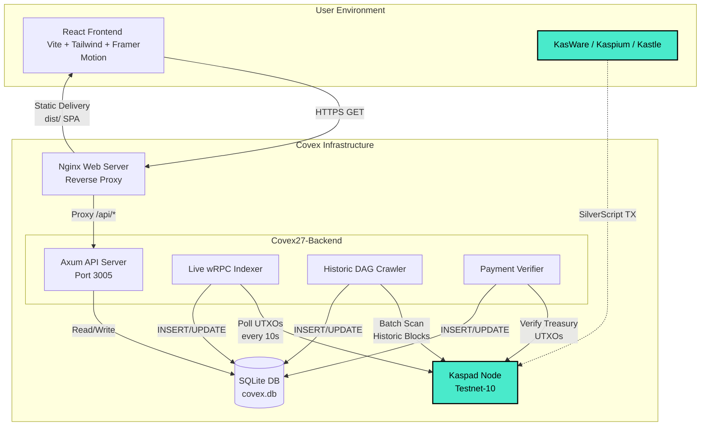

<div align="center">
  <br />

  ```
   ██████╗  ██████╗ ██╗   ██╗███████╗██╗  ██╗
  ██╔════╝ ██╔═══██╗██║   ██║██╔════╝╚██╗██╔╝
  ██║      ██║   ██║██║   ██║█████╗   ╚███╔╝
  ██║      ██║   ██║╚██╗ ██╔╝██╔══╝   ██╔██╗
  ╚██████╗ ╚██████╔╝ ╚████╔╝ ███████╗██╔╝ ██╗
   ╚═════╝  ╚═════╝   ╚═══╝  ╚══════╝╚═╝  ╚═╝
  ```

  <h2>Covex — The Stateful Kaspa Covenant Indexer 🪟</h2>

  > **DAG is the truth. Covex is the window.**

  [](https://rust-lang.org)
  [](https://kaspa.org)
  [](https://github.com/THTProtocol/Covex27)
  [](https://sqlite.org)
  [](https://react.dev)
  [](LICENSE)

  <br />

  ```
  Index. Discover. Customize. All on the BlockDAG.
  ```

  <br />

</div>

---

## What is Covex?

Covex is a **production-grade covenant indexer and SaaS platform** built exclusively for the
[Kaspa BlockDAG](https://kaspa.org). It continuously discovers SilverScript covenant UTXOs by
connecting directly to a Kaspa wRPC node, persisting them in a local SQLite database, and
serving a premium glass-morphism React frontend with a payment-gated interactive UI Builder.

Currently operating on **Kaspa Testnet-10 (TN10)** with a full historic crawl-and-index pipeline.

> Covex does not **create** covenants — the DAG does. Covex **indexes** them and generates
> interactive, customizable user interfaces so anyone can browse, interact with, and deploy
> SilverScript smart contracts on the fastest proof-of-work network in the world.

---

## Core Features

- **Historic BlockDAG Crawler** — A dedicated background task walks the selected-parent DAG
  lineage from tip to genesis, scanning every block for covenant script opcodes (`aa20`–`aa23`).
  State is checkpointed in SQLite — survives node restarts and resumes from the last scanned
  DAA score automatically.

- **Live Mempool Indexer** — Direct wRPC connection to `kaspad` for real-time covenant
  detection. Polls seed addresses every 10 seconds and classifies new UTXOs by covenant type
  (P2SH, extended, multi-sig, spendable). Auto-generates basic interactive UIs for every
  discovered covenant.

- **Payment-Gated SaaS UI Builder** — Tiered one-time KAS payments unlock increasing levels
  of customization: **Creator** (100 KAS) unlocks full disclosure + verified badge + basic
  builder; **PRO** (500 KAS) adds featured placement + advanced tools; **MAX** (1,000 KAS)
  grants top placement + custom branding + full design suite.

- **On-Chain Payment Verifier** — Monitors the treasury address via wRPC, matches incoming
  UTXOs to covenant creator addresses, auto-upgrades covenant records after 6 DAA confirmations,
  and regenerates enhanced UIs with full disclosure fields.

- **Non-Custodial Wallet Integration** — KasWare, Kaspium, Kastle, Kaspa Web, Kasanova, and
  KDX all supported with inline SVG logos. URI deep-link fallback for wallets without browser
  injection. QR code generation for every payment flow. Keys never leave the user's wallet.

- **Oracle-Ready Architecture** — Designed to handle DLC (Discreet Log Contract) signatures
  for predictive market settlement. The payment verifier and indexer infrastructure is
  structured to support multi-sig oracle paths and covenant-based escrow resolution.

---

## Architecture



### Data Flow

1. **Kaspad** exposes a wRPC Borsh endpoint on `0.0.0.0:17110`.
2. **Historic Crawler** walks the selected-parent chain backward from the virtual tip,
   fetching blocks and inspecting `scriptPublicKey` fields for covenant opcodes.
3. **Live Indexer** polls seed addresses for new UTXOs every 10 seconds.
4. **Payment Verifier** monitors the treasury address — when a UTXO with ≥6 confirmations
   appears, it matches the `from_address` to a covenant's `creator_addr` and triggers
   a tier upgrade + enhanced UI regeneration.
5. **Axum API Server** serves `/covenants`, `/status`, and `/tiers` endpoints backed by
   SQLite reads.
6. **Nginx** reverse-proxies `/api/*` to Axum and serves the React SPA from `frontend/dist/`.
7. **React Frontend** consumes the API, renders the covenant explorer, pricing page,
   interactive covenant detail views, and the payment-gated UI Builder.

---

## Technology Stack

| Component   | Technology              | Purpose                                              |
|-------------|-------------------------|------------------------------------------------------|
| Node        | `kaspad` v1.1.1-toc.1   | Full Kaspa node with UTXO index and wRPC Borsh       |
| Backend     | Rust 1.80 + Axum 0.7    | Async API server, indexer, crawler, payment verifier |
| DB          | SQLite (`rusqlite` 0.31)| Persistent covenant store, crawler checkpoint, UIs   |
| Frontend    | React 19 + Vite 8 + Tailwind v4 | Glass-morphism SPA with Framer Motion       |
| Proxy       | Nginx 1.24              | Static file delivery + reverse proxy to Axum         |
| wRPC Client | `kaspa-wrpc-client` 0.15 | Borsh-encoded RPC to kaspad                        |
| Indexer     | Custom Rust loop        | DAG walking (historic) + UTXO polling (live)         |
| Diagrams    | Mermaid.js              | Architecture visualization in documentation          |

---

## Node Requirements

Covex requires a full Kaspa node with **UTXO index** and **wRPC Borsh** enabled.
The exact launch command for Testnet-10:

```bash
kaspad \
  --testnet \
  --utxoindex \
  --rpclisten=0.0.0.0:16110 \
  --listen=0.0.0.0:16111 \
  --rpclisten-borsh=0.0.0.0:17110
```

> **Critical:** The `--utxoindex` flag is mandatory — without it, the indexer cannot
> resolve script public keys. The `--rpclisten-borsh` flag opens the WebSocket port
> that Covex's `kaspa-wrpc-client` connects to.

---

## Quick Start

### Prerequisites

- Rust toolchain 1.80+
- Node.js 20+
- A synced Kaspa node with wRPC Borsh enabled (see above)

### Environment Configuration

Copy and configure the environment file:

```bash
cp deploy/.env.production .env
```

```bash
# .env
KASPA_NETWORK=testnet-10
KASPA_WRPC_URL=ws://127.0.0.1:17110
BIND_ADDR=0.0.0.0:3005
DB_PATH=../covex.db
COVENANT_TREASURY_ADDRESS=kaspatest:qpyfz03k6quxwf2jglwkhczvt758d8xrq99gl37p6h3vsqur27ltjhn68354m
CRAWL_START_DAA=1
RUST_LOG=covex27_backend=info,kaspa_wrpc=warn
```

### Build

```bash
# Backend
cd backend
cargo build --release

# Frontend
cd frontend
npm install
npm run build     # outputs to frontend/dist/
```

### Run

```bash
# Backend (from project root)
./backend/target/release/covex27-backend &

# Frontend dev server (optional — nginx serves dist/ in production)
cd frontend && npm run dev
```

### Production Deployment

For Hetzner VPS deployment, use the provided scripts:

```bash
sudo deploy/deploy-hetzner.sh      # Full setup: nginx, systemd, build
sudo systemctl restart covex-backend
sudo systemctl reload nginx
```

---

## API Reference

All endpoints are served by the Axum backend and proxied through Nginx at `/api/*`.

| Method | Endpoint       | Response                                                    |
|--------|----------------|-------------------------------------------------------------|
| `GET`  | `/health`      | `"OK"`                                                      |
| `GET`  | `/status`      | `{"total_covenants": N, "active_covenants": N, ...}`       |
| `GET`  | `/covenants`   | `{"total": N, "covenants": [...]}` — all indexed covenants  |
| `GET`  | `/tiers`       | `{"tiers": [...]}` — pricing tier definitions               |

Example:

```bash
curl -s https://hightable.pro/api/covenants | jq '.total'
# 4
```

---

## Pricing Tiers

| Tier     | Cost      | Key Features                                                      |
|----------|-----------|-------------------------------------------------------------------|
| Explorer | Free      | Browse all covenants, basic read-only view, limited disclosure     |
| Creator  | 100 KAS   | Full disclosure, verified badge, interactive UI Builder           |
| PRO      | 500 KAS   | Featured placement, advanced UI tools, covenant images, priority  |
| MAX      | 1,000 KAS | Top placement, custom branding, full design suite, custom domain  |

> All payments are **one-time**, processed on-chain via the Kaspa treasury address,
> and verified with 6 DAA confirmations. No subscriptions. No recurring charges.

---

## Security

- **No private key storage** — Covex never accesses, stores, or transmits user keys.
- **Client-side signing** — All transactions are signed in the user's own wallet application.
- **Zero trust payment verification** — Every payment is confirmed directly on the DAG
  via wRPC UTXO inspection.
- **Immutable covenant deployments** — Once deployed to the Kaspa BlockDAG, covenant
  scripts are permanent and cannot be altered.
- **Checkpointed persistence** — The historic crawler persists its progress to SQLite
  on every tick; node restarts never lose scan position.

---

## License

Covex is released under the MIT License. See [LICENSE](LICENSE).

---

```
Covex v1.0.0 — Production Deployment
Live on Kaspa Testnet-10 (hightable.pro)
Rust + Axum + SQLite + React + Nginx
Historic crawler. Live indexer. Payment verifier. UI Builder.
DAG is the truth. Covex is the window.
```
