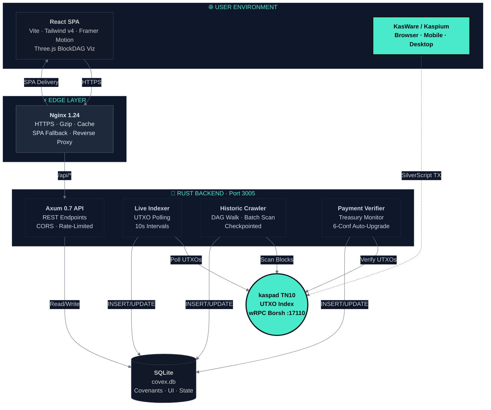
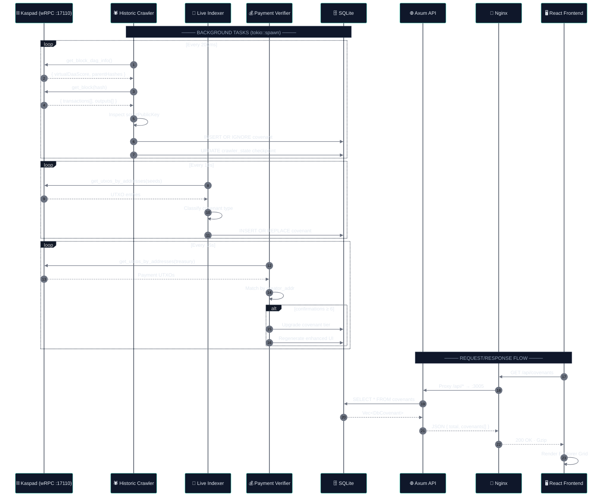

<div align="center">


<!--  Fallback  ASCII  for  non-image  renderers  -->
<pre style="color:#49EACB;line-height:1.2;font-size:12px;letter-spacing:2px;display:none">
   ▄▄▄▄▄▄▄▄        ▄▄▄▄▄▄▄▄     ▄▄   ▄▄  ▄▄▄▄▄▄▄▄▄▄  ▄▄   ▄▄  ▄▄  ▄▄  ▄▄
  ▄█▀▀▀▀▀▀▀██      ▄█▀▀▀▀▀███    ████  ██  ██▀▀▀▀▀▀▀▀  ██   ██  ██  ██  ██
  ██▄            ▄█▀     ███   ██ ██ ██  ██           ██   ██   ██▄██  ██
  ▀█████████▄    ██      ▀██  ██  ██ ██  ██████████▄  ▀██▄██▀    ▀██▀   ██
    ▀▀▀▀▀▀██▄    ██▄     ██  █████████  ██▀▀▀▀▀▀▀▀    ▀██▀           ██
  ▄       ██▀    ▀████████▀   ▀██████▀   ▀██████████    ██            ██
  ▀████████▀       ▀▀▀▀▀▀      ▀▀▀▀▀      ▀▀▀▀▀▀▀▀    ▀▀            ▀▀
</pre>

<br />

<h2 style="color:#49EACB;font-weight:800;letter-spacing:4px;text-transform:uppercase;margin:0">
  Covex
</h2>
<h3 style="color:#8B9DB5;font-weight:400;margin:4px 0 0 0">
  The Stateful Kaspa Covenant Indexer
</h3>

<br />

> **DAG is the truth. &ensp;Covex is the window.**

<br />

<p align="center">
  <a href="https://rust-lang.org"></a>
  <a href="https://kaspa.org"></a>
  <a href="https://github.com/THTProtocol/Covex27/actions"></a>
  <a href="https://sqlite.org"></a>
  <a href="https://react.dev"></a>
  <a href="LICENSE"></a>
</p>

<br />

```
   Index  →  Discover  →  Customize  →  Deploy   •   All on the BlockDAG.
```

</div>

---

## 🪟 &nbsp; What is Covex?

Covex is a **production-grade covenant indexer and SaaS platform** built exclusively for the
[Kaspa BlockDAG](https://kaspa.org). It continuously discovers SilverScript covenant UTXOs by
connecting directly to a Kaspa wRPC node, persisting them in a local SQLite database, and
serving a premium glass-morphism React frontend with a **payment-gated interactive UI Builder**.

Currently live on **Kaspa Testnet-10 (TN10)** at [hightable.pro](https://hightable.pro)
with a full historic crawl-and-index pipeline operating at 10 BPS.

> **Covex does not *create* covenants — the DAG does.**
> Covex **indexes** them and generates interactive, customizable user interfaces so anyone
> can browse, interact with, and deploy SilverScript smart contracts on the fastest
> proof-of-work network in the world.

---

## ⚙️ &nbsp; Core Features

<table>
<tr>
<td width="50%">

### 🔍 &nbsp; Historic BlockDAG Crawler
Walks the selected-parent DAG lineage from tip to genesis, scanning every block
for covenant script opcodes (`aa20`–`aa23`). State is checkpointed in SQLite every
tick — survives node restarts and auto-resumes from the last scanned DAA score.

### ⚡ &nbsp; Live Mempool Indexer
Direct wRPC connection to `kaspad` for real-time covenant detection. Polls seed
addresses every 10 seconds, classifies new UTXOs by type (P2SH, extended, multi-sig,
spendable), and auto-generates basic interactive UIs for every discovered covenant.

### 🎨 &nbsp; Payment-Gated UI Builder
One-time KAS payments unlock progressive customization tiers. Live preview panel
with color swatches, layout toggles, title/description overrides, button styling,
and component toggles. Configuration persists in `localStorage` and publishes
instantly.

</td>
<td width="50%">

### 💰 &nbsp; On-Chain Payment Verifier
Monitors the treasury address via wRPC, matches incoming UTXOs to covenant creator
addresses, auto-upgrades covenant records after 6 DAA confirmations, and regenerates
enhanced UIs with full disclosure fields — all zero-trust.

### 🔐 &nbsp; Non-Custodial Wallet Suite
Inline SVG logos for KasWare, Kaspium, Kastle, Kaspa Web, Kasanova, and KDX.
URI deep-link fallback for wallets without browser injection. QR code generation
for every payment flow. **Keys never leave the user's wallet.**

### 🔮 &nbsp; Oracle-Ready Architecture
Designed to handle DLC (Discreet Log Contract) signatures for predictive market
settlement. Multi-sig oracle paths and covenant-based escrow resolution are
first-class architectural concerns — not afterthoughts.

</td>
</tr>
</table>

---

## 🏗️ &nbsp; Architecture



<br />

### 📊 &nbsp; Data Flow Sequence



---

## 🔧 &nbsp; Technology Stack

| Layer | Technology | Purpose |
|:------|:-----------|:--------|
| **Node** | `kaspad` v1.1.1-toc.1 | Full Kaspa node — UTXO index + wRPC Borsh + Toccata hard-fork support |
| **Runtime** | Rust 1.80 (edition 2021) | Zero-cost abstractions, async I/O, memory safety |
| **Framework** | Axum 0.7 + Tokio | High-performance async HTTP with extractors and layers |
| **Database** | SQLite 3 (`rusqlite` 0.31) | Embedded, zero-config, bundled — perfect for single-node deployments |
| **wRPC** | `kaspa-wrpc-client` 0.15.0 | Borsh-encoded WebSocket RPC — 100× faster than JSON |
| **Frontend** | React 19 + Vite 8 + Tailwind v4 | Glass-morphism UI with Framer Motion animations |
| **3D** | Three.js via `<iframe>` | Live BlockDAG particle visualization from `kgi.kaspad.net` |
| **Proxy** | Nginx 1.24 | TLS termination, Gzip compression, SPA fallback, reverse proxy |
| **Infra** | systemd + PM2 | Process supervision with auto-restart and log rotation |
| **CI/CD** | Git + `deploy-hetzner.sh` | Single-command Hetzner VPS deployment |

---

## 🚀 &nbsp; Node Requirements

Covex requires a full Kaspa node with **UTXO index** and **wRPC Borsh** enabled.
The exact launch command for Testnet-10:

```bash
kaspad \
  --testnet                             \
  --utxoindex                           \
  --rpclisten=0.0.0.0:16110             \
  --listen=0.0.0.0:16111                \
  --rpclisten-borsh=0.0.0.0:17110
```

> **⚠️ &nbsp; Critical:** The `--utxoindex` flag is mandatory — without it the indexer cannot
> resolve script public keys. The `--rpclisten-borsh` flag opens the WebSocket port that
> Covex's `kaspa-wrpc-client` connects to.

---

## ⚡ &nbsp; Quick Start

### Prerequisites

| Tool | Version | Check |
|:-----|:--------|:------|
| Rust | 1.80+ | `rustc --version` |
| Node.js | 20+ | `node --version` |
| kaspad | 1.1.1-toc.1 | `kaspad --version` |

### Build & Deploy

```bash
# 1. Clone
git clone https://github.com/THTProtocol/Covex27.git && cd Covex27

# 2. Configure
cp deploy/.env.production .env

# 3. Build backend (release)
cd backend && cargo build --release

# 4. Build frontend (production bundle)
cd ../frontend && npm install && npm run build

# 5. Start backend
cd .. && ./backend/target/release/covex27-backend &

# 6. Serve frontend (dev) or rely on nginx (production)
cd frontend && npm run dev    # → http://localhost:5173
```

### Production (Hetzner VPS)

```bash
sudo deploy/deploy-hetzner.sh
sudo systemctl restart covex-backend
sudo systemctl reload nginx
```

---

## 📡 &nbsp; API Reference

All endpoints served by Axum on `:3005`, proxied by Nginx at `/api/*`.

| Method | Endpoint | Response |
|:-------|:---------|:---------|
| `GET` | `/health` | `"OK"` |
| `GET` | `/status` | `{"total_covenants":N, "active_covenants":N, "verified_covenants":N, ...}` |
| `GET` | `/covenants` | `{"total":N, "covenants":[...]}` — full indexed covenant list |
| `GET` | `/tiers` | `{"tiers":[...]}` — Explorer/Creator/PRO/MAX definitions |

```bash
# Live example
curl -s https://hightable.pro/api/covenants | jq '.total'
# → 4
```

---

## 💎 &nbsp; Pricing Tiers

| Tier | Cost | Features |
|:-----|:-----|:---------|
| 🔍 &nbsp; **Explorer** | **Free** | Browse all covenants · read-only view · limited disclosure · danger banner |
| 🎨 &nbsp; **Creator** | **100 KAS** | Full disclosure · verified badge · interactive UI Builder · standard listing |
| ⭐ &nbsp; **PRO** | **500 KAS** | Featured placement · advanced UI tools · covenant images · priority indexing |
| 👑 &nbsp; **MAX** | **1,000 KAS** | Top placement · custom branding · full design suite · custom domain embedding |

> 💡 &nbsp; All payments are **one-time** and **non-custodial**. Processed on the DAG via the
> treasury address, verified with 6 DAA confirmations. No subscriptions. No recurring charges.

---

## 🔒 &nbsp; Security

| Principle | Implementation |
|:----------|:---------------|
| **Zero key exposure** | Covex never accesses, stores, or transmits private keys — all signing happens in-user wallet |
| **Client-side signing** | Transactions signed locally via KasWare/Kaspium/Kastle browser injection or URI deep-link |
| **On-chain verification** | Every payment confirmed directly on the BlockDAG via wRPC UTXO inspection — no off-chain trust |
| **Immutable deployment** | Covenant scripts are permanent once confirmed — no administrative override possible |
| **Checkpointed resilience** | Crawler persists DAA scan position to SQLite on every tick — node restarts never lose progress |
| **Transparency tiers** | FREE tier shows DANGER banner with limited disclosure; paid tiers unlock full verified fields |

---

## 📄 &nbsp; License

Covex is released under the **MIT License**. See [LICENSE](LICENSE) for full terms.

<br />

<div align="center">

```
╔══════════════════════════════════════════════════════════════╗
║  Covex v1.0.0  ·  Live on Kaspa Testnet-10  ·  hightable.pro  ║
║  Rust + Axum + SQLite + React + Nginx + systemd              ║
║  Crawler · Indexer · Verifier · Builder · API                ║
║                                                              ║
║  DAG is the truth.  Covex is the window.                     ║
╚══════════════════════════════════════════════════════════════╝
```

</div>
