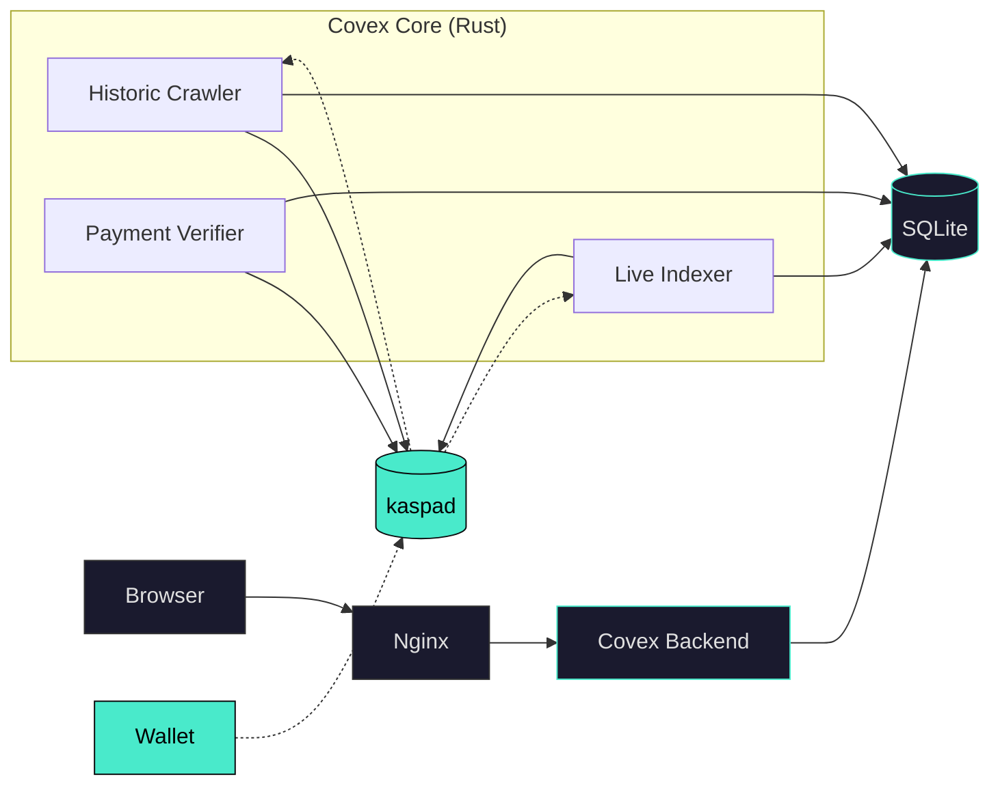

# Covex

**The Stateful Kaspa Covenant Indexer and SaaS Platform**

```
 ██████╗ ██████╗ ██╗   ██╗███████╗██╗  ██╗
██╔════╝██╔═══██╗██║   ██║██╔════╝╚██╗██╔╝
██║     ██║   ██║██║   ██║█████╗   ╚███╔╝
██║     ██║   ██║╚██╗ ██╔╝██╔══╝   ██╔██╗
╚██████╗╚██████╔╝ ╚████╔╝ ███████╗██╔╝ ██╗
 ╚═════╝ ╚═════╝   ╚═══╝  ╚══════╝╚═╝  ╚═╝
```

> **DAG is the truth. Covex is the window.**  
> Index -- Discover -- Customize -- Deploy. All on the BlockDAG.

---

## Overview

Covex is a high-performance, non-custodial indexer and interactive UI platform for Kaspa's native UTXO smart contracts (Covenants). Built in Rust and React, Covex abstracts the complexity of SilverScript compilation, BlockDAG traversal, and wRPC protocol handling into a seamless, API-driven frontend experience.

Covex does not create, modify, or custody any on-chain covenant. It indexes publicly available data from the Kaspa BlockDAG and generates optional interactive UIs for verified creators. All keys remain in the user's wallet.

### Network Support

| Network | Status | wRPC Port | Address Prefix |
|---------|--------|-----------|----------------|
| Testnet-10 | Live | 17110 | `kaspatest:` |
| Mainnet | Toccata-ready | 16110 | `kaspa:` |

The backend is architected for a zero-code network switch. Change one environment variable and restart to target Mainnet when the Toccata hardfork activates native covenant support on the production chain.

---

## Architecture

Covex runs as three concurrent subsystems inside a single Rust binary, connected to a local kaspad full node via wRPC (WebSocket RPC). All state persists in a local SQLite database for zero-dependency operation.



### Subsystem Detail

#### 1. Historic BlockDAG Crawler (`crawler.rs`)

Walks the selected-parent chain backward from the virtual tip, scanning each block for covenant UTXOs. Classifies scripts by opcode prefix and persists findings to the `covenants` table.

- **Checkpointing**: Survives restarts via `crawler_state.last_scanned_daa`
- **Pacing**: 500 blocks per tick, 200ms cooldown between ticks
- **Classification**: Differentiates `aa20` (P2SH covenant), `aa21` (extended), `aa22` (multi-sig) opcode sequences
- **Deduplication**: SQLite `INSERT OR REPLACE` with UNIQUE constraint on `tx_id`

#### 2. Live Indexer (`indexer.rs`)

Polls seed covenant addresses every 10 seconds for new UTXOs. On every successful insertion, spawns a background tokio task that auto-generates a basic interactive UI via `ui_generator.rs` and stores the HTML in `generated_uis`.

- Category assignment via `CovenantCategory::from_script_ops()`
- Fire-and-forget UI generation with parameter extraction
- Designed for 10+ BPS throughput under Toccata

#### 3. Payment Verifier (`payment_verifier.rs`)

Monitors the Covex treasury address for incoming KAS payments. Matches payments to covenants by `from_address == creator_addr`. When a payment reaches 6 confirmations, upgrades the covenant record to full disclosure and triggers enhanced UI regeneration.

- **Confirmation threshold**: 6 blocks
- **Tier detection**: `tier_from_amount()` maps KAS amounts to CREATOR (100), PRO (500), MAX (1000)
- **Post-upgrade actions**: Upgrade account tier, upgrade covenant record with full logic summary, regenerate UI with verified badge, set visibility priority

---

## Technology Stack

| Layer | Technology | Purpose |
|-------|-----------|---------|
| Node | kaspad | Full BlockDAG node, wRPC provider |
| Backend | Rust 2021 + Axum 0.7 + Tokio | High-concurrency indexer, REST API, background workers |
| wRPC Client | kaspa-wrpc-client 0.15 | Borsh-encoded WebSocket RPC to kaspad |
| Database | SQLite (rusqlite, bundled) | Zero-dependency local persistence, 7 tables with 15 indices |
| Frontend | React 18 + Vite + Tailwind CSS | Responsive SPA with Kaspa-green theming |
| Reverse Proxy | Nginx | Routes `/` to static build, `/api/*` to Axum backend |
| Process Manager | systemd | Production service with auto-restart and env file support |
| Hashing | SHA-256 + Blake2b | Script hash computation for covenant identity |
| Serialization | Borsh (wRPC) + JSON (API) | Binary wire protocol + human-readable REST |

---

## Database Schema

The SQLite database contains 7 tables with 15 indices for query performance.

```
covenants           -- Primary: indexed covenant records (tx_id PK, 19 columns)
payments            -- Incoming tier payments (tx_id UNIQUE, 10 columns)
accounts            -- User accounts by address (address PK, 7 columns)
generated_uis       -- Auto-generated interactive UI HTML (10 columns, indexed by covenant_id)
visibilities        -- Search ranking and featured placement (5 columns)
crawler_state       -- Crawler checkpoint (singleton, last_scanned_daa)
```

Key indices: `address`, `covenant_type`, `category`, `timestamp`, `is_active`, `verified_tier`, `creator_addr`, `featured`, `slug`.

---

## API Reference

All endpoints served at `http://<host>:3005`. In production, Nginx proxies `/api/*` to this port.

| Method | Path | Description | Auth |
|--------|------|-------------|------|
| GET | `/` | Root status: version, network | None |
| GET | `/health` | Health check (returns `OK`) | None |
| GET | `/covenants` | List all active covenants with full metadata | None |
| GET | `/status` | Indexer status: total/active/verified counts | None |
| GET | `/tiers` | Pricing tier definitions with features | None |

### Response: `/status`

```json
{
  "status": "ok",
  "network": "testnet-10",
  "node_connected": true,
  "total_covenants": 4,
  "active_covenants": 4,
  "verified_covenants": 4,
  "message": "Indexer active"
}
```

### Response: `/covenants`

Returns `{ total, covenants: [...] }` where each covenant includes: `tx_id`, `address`, `amount_kaspa`, `script_hash`, `script_hex`, `covenant_type`, `category`, `creator_addr`, `description`, `verified_tier`, `custom_ui_enabled`, `full_logic_summary`, `is_active`, `block_daa_score`, `timestamp`.

### Response: `/tiers`

```json
{
  "tiers": [
    { "name": "EXPLORER", "price_kas": 0, "features": ["Browse all indexed covenants", ...] },
    { "name": "CREATOR",  "price_kas": 100, "features": ["Full disclosure", "Verified badge", ...] },
    { "name": "PRO",      "price_kas": 500, "features": ["Featured listing", "Priority queue", ...] },
    { "name": "MAX",      "price_kas": 1000, "features": ["Custom domain", "Top placement", ...] }
  ]
}
```

---

## Pricing Tiers

One-time KAS payment. No subscriptions. No recurring charges. Your covenant gets a permanent interactive UI and visibility boost.

| Tier | Price | Confirmation | Disclosure | UI | Visibility |
|------|-------|-------------|------------|----|-----------|
| EXPLORER | Free | None | Limited (tx_id, hash, amount) | Basic + danger banner | Standard |
| CREATOR | 100 KAS | 6 blocks | Full (all fields, logic summary) | Enhanced + verified badge | Standard |
| PRO | 500 KAS | 6 blocks | Full | Enhanced + featured placement | Priority + featured |
| MAX | 1,000 KAS | 6 blocks | Full | Enhanced + custom domain | Top placement |

Payment flow: Send KAS from your creator address to the Covex treasury. The payment verifier detects the UTXO, matches it to your covenant by creator address, waits 6 confirmations, then upgrades your record and regenerates your UI.

---

## Covenant Classification

Covenants are detected by scanning UTXO script public keys for opcode prefixes. Classification happens at two levels.

### Type Classification (script structure)

| Prefix | Type | Description |
|--------|------|-------------|
| `aa20` + `87` suffix | `p2sh-covenant` | Standard P2SH covenant |
| `aa21` | `extended-covenant` | Extended covenant with additional opcodes |
| `aa22` | `multi-sig-covenant` | Multi-signature covenant |
| `51` present | `spendable-covenant` | Spendable/payable covenant |
| Other `aa*` patterns | `generic-covenant` | Unknown covenant variant |

### Category Classification (use case)

| Category | Matching Pattern | Use Case |
|----------|-----------------|----------|
| Skill Contests | `aa20`/`aa21` with default path | Competitive skill-based contests |
| Predictive Markets | Specific script patterns | Oracle-driven prediction markets |
| Escrow & Custody | `aa21` prefix | Time-locked escrow and custody |
| Tournaments | `aa22` prefix | Multi-party tournament structures |
| Community Pools | Community pool patterns | Shared community treasury |
| Flash Covenants | Flash-specific patterns | Instant-settlement covenants |
| Structured Settlement | Structured patterns | Scheduled payment releases |
| Governance | Governance patterns | On-chain voting and DAO |
| General | Fallback | Uncategorized covenants |

---

## UI Generation

Covex auto-generates interactive HTML UIs for every indexed covenant. Two tiers:

### Basic UI (FREE / EXPLORER)

- Danger banner warning users the covenant is unverified
- Limited fields: TX ID, category, script hash, amount
- No logic summary or receiving addresses disclosed
- "Connect Wallet to Interact" button (disabled until wallet detected)

### Enhanced UI (CREATOR / PRO / MAX)

- Verified badge with tier color (Blue/Gold/Purple)
- Full disclosure: all fields, logic summary, creator address, receiving addresses
- Form builder with parameter extraction from script hex
- Amount input with KAS suffix, address fields
- Wallet auto-detection (KasWare, Kaspium, OneKey)
- Direct transaction signing via wallet API or deep-link fallback

Tier-specific border colors and featured badges applied per contract.

---

## Deployment

### Prerequisites

- Rust 1.75+ (2021 edition)
- Node.js 18+
- kaspad full node (synced to Testnet-10 or Mainnet)
- Nginx

### Environment Configuration

Copy `.env.example` to `.env` and adjust:

```bash
KASPA_NETWORK=testnet-10           # or mainnet
KASPA_WRPC_URL=ws://127.0.0.1:17110  # 16110 for mainnet
BIND_ADDR=0.0.0.0:3005
DB_PATH=/path/to/covex.db
COVENANT_TREASURY_ADDRESS=kaspatest:<your-address>
COVENANT_SEED_ADDRESSES=kaspatest:addr1,kaspatest:addr2
CRAWL_START_DAA=1
RUST_LOG=covex27_backend=info
```

### Build

```bash
# Backend (Rust release binary)
cd backend
cargo build --release
# Binary at: target/release/covex27-backend

# Frontend (React static build)
cd frontend
npm install
npm run build
# Output at: frontend/dist/
```

### Production Service

```ini
# /etc/systemd/system/covex-backend.service
[Service]
Type=simple
User=root
WorkingDirectory=/mnt/HC_Volume_105579109/Covex27
EnvironmentFile=-/mnt/HC_Volume_105579109/Covex27/.env
ExecStart=/mnt/HC_Volume_105579109/Covex27/backend/target/release/covex27-backend
Restart=always
RestartSec=5
LimitNOFILE=65536
```

```bash
sudo systemctl enable covex-backend
sudo systemctl start covex-backend
```

### Nginx Reverse Proxy

```nginx
server {
    listen 80 default_server;
    root /path/to/frontend/dist;
    index index.html;

    location / {
        try_files $uri $uri/ /index.html;
    }

    location /api/ {
        rewrite ^/api/(.*)$ /$1 break;
        proxy_pass http://127.0.0.1:3005/;
        proxy_http_version 1.1;
        proxy_set_header Host $host;
        proxy_set_header X-Real-IP $remote_addr;
    }
}
```

---

## Current Deployment

Covex is deployed on Hetzner bare metal running Testnet-10 in preparation for the Toccata hardfork.

| Metric | Value |
|--------|-------|
| Network | Testnet-10 |
| wRPC Endpoint | `ws://127.0.0.1:17110` (local kaspad) |
| Backend Port | `0.0.0.0:3005` |
| Database | SQLite at `/mnt/HC_Volume_105579109/Covex27/covex.db` |
| Service | `systemctl` managed, auto-restart |
| Binary | Release build, `kaspa-rpc-core 0.15.0` |

---

## Repository

```
Covex27/
  backend/
    src/
      main.rs              # Axum server, route definitions, background task spawns
      crawler.rs           # Historic BlockDAG crawler (selected-parent chain walk)
      indexer.rs           # Live UTXO indexer (10s polling, auto-UI generation)
      payment_verifier.rs  # Treasury monitor, tier matching, 6-conf upgrade
      covenant_types.rs    # CovenantCategory, TierInfo, UiGenerationConfig structs
      db.rs                # SQLite schema (7 tables), CRUD, crawler state
      ui_generator.rs      # Basic/Enhanced HTML UI generation with embedded CSS/JS
    Cargo.toml             # 19 dependencies including kaspa-wrpc-client 0.15
    target/release/        # Compiled binary
  frontend/
    src/
      App.jsx              # Router, nav, footer, KaspaPromo section
      pages/
        Explorer.jsx       # Covenant explorer grid with live API fetch
        CovenantInteractive.jsx  # Individual covenant detail page
        CreateCovenant.jsx      # Covenant creation wizard
        Pricing.jsx             # 4-tier pricing grid with checkout flow
        Dashboard.jsx           # Creator dashboard for owned covenants
        Terms.jsx               # Legal terms
      components/
        WalletContext.jsx  # Wallet provider context
        WalletButton.jsx   # Connect/disconnect wallet button
        DagBackground.jsx  # Animated DAG particle background
        WhatIsKaspa.jsx    # Educational Kaspa overview modal
        Hero.jsx           # Landing hero section
        LegalModal.jsx     # Legal disclaimer modal
        WalletModal.jsx    # Wallet connection modal
    index.html             # Entry point with SEO meta tags
  .env                     # Active environment config
  .env.example             # Documented template with mainnet/testnet switch
  deploy/
    .env.production        # Production environment template
```

---

## License

Covex indexes publicly available blockchain data. All on-chain covenants remain immutable and are not owned, controlled, or modified by Covex. Use of the platform is subject to the Terms and Conditions available at `/terms`.

---

**Covex** -- Built by [THTProtocol](https://github.com/THTProtocol) for the Kaspa ecosystem.
