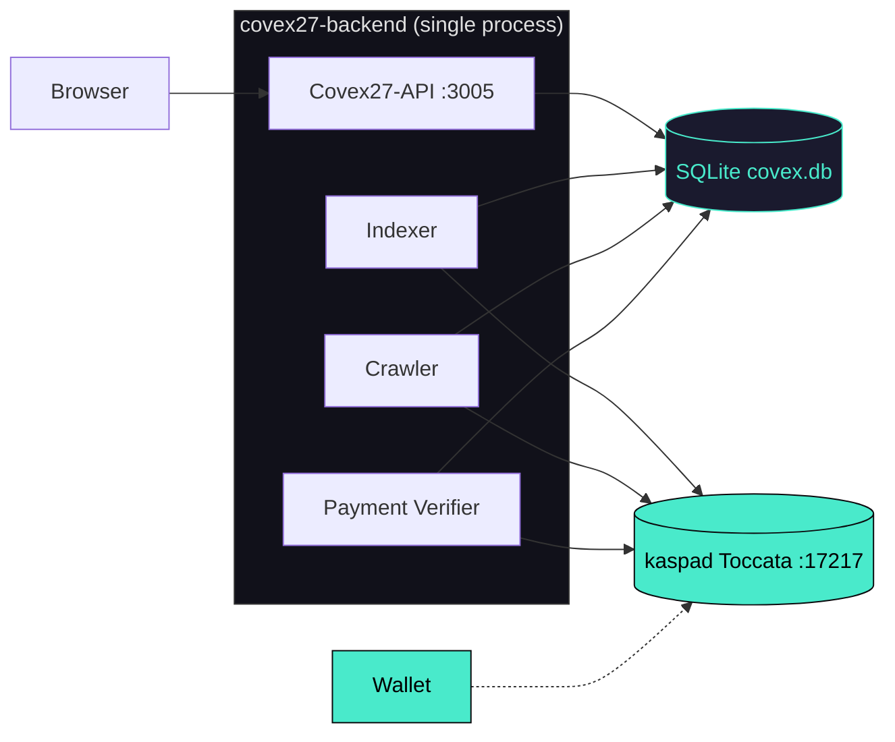
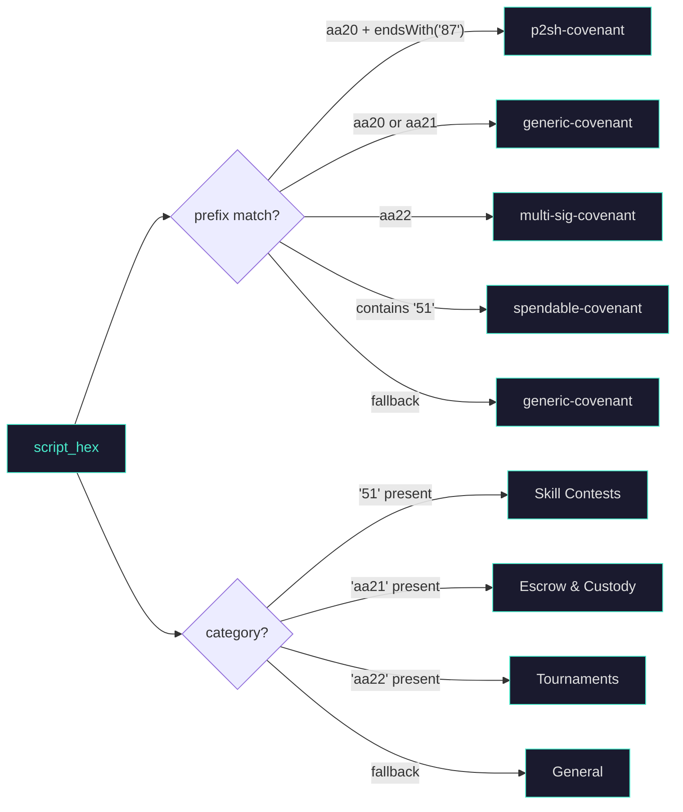

# COVEX: Toccata Covenant Hub

High-performance, non-custodial indexer for native Kaspa UTXO smart contracts (Covenants) on the SilverScript-enabled Toccata BlockDAG.

## Protocol Architecture

- **Backend:** Unified Rust-native Axum binary (Port 3005).
- **Network:** TN-12 (Toccata Fork) — SilverScript enabled (aa20-aa23 opcodes).
- **Storage:** SQLite3 persistent state machine.
- **Frontend:** React + Vite + Tailwind (Kaspa-Green standard).

## Deployment Specifications

- **Node:** kaspad v0.15+ (TN12)
- **Args:** `--testnet --netsuffix=12 --utxoindex --rpclisten-borsh=0.0.0.0:17217`

## Premium SaaS Tiering

| Tier | Logic | Visibility |
|:---|:---|:---|
| MAX | 1000 KAS | Glowing border, Expanded details, Premium UI |
| PRO | 500 KAS | Glowing border, Compact view |
| CREATOR| 100 KAS | Verified badge |
| FREE | 0 KAS | Standard listing |

## System Architecture

The Covex backend runs as a single Rust process binding to `127.0.0.1:3005`. Three concurrent `tokio::spawn` background tasks share a single `KaspaRpcClient` connection to the local kaspad node via wRPC on port `17217`. All application state resides in a SQLite database (`covex.db`) protected by a `Mutex<Connection>` shared via `Arc` across all subsystems.



## Subsystem Detail

### Historic Crawler (`crawler.rs`)

Polls `get_block_dag_info()` each tick to determine the virtual tip DAA score. Walks the selected-parent chain backward up to `MAX_WALK_DISTANCE` blocks per tick (default 500), calling `get_block()` for each parent hash. Every transaction output is checked against `looks_like_covenant()`, which matches `aa20`/`aa21`/`aa22`/`aa23` script prefixes. Inserted covenants use a `UNIQUE` constraint so duplicate blocks are silently skipped. Checkpoint state (`crawler_state.last_scanned_daa`) is persisted after each batch, enabling resume-on-restart.

### Live Indexer (`indexer.rs`)

Loops on a 10-second interval. Calls `get_utxos_by_addresses()` for each seed address configured in `COVENANT_SEED_ADDRESSES`. Every returned UTXO is classified by script opcodes (`classify_covenant`) and category (`CovenantCategory::from_script_ops`), then inserted into the `covenants` table. After insertion, a `tokio::spawn` fires off basic UI generation — the indexer loop continues immediately, never blocked on HTML rendering.

### Payment Verifier (`payment_verifier.rs`)

Loops on a 15-second interval. Queries UTXOs for the treasury address. Each UTXO's `amount_sompi` is checked against `tier_from_amount()` thresholds (100/500/1,000 KAS). The `from_address` field is matched to a creator address in the covenants table. Once the DAA score delta reaches 6 confirmations, `upgrade_covenant_record()` sets `verified_tier`, `verified_payment_tx`, `full_logic_summary`, `receiving_addresses`, and `custom_ui_enabled`. An enhanced UI is regenerated and stored in `generated_uis`, with a visibility record created at tier-appropriate priority (MAX=100, PRO=50, CREATOR=10).

### UI Generator (`ui_generator.rs`)

Produces self-contained HTML pages with embedded CSS and JavaScript. Two modes:
- **`generate_basic_ui()`** — Red danger banner, limited disclosure (tx_id, script_hash, amount, type) for FREE/EXPLORER tiers.
- **`generate_enhanced_ui()`** — Green verified banner, full disclosure (creator, receiving addresses, logic summary) for CREATOR/PRO/MAX tiers.

Both modes include wallet detection (KasWare, Kaspium, OneKey), amount and recipient form fields, and `kaspa_sendTransaction` integration. Cyberpunk-styled CSS uses glass-panel backdrop-blur, neon glow (`#49EACB`), and dark radial gradient backgrounds.

## Native Visibility Engine

The `get_all_covenants()` function in `db.rs` performs **native SQLite-tier sorting** using a `CASE` expression:

```sql
SELECT ... FROM covenants WHERE is_active = 1
ORDER BY
  CASE verified_tier
    WHEN 'MAX' THEN 100 WHEN 'PRO' THEN 50 WHEN 'CREATOR' THEN 10 ELSE 0
  END DESC, timestamp DESC;
```

Each covenant API response includes a `ui_config` object — `{glow, expanded, priority, label}` — computed server-side by `db::ui_config_for_tier()`. The React `Explorer.jsx` frontend **never re-sorts** the array; it renders in the exact order returned by the backend.

Premium tier styling on the frontend:

| Tier | Card Styling | Badge | Expanded Panel |
|:---|:---|:---|:---|
| MAX | `shadow-[0_0_15px_#49EACB] border-[#49EACB]` | Purple ring | Full: script hash, creator, block DAA, type, logic summary |
| PRO | `shadow-[0_0_10px_#49EACB] border-[#49EACB]` | Amber ring | Partial: script hash + type |
| CREATOR | `border-zinc-600` | Blue ring | None (compact) |
| FREE | `border-zinc-700` | Gray | None (compact) |

## Covenant Classification

Covex classifies every detected UTXO by analyzing its script public key hex:



The `CovenantCategory` enum defines nine categories — four currently detectable from script opcodes, five reserved for future SilverScript features:

| Category | Opcode Pattern | Status |
|:---|:---|:---|
| Skill Contests | `51` in script body | Active |
| Escrow & Custody | `aa21` prefix | Active |
| Tournaments | `aa22` prefix | Active |
| General | No opcode match | Active (fallback) |
| Predictive Markets | — | Planned |
| Community Pools | — | Planned |
| Flash Covenants | — | Planned |
| Structured Settlement | — | Planned |
| Governance | — | Planned |

## Technology Stack

| Layer | Technology | Purpose |
|:---|:---|:---|
| Node | kaspad v0.15 with `--netsuffix=12` | wRPC (Borsh encoding) — Toccata Testnet-12 full node with `--utxoindex` |
| Backend | Rust 1.80 · Axum 0.7 · Tokio 1 | Async HTTP server with three concurrent background tasks |
| wRPC Client | kaspa-wrpc-client 0.15 | Borsh-encoded WebSocket RPC to kaspad on `ws://127.0.0.1:17217` |
| Database | SQLite via rusqlite 0.31 | 6 tables, 15 indexes, `Mutex<Connection>` shared via `Arc` |
| Tier Sorting | SQL CASE expression | Native DB-level weighted sort (MAX=100, PRO=50, CREATOR=10, FREE=0) |
| Hashing | SHA-256 (sha2 0.10) | Script hash computation for covenant deduplication |
| Frontend | React 19 + Vite 8 | Static SPA — cyberpunk covenant browser with premium tier styling |
| Styling | Tailwind CSS + custom neon | `#49EACB` glow borders, purple/amber/blue tier badges, dark theme |
| WASM Signing | @onekeyfe/kaspa-wasm | TN12 Mnemonic Dev Mode — local key derivation and transaction signing |
| Deployment | systemd + bash | Two service units (kaspad-toccata + covex-backend), unified deploy script |

## Database Schema

SQLite at `covex.db`. Auto-created on first startup by `db::open_db()`.

```
covenants              payments              accounts
├─ tx_id (PK)          ├─ id (PK, AUTO)      ├─ address (PK)
├─ address             ├─ tx_id (UNIQUE)     ├─ tier
├─ amount_kaspa        ├─ from_address       ├─ payment_tx_id
├─ script_hash         ├─ to_address         ├─ paid_at
├─ script_hex          ├─ amount_sompi       ├─ expires_at
├─ covenant_type       ├─ tier               ├─ is_active
├─ category            ├─ confirmations      └─ created_at
├─ creator_addr        ├─ status
├─ description         ├─ covenant_id (FK)
├─ verified_tier       └─ timestamp          crawler_state
├─ verified_payment_tx                       ├─ id (PK, CHECK=1)
├─ verified_at          generated_uis        └─ last_scanned_daa
├─ custom_ui_enabled    ├─ id (PK, AUTO)
├─ full_logic_summary   ├─ covenant_id       visibilities
├─ receiving_addresses  ├─ owner_address     ├─ covenant_id (PK)
├─ is_active            ├─ tier              ├─ tier
├─ block_daa_score      ├─ ui_html           ├─ featured
└─ timestamp            ├─ ui_config         ├─ priority
                        ├─ slug (UNIQUE)     └─ custom_domain
                        ├─ is_published
                        ├─ featured
                        └─ ui_generated_at
```

Crawl state is checkpointed to `crawler_state` (single row, id=1). The crawler reads `last_scanned_daa` on startup and updates it after every batch — no full rescan on restart.

## API Reference

All endpoints return JSON. The `/covenants` endpoint returns **natively sorted** results — highest-tier covenants first.

| Method | Path | Response |
|:---|:---|:---|
| `GET` | `/` | `{"status":"ok","app":"Covex v1.0.0","network":"testnet-12"}` |
| `GET` | `/health` | `OK` (plain text, used by uptime monitors) |
| `GET` | `/covenants` | `{"total":N,"covenants":[...]}` — each record includes `tx_id`, `address`, `amount_kaspa`, `script_hash`, `script_hex`, `covenant_type`, `category`, `creator_addr`, `verified_tier`, `full_logic_summary`, `receiving_addresses`, `block_daa_score`, `timestamp`, `name`, `tier`, `ui_config` (with `glow`, `expanded`, `priority`, `label`) |
| `GET` | `/status` | `{"status":"ok","network":"testnet-12","node_connected":true,"total_covenants":N,"active_covenants":N,"verified_covenants":N}` |
| `GET` | `/tiers` | Array of four tier definitions with `name`, `label`, `price_kas`, `price_sompi`, `features[]`, `color`, `featured` |

**Critical**: The `/covenants` response is sorted server-side by `CASE verified_tier WHEN 'MAX' THEN 100 WHEN 'PRO' THEN 50 WHEN 'CREATOR' THEN 10 ELSE 0 END DESC, timestamp DESC`. The frontend **must not re-sort** the array — it renders in the exact order received.

## SaaS Pricing Tiers

Covenant creators purchase verification and visibility by sending KAS to the Covex treasury address. The payment verifier detects the deposit, waits for 6 BlockDAG confirmations, and upgrades the account and covenant record.

| Tier | Price (KAS) | Price (sompi) | Weight | ui_config | Key Capabilities |
|:---|:---|:---|:---|:---|:---|
| `EXPLORER` | `0` | `0` | 0 | `{glow:false, expanded:false}` | Browse all covenants, basic UI with limited disclosure |
| `CREATOR` | `100` | `10,000,000,00` | 10 | `{glow:false, expanded:false}` | Full disclosure, verified badge, form builder, wallet integration |
| `PRO` | `500` | `50,000,000,00` | 50 | `{glow:true, expanded:false}` | Featured listing, priority indexing, neon glow border, higher search ranking |
| `MAX` | `1,000` | `100,000,000,00` | 100 | `{glow:true, expanded:true}` | Top placement, full detail panel, custom domain, premium branding, neon glow border, expanded view by default |

Tier detection: `tier_from_amount()` checks `amount_sompi >= 100_000_000_00` for MAX, `>= 50_000_000_00` for PRO, `>= 10_000_000_00` for CREATOR.

Treasury: `kaspatest:qpyfz03k6quxwf2jglwkhczvt758d8xrq99gl37p6h3vsqur27ltjhn68354m`

## Toccata TN12 Node Setup

The Toccata fork enables SilverScript covenant opcodes (`aa20`, `aa21`, `aa22`, `aa23`). A properly configured node is required for the crawler and indexer to discover real covenants.

```bash
# Create data directory
mkdir -p /mnt/covex-data/kaspa-data/tn12

# Start Toccata node (use systemd or background process)
kaspad --testnet --netsuffix=12 --utxoindex \
  --appdir=/mnt/covex-data/kaspa-data/tn12 \
  --rpclisten-borsh=0.0.0.0:17217
```

**Bootstrap time**: ~6–8 minutes from cold start. Headers download first (~1.4M IBD), then blocks. The backend crawler starts discovering covenants only after IBD completes.

**Verify sync**:
```bash
journalctl -u kaspad --no-pager -n 5 | grep "IBD\|synced\|isSynced"
```

## Wallet Integration

Covex provides multi-wallet detection across 8 wallet providers (KasWare, Kastle, Kasperia, OKX, Kasanova, Kaspium, KaspaCom, Tangem) following the THTProtocol/27 detection pattern. Wallet providers are detected directly via `window.*` globals with Chrome Web Store CDN logos.

### TN12 Mnemonic Dev Mode

A built-in developer testing interface uses `@onekeyfe/kaspa-wasm` to derive Kaspa keys locally from a BIP39 mnemonic phrase. This completely bypasses browser extensions:

1. **`Mnemonic.fromPhrase(phrase)`** — Parses 12 or 24-word BIP39 mnemonic
2. **`.toSeed('')`** → **`new XPrv(seed)`** — Creates master extended private key
3. **`xprv.derivePath("m/44'/111111'/0'/0/0")`** — Derives testnet key at standard BIP44 path
4. **`privateKey.toAddress('testnet-12')`** — Generates TN12 address
5. **`privateKey.signMessage(message)`** — Signs messages locally

When dev mode is active, all `signMessage` and `sendPayment` calls are intercepted and signed locally with the derived private key, completely bypassing browser extension providers.

## Wallet Provider Polling

Covex implements a 5-second interval-based retry detection loop that polls for `window.kasware` and `window.okxwallet` injection at 200ms intervals (25 attempts). This handles the race condition where wallet extensions inject their providers after the React application mounts.

## Deployment

### Prerequisites

- Rust 1.80+ stable toolchain
- Node.js 20+ and npm
- kaspad Toccata node synced to Testnet-12 with `--testnet --netsuffix=12 --utxoindex --rpclisten-borsh=0.0.0.0:17217`

### Quick Deploy

```bash
sudo bash deploy/deploy-hetzner.sh
```

Installs all system dependencies, builds the Rust backend (release) and React frontend, and creates the systemd service unit.

### Unified Deploy (production update)

```bash
sudo bash deploy/deploy_all.sh
```

Hard-resets to `origin/master`, rebuilds backend and frontend, reconfigures kaspad and covex27-api systemd services, and runs a health report. Fully idempotent.

### Environment

```bash
KASPA_NETWORK=testnet-12
KASPA_WRPC_URL=ws://127.0.0.1:17217
BIND_ADDR=127.0.0.1:3005
DB_PATH=../covex.db
COVENANT_TREASURY_ADDRESS=kaspatest:qpyfz03k6quxwf2jglwkhczvt758d8xrq99gl37p6h3vsqur27ltjhn68354m
COVENANT_SEED_ADDRESSES=
CRAWL_START_DAA=1
RUST_LOG=covex27_backend=info,kaspa_wrpc=warn
```

### Manual Build

```bash
cd backend
cargo build --release
./target/release/covex27-backend
```

### Systemd Unit

```ini
[Unit]
Description=Covex27 Backend (Toccata TN12)
After=network.target kaspad.service
Wants=kaspad.service

[Service]
Type=simple
User=root
WorkingDirectory=/mnt/HC_Volume_105579109/Covex27
ExecStart=/mnt/HC_Volume_105579109/Covex27/backend/target/release/covex27-backend
Restart=always
RestartSec=5
Environment="KASPA_NETWORK=testnet-12"
Environment="KASPA_WRPC_URL=ws://127.0.0.1:17217"
Environment="BIND_ADDR=127.0.0.1:3005"
Environment="DB_PATH=/mnt/HC_Volume_105579109/Covex27/covex.db"
```

### Frontend Deployment

```bash
cd frontend
npm run build
rm -rf /root/htp/public/*
cp -r dist/* /root/htp/public/
```

Production URL: **https://hightable.pro**

The Nginx config at `/etc/nginx/sites-available/hightable.pro` proxies `/api/` to `http://127.0.0.1:3005/` (trailing slash strips the `/api/` prefix) and serves static assets from `/root/htp/public` with SPA fallback (`try_files $uri $uri/ /index.html`). SSL via Let's Encrypt certbot.

## Repository

```
Covex27/
├── backend/
│   ├── Cargo.toml                  # Rust dependencies (Axum, Tokio, kaspa-wrpc-client 0.15)
│   └── src/
│       ├── main.rs                 # Entry point, router, 5 JSON endpoints, ui_config injection
│       ├── covenant_types.rs       # Enums, tiers, UI config structs, pricing logic
│       ├── crawler.rs              # Historic BlockDAG crawler (selected-parent chain walk)
│       ├── db.rs                   # SQLite schema, CRUD, tier-weighted sorting, ui_config_for_tier()
│       ├── indexer.rs              # Live UTXO poller + auto basic UI generation
│       ├── payment_verifier.rs     # Treasury monitor + tier upgrades + enhanced UI trigger
│       └── ui_generator.rs         # Basic & enhanced HTML UI rendering with wallet integration
├── frontend/
│   └── src/
│       ├── pages/
│       │   ├── Explorer.jsx              # Covenant browser — native sort + premium neon styling
│       │   ├── CreateCovenant.jsx        # Covenant deployment form with payment gate
│       │   ├── HostCovenant.jsx          # Covenant hosting interface
│       │   ├── CovenantInteractive.jsx   # Interactive covenant detail view
│       │   ├── Dashboard.jsx             # Creator dashboard
│       │   ├── Deploy.jsx                # SilverScript covenant deployment engine
│       │   ├── Pricing.jsx               # Tier pricing page
│       │   └── Terms.jsx                 # Terms of service
│       └── components/
│           ├── WalletContext.jsx    # Wallet state management + TN12 Mnemonic Dev Mode
│           ├── WalletButton.jsx     # Wallet connection UI + Dev Mode toggle
│           ├── WalletModal.jsx      # Wallet selection modal
│           ├── Hero.jsx             # Landing page hero section
│           ├── DagBackground.jsx    # Animated BlockDAG background
│           ├── PremiumBuilder.jsx   # Gated UI customization tool
│           ├── WhatIsKaspa.jsx      # Educational Kaspa overview
│           └── LegalModal.jsx       # Legal/TOS modal
├── deploy/
│   ├── .env.production             # Production environment template (TN12)
│   ├── deploy-hetzner.sh           # Fresh deployment (deps, build, configure)
│   ├── deploy_all.sh               # Unified production update (reset, rebuild, restart)
│   ├── covex-backend.service       # systemd unit for backend (TN12)
│   └── nginx-covex.conf            # Nginx reverse proxy config
├── scripts/
│   └── generate_covex_health_report.sh  # Production health diagnostic report
├── .env                            # Local environment (TN12)
└── README.md
```

---

## License

MIT

---

**Covex** — Built by **HIGH TABLE PROTOCOL** for the Kaspa ecosystem. Running on Toccata Testnet-12.

