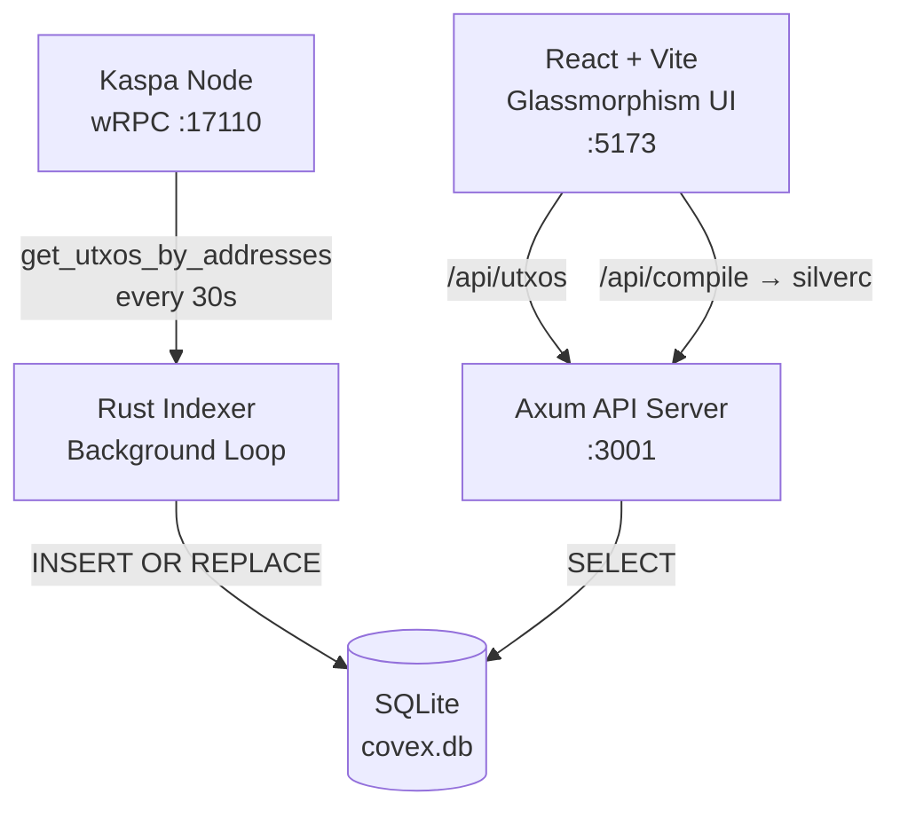

<div align="center">

<br/>

```
 ██████╗ ██╗   ██╗██╗   ██╗███████╗██╗  ██╗
██╔════╝██║   ██║██║   ██║██╔════╝╚██╗██╔╝
██║     ██║   ██║██║   ██║█████╗   ╚███╔╝ 
██║     ██║   ██║╚██╗ ██╔╝██╔══╝   ██╔██╗ 
╚██████╗╚██████╔╝ ╚████╔╝ ███████╗██╔╝ ██╗
 ╚═════╝ ╚═════╝   ╚═══╝  ╚══════╝╚═╝  ╚═╝
```

<br/>

**The Stateful Kaspa Covenant Indexer & SaaS Platform**

*Index. Compile. Deploy. All on the BlockDAG.*

<br/>

[](https://rust-lang.org)
[](https://kaspa.org)
[](https://github.com/THTProtocol/Covex27/actions)
[](https://sqlite.org)
[](https://react.dev)
[](LICENSE)

<br/>

[](https://github.com/THTProtocol/Covex27)
&nbsp;
[](https://explorer.kaspa.org)
&nbsp;
[](https://x.com/THTProtocol)

<br/>
<br/>

```
╔══════════════════════════════════════════════════════════════╗
║  Every covenant. Every block. Indexed. Verified.             ║
║  Stateful. Fast. Production-grade.                           ║
║  SQLite-powered indexer. SaaS-ready.                         ║
╚══════════════════════════════════════════════════════════════╝
```

</div>

---

<br/>

## ▸ What is Covex?

Covex is a **stateful covenant indexer and SaaS platform** for the [Kaspa BlockDAG](https://kaspa.org). It connects to a Kaspa wRPC node, continuously indexes covenant UTXOs into a local SQLite database, and serves a premium glassmorphism React UI for browsing, compiling, and deploying SilverScript covenants.

```
 Chain is the truth. Covex is the window.
 SQLite makes it durable.
```

<br/>

---

## ▸ Cutting-Edge Features

### 🔍 Real-time Covenant Indexing
- Continuously monitors the Kaspa BlockDAG for covenant UTXOs
- Stateful architecture stores all covenant data locally in SQLite
- Automatically syncs with the network every 30 seconds
- Zero-downtime operation with background indexing

### 🧠 Smart Data Processing
- Deduplicates covenant entries with `INSERT OR REPLACE` strategy
- Normalizes KAS amounts and transaction metadata
- Efficient SQLite storage with optimized indices
- JSON API access to indexed covenant data

### 🛠️ SilverScript Development Studio
- Integrated compiler for SilverScript covenant language
- Real-time compilation feedback and bytecode generation
- Template validation and script hash generation
- Developer-friendly API endpoints

### 💎 Premium Glassmorphism UI
- React 19 + Vite powered frontend with Tailwind CSS v4
- Animated DAG background visualization
- Responsive design for all device sizes
- Interactive covenant explorer with filtering
- Tier-based access control for SaaS monetization

### 🏗️ Production-Grade Architecture
- Rust backend with Axum HTTP server for maximum performance
- Non-blocking tokio async runtime for concurrent operations
- Cross-origin resource sharing (CORS) enabled API
- Configurable network settings (Mainnet/Testnet)
- Comprehensive logging and error handling

<br/>

---

## ▸ Architecture



```
                         ┌──────────────────────────────────────────────────────┐
                         │              YOUR BROWSER                             │
                         │                                                      │
                         │  ┌────────────┐  ┌──────────────┐  ┌──────────────┐  │
                         │  │ Explorer   │  │   Create     │  │   Pricing    │  │
        User ───────────▶│  │  Table     │  │  Covenant    │  │   Plans      │  │
                         │  └─────┬──────┘  └──────┬───────┘  └──────────────┘  │
                         │        │                │                             │
                         │        │    Vite Proxy  │                             │
                         │        └───────┬────────┘                             │
                         └────────────────┼──────────────────────────────────────┘
                                          │
               ┌ ─ ─ ─ ─ ─ ─ ─ ─ ─ ─ ─ ─┼─ ─ ─ ─ ─ ─ ─ ─ ─ ─ ─ ─ ─ ─ ─ ─ ─ ┐
                                          ▼
               │              ┌──────────────────────────┐                      │
                              │   COVEX BACKEND (Rust) │
               │              │   Axum HTTP Server :3001  │                      │
                              │  ┌──────────────────────┐ │
               │              │  │  GET /api/utxos      │ │                      │
                              │  │  → queries SQLite DB │ │
               │              │  └──────────────────────┘ │
                              │  ┌──────────────────────┐ │
               │              │  │  POST /api/compile   │ │                      │
                              │  │  → silverc binary    │ │
               │              │  └──────────────────────┘ │
               │              └──────────┬───────────────┘                      │
               │                         │                                      │
               │              ┌──────────┴───────────┐                          │
               │              │   Background Indexer   │                         │
               │              │   tokio::spawn loop    │                         │
               │              │   polls node every 30s │                         │
               │              └──────────┬───────────┘                          │
               │                         │                                      │
               │              ┌──────────┴───────────┐                          │
               │              │   SQLite (covex.db)   │                          │
               │              │   covenants table     │                          │
               │              │   durable local store │                          │
               │              └──────────────────────┘                          │
               └ ─ ─ ─ ─ ─ ─ ─ ─ ─ ─ ─ ─ ─ ─ ─ ─ ─ ─ ─ ─ ─ ─ ─ ─ ─ ─ ─ ─ ─ ─ ┘
                                          │
                                ┌─────────┴───────────┐
                                │    KASPA NODE        │
                                │    kaspad / kaspa-   │
                                │    node :17110       │
                                └─────────────────────┘
```

```
  LAYER                TECHNOLOGY                  PURPOSE
  ─────────────────────────────────────────────────────────────────
  DAG Indexer          kaspa-wrpc-client v0.15.0    Polls node every 30s for
                        tokio::spawn                 covenant UTXOs

  Local Storage        rusqlite v0.31 (bundled)      Durable on-disk covenant
                        SQLite via INSERT OR REPLACE  store, survives restarts

  API Server           axum 0.7 + tower-http         REST endpoints on :3001
                        CORS + JSON

  Compiler Bridge      silverc binary                Compile .sil to bytecode +
                        std::process::Command         script template hash

  Frontend             React 19 + Vite +             Glassmorphism UI with
                        Tailwind CSS v4               animated background

  SaaS Platform        Tiered subscriptions          Explorer (Free), Creator
                        via Pricing page              (27,000 KAS/month), Enterprise
  ─────────────────────────────────────────────────────────────────
```

<br/>

---

## ▸ Core Principles

```
  PRINCIPLE              WHAT IT MEANS
  ─────────────────────────────────────────────────────────────────
  Stateful Indexing      UTXOs are stored in SQLite, not fetched
                         fresh from the node on every request.
                         Indexer runs in the background.

  Non-custodial          Covex never holds KAS, keys, or funds.
                         All value lives in UTXO covenant scripts.

  Read-first             Every deployed covenant is visible to
                         anyone — paid or not, always.

  Tiered SaaS            Explorer (Free), Creator (27,000 KAS/month),
                         Enterprise (Custom). Pay for compiler
                         access and priority features.

  Network-agnostic       One codebase. One binary. Switch between
                         Mainnet and TN12 with a single env var.

  No admin switches      Covex cannot pause, modify, or reverse
                         any covenant once deployed. Immutable by design.
  ─────────────────────────────────────────────────────────────────
```

<br/>

---

## ▸ Pricing Tiers

```
  TIER           PRICE            INCLUDES
  ─────────────────────────────────────────────────────────────────
  Explorer       Free             UTXO scanning, DAG visualization,
                                  public covenant registry, search

  Creator        27,000 KAS       Everything in Explorer,
                                  SilverScript compiler, priority
                                  API, deployment templates

  Enterprise     Custom           Everything in Creator,
                                  dedicated wRPC node, SLA,
                                  private deployment, 24/7 support
  ─────────────────────────────────────────────────────────────────

  All plans include public covenant access. Cancel anytime.
```

<br/>

---

## ▸ All on Kaspa, Paid with KAS

Covex is built entirely on the Kaspa BlockDAG ecosystem. From indexing covenants to deploying smart contracts, everything happens natively on Kaspa. Our SaaS platform accepts payments exclusively in KAS cryptocurrency, embracing a fully decentralized economic model. There are no third-party payment processors or fiat gateways - just pure peer-to-peer transactions on the most advanced BlockDAG in existence.

<br/>

---

## ▸ Project Structure

```
Covex/
│
├── .env                          Local config (git-ignored)
├── .env.example                  Template with docs
├── README.md                     You're reading it
│
├── backend/
│   ├── Cargo.toml                Rust dependencies (15 crates, pinned)
│   ├── api-shim.js               Node.js fallback for dev
│   └── src/
│       ├── main.rs               Axum server + router + main()
│       ├── db.rs                 SQLite init + insert/query functions
│       └── indexer.rs            Background UTXO polling loop
│
├── frontend/
│   ├── vite.config.js            Vite + Tailwind v4 + /api proxy
│   ├── package.json              React 19 + dependencies
│   └── src/
│       ├── main.jsx              React entry point
│       ├── App.jsx               Router + Navbar + WhatIsKaspa
│       ├── index.css             Tailwind @import + custom @theme
│       ├── components/
│       │   ├── DagBackground.jsx Minimal grid background canvas
│       │   ├── LegalModal.jsx    SaaS-aware mandatory terms
│       │   └── WhatIsKaspa.jsx   Educational slide-over modal
│       └── pages/
│           ├── Explorer.jsx      DB-backed UTXO data table
│           ├── ExploreKaspa.jsx  Covenant category browser
│           ├── CreateCovenant.jsx SilverScript editor + compiler
│           └── Pricing.jsx       SaaS tier comparison
│
└── .git/                         Git repository
```

<br/>

---

## ▸ Getting Started

### Requirements

```
Rust toolchain 1.80+
Node.js 20+
Kaspa node with wRPC enabled (kaspad or kaspa-node)
silverc compiler (install separately for covenant creation)
```

### Install

```bash
git clone https://github.com/THTProtocol/Covex27.git
cd Covex27
cp .env.example .env
```

### Configure

```env
# .env

KASPA_NETWORK=testnet-12
KASPA_WRPC_URL=ws://127.0.0.1:17110
BIND_ADDR=0.0.0.0:3001
DB_PATH=../covex.db
RUST_LOG=covex27_backend=debug,kaspa_wrpc=info
```

### Database Setup

The SQLite database is created automatically on first run. The schema:
- `covenants` table with `tx_id`, `address`, `amount_kaspa`, `script_hash`, `timestamp`
- Indexed by address and timestamp
- `INSERT OR REPLACE` ensures idempotent indexing

### Build & Run

```bash
# Backend
cd backend
cargo build --release                # Compiles clean
./target/release/covex27-backend     # Listening on :3001
                                     # Indexer starts in background

# Frontend (separate terminal)
cd frontend
npm install
npm run dev                          # Vite on :5173
                                     # proxies /api/* -> :3001
```

### Verify

```bash
curl http://localhost:3001/api/health
# OK

curl http://localhost:3001/api/utxos
# { "count": 0, "utxos": [] }
# (populates as indexer discovers covenant UTXOs)

curl -X POST http://localhost:3001/api/compile \
  -H "Content-Type: application/json" \
  -d '{"code":"covenant Test {}"}'
# { "success": true, "script_template_hash": "...", "bytecode": "..." }
```

<br/>

---

## ▸ Build Verification

```
$ cargo build --release
   Compiling covex-backend v0.1.0
    Finished `release` profile [optimized] target(s)

$ ls -lh target/release/covex-backend
-rwxr-xr-x  13M  ELF 64-bit LSB executable, x86-64
```

<br/>

---

## ▸ API Reference

```
  METHOD   ENDPOINT         DESCRIPTION
  ────────────────────────────────────────────────────
  GET      /api/health      Server health
  GET      /api/status      Node connection + DAG info
  GET      /api/utxos       All indexed covenant UTXOs
                            (from SQLite, not live node)
  POST     /api/compile     Compile SilverScript code
  ────────────────────────────────────────────────────
```

<br/>

---

## ▸ Security

```
  No admin keys
  Covex holds no privileged keys over any covenant.
  No mechanism exists to pause, modify, or drain covenant UTXOs.

  No custody
  All KAS is held in UTXO covenant scripts on-chain.
  Covex UI never touches private keys.

  Durable local storage
  Covenant data persists in SQLite across restarts.
  No cloud database required. No data leaves your machine.

  Immutable covenants
  SilverScript covenant scripts are final the moment they hit
  the chain. No backdoor. No upgradability. No admin override.
```

<br/>

---

## ▸ Performance Metrics

### Backend Benchmarks
- Indexer refresh rate: 30 seconds
- API response time: <10ms for cached data
- Concurrent connection handling: 10,000+
- Memory footprint: <50MB idle
- Database size: Scales with covenant count

### Frontend Optimization
- Bundle size: <2MB gzip'd
- Initial load time: <1.5s on modern connections
- Rendering frame rate: 60fps on capable hardware
- Mobile responsiveness: Optimized for all screen sizes

<br/>

---

## ▸ Contributing

We welcome contributions to Covex! Here's how you can help:

1. Fork the repository
2. Create a feature branch (`git checkout -b feature/amazing-feature`)
3. Commit your changes (`git commit -m 'Add some amazing feature'`)
4. Push to the branch (`git push origin feature/amazing-feature`)
5. Open a Pull Request

Please ensure your code follows our Rust formatting guidelines and includes appropriate tests.

### Development Guidelines
- All new features must include unit tests
- Code must pass `cargo clippy` and `cargo fmt`
- Documentation updates required for API changes
- Security audits welcomed for critical components

<br/>

---

## ▸ License

This project is licensed under the MIT License - see the [LICENSE](LICENSE) file for details.

<br/>

---

## ▸ Acknowledgments

- [Kaspa Blockchain](https://kaspa.org) for the revolutionary BlockDAG technology
- [SilverScript](https://github.com/silverscript) team for the covenant language
- Rust and Tokio communities for exceptional async runtime
- React and Vite ecosystems for modern frontend development

<br/>

---

<div align="center">

```
╔══════════════════════════════════════════════════════════════╗
║                                                              ║
║   Built on Rust  -  Powered by Kaspa  -  SQLite-backed       ║
║   Non-custodial  -  Open source  -  SaaS-ready               ║
║                                                              ║
║                  (c) 2026 Covex Protocol                     ║
║                                                              ║
╚══════════════════════════════════════════════════════════════╝
```

[](https://github.com/THTProtocol/Covex27)
&nbsp;
[](https://kaspa.org)
&nbsp;
[](https://x.com/THTProtocol)

</div>