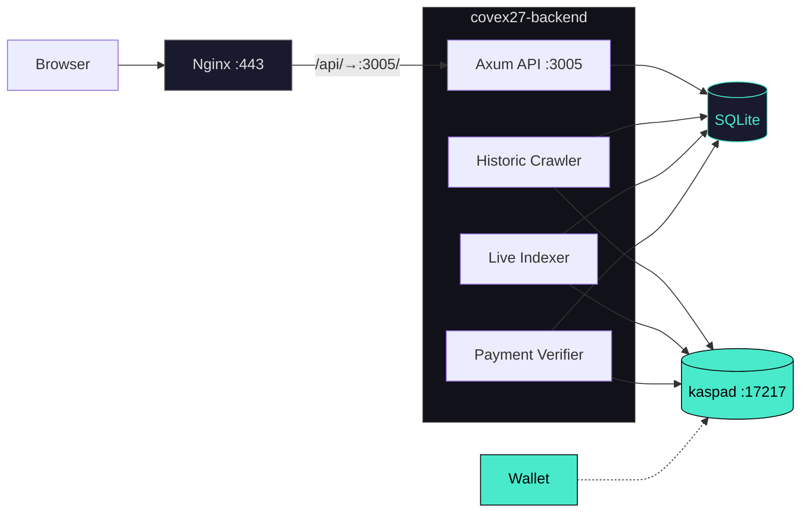
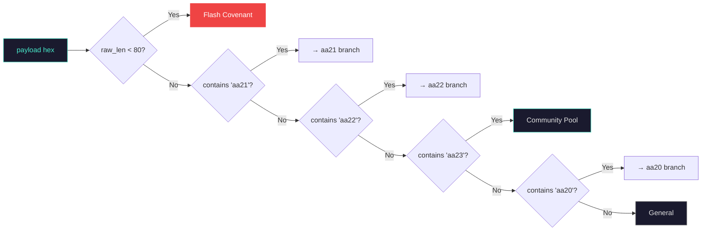
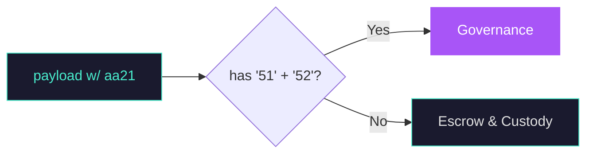
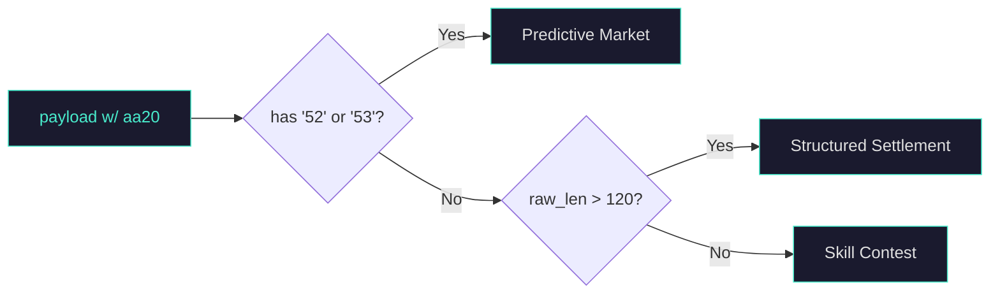

<div align="center">
  <br>
  <br>

  <pre>
██████╗  ██████╗ ██╗   ██╗███████╗██╗  ██╗
██╔════╝ ██╔═══██╗██║   ██║██╔════╝╚██╗██╔╝
██║      ██║   ██║██║   ██║█████╗   ╚███╔╝
██║      ██║   ██║╚██╗ ██╔╝██╔══╝   ██╔██╗
╚██████╗ ╚██████╔╝ ╚████╔╝ ███████╗██╔╝ ██╗
 ╚═════╝  ╚═════╝   ╚═══╝  ╚══════╝╚═╝  ╚═╝
  </pre>

  <h3 style="margin-top: -10px;">Kaspa Covenant Explorer & Visibility Platform</h3>

  <br>

  <a href="https://hightable.pro"></a>
  <a href="https://hightable.pro"></a>
  <a href="https://github.com/THTProtocol/Covex27/blob/master/LICENSE"></a>
  <a href="#"></a>

  <br>
  <br>

  > **Live:** [hightable.pro](https://hightable.pro) &nbsp; • &nbsp; **Code:** 2,504 lines Rust &nbsp; • &nbsp; **Frontend:** React 19 + Vite 8
  >
  > Non-custodial covenant explorer and visibility platform for native Kaspa SilverScript covenants. One binary. One DB. Zero middlemen. Deploy custom interactive UIs through the Covex Terminal.

  <br>

  

  ---

  <br>
  **Built by HIGH TABLE PROTOCOL**
  <br>
  <br>
</div>

---

## Overview

Covex is a high-performance covenant indexer for the Kaspa **Toccata Testnet-12** BlockDAG. It crawls the historic chain, polls live UTXOs, and classifies SilverScript covenants (`aa20`–`aa23` opcodes) — then serves them through a tier-weighted REST API with a premium React/Tailwind explorer frontend.

**Key guarantees:** non-custodial (keys never leave your wallet), on-chain verification only (no synthetic data), single Rust binary with zero external dependencies beyond SQLite and kaspad.

76 covenants indexed live at [hightable.pro](https://hightable.pro).

<br>

---

## Architecture



<br>

### How the subsystems work together

**Step 1 — Historic Crawler** (`crawler.rs`): Every tick, the crawler fetches the virtual tip DAA via `get_block_dag_info()`, then walks the selected-parent chain backward up to 2,000 blocks per batch. For each block, it downloads full transaction data via `get_block(hash, true)` and scans `tx.payload` for `aa20`–`aa23` covenant opcodes. Tier is determined from the **second output only**: `tx.outputs[1]` must match the treasury P2PKH script (`76a914<hash160>88ac`) and its sompi amount must exceed tier thresholds (100/500/1,000 KAS). Found covenants are inserted via `UNIQUE` constraint — duplicates silently skipped. Progress checkpointed to `crawler_state.last_scanned_daa` after every batch.

**Step 2 — Live Indexer** (`indexer.rs`): Polls `get_utxos_by_addresses()` every 10 seconds for configured seed addresses. Filters out standard wallet outputs (P2PKH ≤50 hex, Schnorr P2PK 68 hex, P2SH 46 hex) via `is_standard_output()`, then checks for covenant opcodes via `looks_like_covenant()`. Each new covenant triggers a `tokio::spawn` for basic UI generation — the polling loop never blocks.

**Step 3 — Payment Verifier** (`payment_verifier.rs`): Monitors treasury UTXOs every 15 seconds. Matches `from_address` to `creator_addr` in the covenants table. Waits for **6 DAA confirmations**. Then: upgrades the covenant record (`verified_tier`, `verified_payment_tx`, `full_logic_summary`, `custom_ui_enabled = 1`), regenerates enhanced UI, and creates a visibility record with tier-appropriate priority (MAX=100, PRO=50, CREATOR=10).

**Step 4 — Native Visibility Engine**: The `get_all_covenants()` function sorts at the **SQL level**:

```sql
ORDER BY
  CASE verified_tier
    WHEN 'MAX' THEN 100 WHEN 'PRO' THEN 50 WHEN 'CREATOR' THEN 10 ELSE 0
  END DESC, timestamp DESC
```

The React frontend renders in the exact order returned. **No frontend re-sorting.**

<br>

---

## Covenant Classification

Both crawler and indexer classify every detected covenant using the `CovenantCategory` enum — 9 categories, driven by a shared `from_script_ops()` function. The crawler inspects `tx.payload`; the indexer inspects output script public key hex. The classification flows through **three stages** below, and PRO/MAX tier creators can override the detected category with a **custom label** via the Trust Builder.

### Stage 1 — Opcode Dispatch

Every covenant payload hits a five-way opcode fork. Fast-path: payloads shorter than 80 bytes are classified as **Flash** covenants.



### Stage 2 — aa21 / aa20 Sub-Branches

**aa21 branch** (time-based custody patterns):



**aa20 branch** (single-outcome patterns):



### Stage 3 — Custom Category Override (PRO / MAX)

Paid-tier covenant creators can set a custom category name via the **Trust Builder** (`UiBuilder.jsx` → `POST /api/covenants/:id/ui-config` with `custom_category` field). The backend validates wallet ownership against on-chain `creator_addr` and writes the override to both `generated_uis.ui_config` and `covenants.category`.

Custom categories are free-form strings. If set, they replace the auto-detected category on the Explorer card and detail page. If left blank, the auto-detected category remains. This allows DAO treasuries, insurance pools, lotteries, or any niche use case to surface under a descriptive label.

### Category Summary

| Category | Detection Rule | Overridable |
|:---|:---|:---:|
| **Flash** | Any `aa20`–`aa23` + payload < 80 raw bytes | — |
| **Governance** | `aa21` + `51` (OP_1) + `52` (OP_2) — multi-outcome voting | — |
| **Escrow & Custody** | `aa21`, no multi-outcome markers | — |
| **Tournament** | `aa22` | — |
| **Community Pool** | `aa23` | — |
| **Predictive Markets** | `aa20` + `52` (OP_2) or `53` (OP_3) | — |
| **Structured Settlement** | `aa20`, payload > 120 bytes, no OP_2/OP_3 | — |
| **Skill Contests** | `aa20`/`aa21` with `51` (OP_1), single-outcome | — |
| **General** | Fallback (opcodes present, no specific pattern) | — |
| **Custom** | Creator-defined free-form string | ✓ PRO/MAX |

Classification types (the `covenant_type` column, assigned by the `classify()` / `classify_covenant()` functions):

| Type | Detection |
|:---|:---|
| `p2sh-covenant` | Starts `aa20` AND ends `87` |
| `extended-covenant` | Contains `aa21` |
| `multi-sig-covenant` | Contains `aa22` |
| `community-pool-covenant` | Contains `aa23` |
| `spendable-covenant` | Contains `51` (indexer only) |
| `generic-covenant` | No opcode match (fallback) |

<br>

---

## Pricing & Trust

Covex operates a four-tier on-chain verification model. Tier is determined by the amount of KAS sent to the treasury address in a covenant deployment transaction — specifically `tx.outputs[1]` (the second output). Prices are one-time, not recurring.

**All paid tiers (Creator, PRO, MAX) give identical access to the same Covex Terminal for deploying custom interactive UIs. The ONLY difference between paid tiers is visibility ranking on the Explorer. Higher tier = better placement. No other features are tier-gated.**

| | **FREE** | **CREATOR** | **PRO** | **MAX** |
|:---|:---:|:---:|:---:|:---:|
| **One-time fee** | `0` | `100 KAS` | `500 KAS` | `1,000 KAS` |
| **Custom covenant** | — | 1 covenant | 1 covenant | 1 covenant |
| **Terminal access** | — | ✓ | ✓ | ✓ |
| **Custom UI deployment** | — | ✓ | ✓ | ✓ |
| **Explorer placement** | Standard | Basic | Featured | Top priority |
| **TVL ranking boost** | — | — | — | ✓ |

### Covenant Architecture

All paid covenants are user-configurable through the Covex Terminal:

- **Fee percentage**: 0% up to 5% kept in the covenant on every claim
- **Reusable by default**: Multiple independent game sessions on the same covenant as long as funds remain
- **Partial claims**: Configure winner claim percentage (rest stays in covenant for future games)
- **Top-up capability**: Allow new players to add funds to the pot
- **Owner safeguards**: Close covenant only after cooldown + no active games (anti-sabotage)

### ZK Proofs & Claim Verification

Covex is fully ZK-ready for trustless covenant execution:

- **ZK stack**: RISC Zero zkVM + Groth16 verifier
- **Claim workflow**: "Claim Now" triggers automatic ZK proof generation when possible
- **Fallback**: Covex trusted oracle (signed outcome) for instant UX while ZK infrastructure matures

### Covex Terminal

The central deployment tool for all paid users. After upgrading, access the Terminal tab on your covenant detail page to:

- Paste custom UI code/configuration from any external source
- Configure covenant parameters (fee percentage, claim rules, top-up settings)
- Set claim method (ZK proof, trusted oracle, or auto-detect)
- Apply custom CSS and branding
- Export self-contained HTML covenant pages

Treasury: `kaspatest:qpyfz03k6quxwf2jglwkhczvt758d8xrq99gl37p6h3vsqur27ltjhn68354m`

---

## Technology Stack

| Layer | Technology | Detail |
|:---|:---|:---|
| **Node** | `kaspad` v0.15 + `--netsuffix=12` | Toccata TN12 full node with `--utxoindex`, wRPC Borsh on `:17217` |
| **Backend** | Rust (2021 edition) · Axum 0.7 · Tokio 1 | Single binary with 4 concurrent tasks |
| **wRPC Client** | `kaspa-wrpc-client` 0.15 | Borsh-encoded WebSocket to kaspad |
| **Consensus** | `kaspa-consensus-core` 0.15 (vendored) | Patched sighash for covenant payload hashing |
| **Database** | SQLite via `rusqlite` 0.31 (bundled) | 6 tables, 15 indexes, `Arc<Mutex<Connection>>` |
| **Hashing** | SHA-256 (`sha2` 0.10) | 20-byte hex digest for script hash computation |
| **Signing** | `secp256k1` 0.29 · `workflow-serializer` 0.18 | Rust-native transaction signing |
| **Frontend** | React 19 · Vite 8 · Tailwind CSS v4 | Static SPA, cyberpunk neon design system |
| **WASM** | `@onekeyfe/kaspa-wasm` | BIP39 key derivation, local tx building and signing for dev mode |
| **Reverse Proxy** | Nginx + Let's Encrypt | TLS termination, `/api/` → `:3005/` proxy, SPA fallback |
| **Deploy** | systemd + bash | `kaspad-toccata.service`, `covex-backend.service`, idempotent scripts |

---

## API Reference

All endpoints return JSON. Nginx strips the `/api/` prefix before forwarding to the backend.

| Method | Path | Description |
|:---|:---|:---|
| `GET` | `/` | `{"status":"ok","app":"Covex v1.0.0","network":"testnet-12"}` |
| `GET` | `/health` | Plain text `OK` — uptime monitoring |
| `GET` | `/covenants` | Tier-sorted array. Each record: `tx_id`, `address`, `amount_kaspa`, `script_hash`, `script_hex`, `covenant_type`, `category`, `creator_addr`, `verified_tier`, `full_logic_summary`, `block_daa_score`, `timestamp`, `ui_config`, `trust_config`, `has_verified_source` |
| `GET` | `/status` | `{"total_covenants":N,"active_covenants":N,"verified_covenants":N,"node_connected":true}` |
| `GET` | `/tiers` | Four tier definitions with pricing, features, colors |
| `POST` | `/covenants/:id/ui-config` | **Secured.** Saves trust config (source URL, notes, interaction schema). Validates wallet address matches on-chain `creator_addr`. PRO/MAX only |
| `GET` | `/covenants/:id/trust-config` | Returns trust configuration or `null` |
| `POST` | `/broadcast` | Broadcast signed tx hex → wRPC. Returns `tx_id`. Zero DB writes |
| `POST` | `/sign-and-broadcast` | Rust-native tx builder + signer — accepts `private_key_hex`, `deployer_addr`, `script_hex`, `tier` |
| `GET` | `/utxos/:address` | UTXOs from kaspad |
| `GET` | `/balance/:address` | Balance from kaspad |

---

## Wallet Integration

Eight wallet providers detected via `window.*` globals (THTProtocol/27 pattern). Desktop/mobile split with 5-second retry loop at 200ms intervals to handle extension injection race conditions.

| Wallet | Detection | Platform |
|:---|:---|:---|
| KasWare | `window.kasware` | Desktop |
| Kastle | `window.kastle` | Desktop |
| Kasperia | `window.kasperia` | Desktop |
| OKX | `window.okxwallet.kaspa` | Desktop + Mobile |
| KaspaCom | `window.kaspa.connect` | Desktop + Mobile |
| Kasanova | `window.kasanova` | Mobile |
| Kaspium | `window.kaspium` | Mobile |
| Tangem | `window.tangem` | Mobile |

**TN12 Mnemonic Dev Mode**: Derives keys locally via `@onekeyfe/kaspa-wasm` — `Mnemonic.fromPhrase()` → `.toSeed('')` → `XPrv` → `derivePath("m/44'/111111'/0'/0/0")` → `toAddress('testnet-12')`. All message signing and transaction building is local. No browser extension required.

---

## Quick Start

```bash
# 1. Start Toccata node (~6–8 min bootstrap)
kaspad --testnet --netsuffix=12 --utxoindex \
  --appdir=/mnt/covex-data/kaspa-data/tn12 \
  --rpclisten-borsh=0.0.0.0:17217

# 2. Configure environment
export KASPA_NETWORK=testnet-12
export KASPA_WRPC_URL=ws://127.0.0.1:17217
export BIND_ADDR=0.0.0.0:3005
export DB_PATH=covex.db
export COVENANT_TREASURY_ADDRESS=kaspatest:qpyfz03k6quxwf2jglwkhczvt758d8xrq99gl37p6h3vsqur27ltjhn68354m

# 3. Build & run backend
cd backend && cargo build --release && ./target/release/covex27-backend

# 4. Build frontend
cd frontend && npm install && npm run build
# Serve dist/ via Nginx or any static server
```

**One-command deploy:**
```bash
bash deploy/deploy-hetzner.sh   # Fresh install
bash deploy/deploy_all.sh       # Production update (idempotent)
```

---

## Database

Auto-created on first startup by `db::open_db()`. All state lives in the 6-table SQLite schema below.

```
covenants                         generated_uis              visibilities
 ├─ tx_id (PK)                    ├─ id (PK, AUTO)           ├─ covenant_id (PK)
 ├─ address                       ├─ covenant_id             ├─ tier
 ├─ amount_kaspa                  ├─ owner_address           ├─ featured
 ├─ script_hash                   ├─ tier                    ├─ priority
 ├─ script_hex                    ├─ ui_html                 └─ custom_domain
 ├─ covenant_type                 ├─ ui_config
 ├─ category                      ├─ slug (UNIQUE)           crawler_state
 ├─ creator_addr                  ├─ is_published            ├─ id (PK, CHECK=1)
 ├─ description                   ├─ featured                └─ last_scanned_daa
 ├─ verified_tier                 └─ ui_generated_at
 ├─ verified_payment_tx
 ├─ verified_at                   payments
 ├─ custom_ui_enabled             ├─ id (PK, AUTO)
 ├─ full_logic_summary            ├─ tx_id (UNIQUE)
 ├─ receiving_addresses           ├─ from_address
 ├─ is_active                     ├─ to_address
 ├─ block_daa_score               ├─ amount_sompi
 └─ timestamp                     ├─ tier
                                  ├─ confirmations
accounts                          ├─ status
 ├─ address (PK)                  ├─ covenant_id
 ├─ tier                          └─ timestamp
 ├─ payment_tx_id
 ├─ paid_at
 ├─ expires_at
 ├─ is_active
 └─ created_at
```

Crawl state checkpointed to `crawler_state` (single row, `id=1`) — restart picks up where it left off.

---

## Repository

```
Covex27/
├── backend/
│   ├── Cargo.toml                        # Rust deps, vendored kaspa-consensus-core patch
│   └── src/
│       ├── main.rs                       # Entry point, Axum router, 11 endpoints
│       ├── covenant_types.rs             # Enums, pricing, UI generation configs
│       ├── crawler.rs                    # Historic BlockDAG walker — selected-parent chain
│       ├── db.rs                         # Schema, CRUD, tier-weighted SQL sort, trust config
│       ├── indexer.rs                    # Live UTXO poller + auto UI generation
│       ├── payment_verifier.rs           # Treasury monitor, 6-conf upgrades, UI regeneration
│       ├── ui_generator.rs               # Basic/enhanced HTML UI with wallet integration
│       ├── signer.rs                     # Rust-native tx builder + signer for covenants
│       ├── broadcast.rs                  # Tx relay — broadcast only, zero DB writes
│       └── dev_wallets.rs               # Dev wallet identities for testing
├── frontend/
│   └── src/
│       ├── pages/
│       │   ├── Explorer.jsx              # Covenant browser — native sort, tier badges
│       │   ├── CovenantInteractive.jsx   # Detail view — interact/trust/builder tabs
│       │   ├── Deploy.jsx                # SilverScript deployment — WASM tx builder
│       │   ├── Pricing.jsx               # Tier pricing with checkout flow
│       │   ├── Dashboard.jsx             # Creator dashboard
│       │   └── Terms.jsx                 # Terms of service
│       └── components/
│           ├── WalletContext.jsx          # Wallet state + TN12 dev mode
│           ├── WalletButton.jsx           # Multi-wallet detection + connection UI
│           ├── DevWalletModal.jsx         # BIP39 mnemonic / hex key derivation
│           ├── UiBuilder.jsx              # Trust-verification builder (source, notes, buttons)
│           ├── PremiumBuilder.jsx         # Gated UI customization (glow, layout, color)
│           ├── DagBackground.jsx          # Live BlockDAG iframe
│           └── WhatIsKaspa.jsx            # Educational Kaspa overview
├── deploy/
│   ├── deploy-hetzner.sh                 # Fresh deployment
│   ├── deploy_all.sh                     # Production update (idempotent)
│   ├── covex-backend.service             # systemd unit template
│   └── nginx-covex.conf                  # Nginx reverse proxy
├── scripts/
│   └── generate_covex_health_report.sh   # Health diagnostic
├── .env                                   # Local environment
└── README.md
```

<br>

---

<p align="center">
  <a href="https://hightable.pro"><strong>hightable.pro</strong></a>
  <br>
  <br>
  
</p>

---

## License

MIT

---

<div align="center">
  <br>
  <strong>Covex</strong> — Built by <strong>HIGH TABLE PROTOCOL</strong> for the Kaspa ecosystem.
  <br>
  Toccata is coming. The window is open.
  <br>
  <br>
</div>
