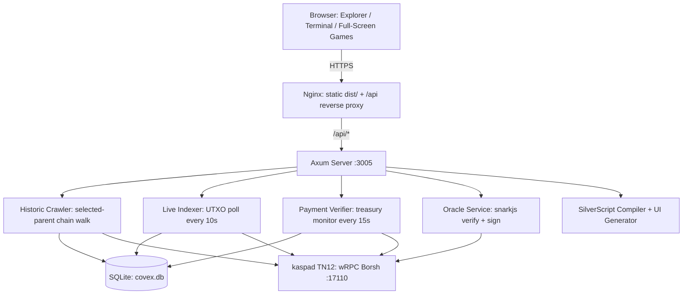
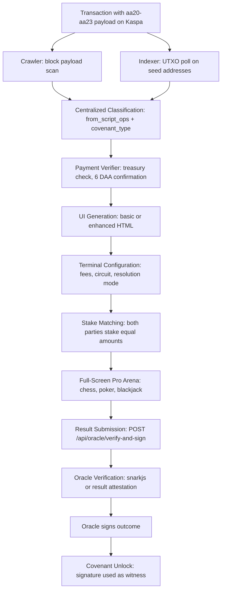
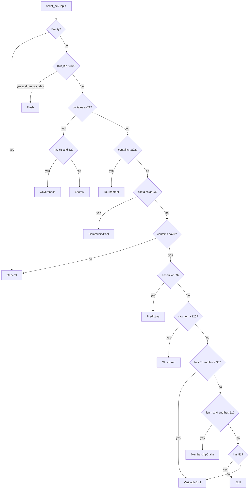
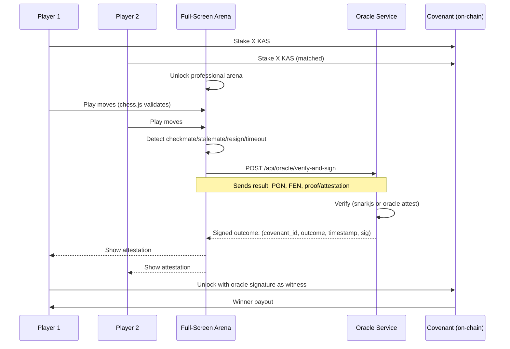

<div align="center">
  <br>

  <pre>
 ██████╗ ██████╗ ██╗   ██╗███████╗██╗  ██╗
██╔════╝██╔═══██╗██║   ██║██╔════╝╚██╗██╔╝
██║     ██║   ██║██║   ██║█████╗   ╚███╔╝ 
██║     ██║   ██║╚██╗ ██╔╝██╔══╝   ██╔██╗ 
╚██████╗╚██████╔╝ ╚████╔╝ ███████╗██╔╝ ██╗
 ╚═════╝ ╚═════╝   ╚═══╝  ╚══════╝╚═╝  ╚═╝
  </pre>

  <h3 style="margin-top: -10px;">The Platform for Verifiable Interactive Covenants on Kaspa</h3>

  <br>

  <a href="https://hightable.pro"></a>
  <a href="https://hightable.pro"></a>
  <a href="https://github.com/THTProtocol/Covex27/blob/master/LICENSE"></a>
  <a href="https://github.com/THTProtocol/Covenant-Studio"></a>

  <br><br>

  **Live:** [hightable.pro](https://hightable.pro) -- Hundreds of real covenants indexed and interactive.

</div>

---

## 1. What Covex Is

Covex is a non-custodial platform that discovers real SilverScript covenants on the Kaspa BlockDAG, classifies and indexes them, attaches rich interactive frontends, and provides cryptographic or oracle-attested resolution. It is a single-page application served via nginx on a Hetzner VPS, backed by a Rust binary that crawls the selected-parent chain, polls UTXOs, verifies tier payments, and runs an oracle service for proof verification and outcome signing. All covenant data lives on-chain. Covex is the indexing, classification, UI generation, Terminal, and resolution layer.

---

## 2. Core Capabilities

- **Free deployment**: Anyone can deploy a covenant. The platform indexes and displays it with basic auto-generated UI at no cost.
- **Paid tiers** -- **BUILDER** 100 KAS, **PRO** 500 KAS, **MAX** 1000 KAS -- unlock enhanced visibility, full disclosure, custom UI, Terminal access, and pro game experiences.
- **Covex Terminal**: A powerful configuration and game arena interface for paid covenants. Set fees, resolution modes, ZK circuits, verifier keys, and paste custom UI code from Covenant Studio.
- **Pro full-screen games**: After two parties stake equal amounts, the professional full-screen arena unlocks. Chess is the primary example: chess.com-smooth large board, real clocks, move list, FIDE rules enforced by chess.js, resign and draw offers.
- **ZK resolution**: Groth16 proof verification via snarkjs for Merkle Membership, production ready, and Range Proofs, wired with ceremony in progress. Oracle attestation for game results.
- **Oracle service**: Accepts proofs or game results via `POST /api/oracle/verify-and-sign`, runs snarkjs verification in a child process, returns a signed outcome usable as a covenant witness.
- **Covenant Studio integration**: The visual editor at [github.com/THTProtocol/Covenant-Studio](https://github.com/THTProtocol/Covenant-Studio) generates custom UI code pasteable directly into the Terminal.
- **SilverScript compiler pipeline**: Covex DSL text generated by the Terminal is parsed, translated to SilverScript, and compiled to Kaspa Script bytecode via silverc.
- **Multi-wallet support**: Detects KasWare, Kastle, Kasperia, OKX, KaspaCom, Kasanova, Kaspium, Tangem, plus local dev mode via WASM.

---

## 3. Architecture Overview



The Rust binary spawns four long-running background tasks at startup:

1. **Historic Crawler** (`crawler.rs`): Walks the selected-parent chain backward from the virtual tip, fetches full blocks, scans `tx.payload` for `aa20`-`aa23` opcodes, classifies each covenant via the centralized `covenant_types.rs` module, and inserts records into the `covenants` table with auto-generated UI.

2. **Live Indexer** (`indexer.rs`): Polls `get_utxos_by_addresses` on configured seed addresses every 10 seconds. Filters out standard wallet outputs via `is_standard_output` and enforces `looks_like_covenant`. Classifies and inserts new covenant UTXOs with the same centralized logic as the crawler.

3. **Payment Verifier** (`payment_verifier.rs`): Polls the treasury address UTXOs every 15 seconds. On a 6 DAA confirmation threshold, upgrades the covenant's `verified_tier` and sets `custom_ui_enabled`. Assigns visibility priority: MAX=100, PRO=50, BUILDER=10.

4. **Oracle Service** (`oracle.rs`): Runs snarkjs verification in a `tokio::task::spawn_blocking` for Merkle Membership and Range Proof circuits. Signs outcomes with `SHA256(oracle_key || message)` and supports multi-oracle federation with threshold-based weighted voting.

---

## 4. Data Flow: From On-Chain Covenant to Resolution



### Step-by-step

**On-chain birth**: A user creates a transaction containing a SilverScript payload with `aa20`-`aa23` opcodes. Output[1] may route a tier payment to the treasury address.

**Detection**: The crawler walks the selected-parent chain scanning block transactions. The indexer polls seed address UTXOs every 10 seconds. Both call the centralized `CovenantCategory::from_script_ops` and `CovenantCategory::covenant_type` functions for classification.

**Classification**: Raw `script_hex` is analyzed for opcode presence, payload length, and specific byte patterns. The result is a broad **category** and a granular **covenant_type**. These drive the Explorer organization and suggest appropriate ZK circuits and templates in the Terminal.

**Tier and visibility**: The Payment Verifier watches the treasury. When it detects a transaction with 6 DAA confirmations whose output[1] amount matches a tier threshold, it upgrades the covenant record and assigns visibility priority.

**UI generation**: A basic interactive UI is auto-generated for every detected covenant. Paid tiers get enhanced UIs. The Terminal supports further customization: fee percentages, reusable flag, top-up allowance, resolution mode, ZK circuit selection, and custom UI code pasting.

**Pro game experience**: In the Terminal, the covenant creator configures a game type. Two players stake equal amounts. Once stakes match, the full-screen professional arena becomes available. Chess uses chess.js for complete FIDE enforcement and react-chessboard for a chess.com-smooth board with real clocks and a move list.

**Resolution**: The game result, with client-side rule enforcement, is submitted to `POST /api/oracle/verify-and-sign`. For ZK circuits, a Groth16 proof is verified via snarkjs. The oracle signs the outcome. The signature and outcome can be used as witness data when spending the covenant UTXO.

---

## 5. Covenant Classification System

Both crawler and indexer share the same centralized classification logic in `backend/src/covenant_types.rs`. The module exports two functions:

- **`from_script_ops`**: Returns a broad `CovenantCategory` enum variant. Used for the user-facing category shown on Explorer cards.
- **`covenant_type`**: Returns a more granular string. Used internally for indexing and API responses.

### Classification Enum

```rust
pub enum CovenantCategory {
    VerifiableSkill,   // Skill contests with ZK/oracle resolution
    Skill,             // Classic single-outcome skill contests
    MembershipClaim,   // Merkle, range proofs, eligibility claims
    Predictive,        // Binary/ternary outcome markets
    Structured,        // Long complex scripts with timelock/DAA logic
    Escrow,            // Time-based custody, 2-party
    Governance,        // Multi-outcome voting, DAO style
    Tournament,        // Multi-sig threshold tournaments
    CommunityPool,     // Shared funds, lotteries, pools
    Flash,             // Compact one-shot logic under 80 bytes
    General,           // Fallback
}
```

### Classification Decision Tree



### Full Category Table

| Category | Detection Rules | Typical Use Case |
|---|---|---|
| **Verifiable Games (ZK/Oracle)** | `aa20` + `51` + `len > 90` | Chess, poker, skill games with real resolution |
| **Skill Contests** | `aa20` + `51`, single outcome, shorter payload | Classic one-winner contests |
| **Membership & Claims** | `aa20` + `len < 140` + `51` present or `len > 60` | Merkle membership, range proofs, eligibility, airdrops |
| **Predictive Markets** | `aa20` containing `52` or `53` | Binary/ternary outcome markets |
| **Structured Settlement** | `aa20` + `len > 120` | Escrow with time or block conditions |
| **Escrow & Custody** | `aa21` without multi-outcome markers | 2-party or multi-party time-locked |
| **Governance** | `aa21` + `51` + `52` | DAO votes, multi-party decisions |
| **Tournaments** | `aa22` | Multi-sig threshold tournaments |
| **Community Pools** | `aa23` | Shared funds, lotteries, pools |
| **Flash Covenants** | Any `aa2x` + `len < 80` | Simple one-shot logic |
| **General** | Fallback | Everything else |

### Granular `covenant_type` Values

| covenant_type | Detection | Used For |
|---|---|---|
| `p2sh-covenant` | `script_hex` starts with `aa20` and ends with `87` | Standard pay-to-script-hash covenants |
| `extended-covenant` | Contains `aa21` without 51+52 | Extended time-based covenants |
| `multi-sig-covenant` | Contains `aa22` | Multi-signature covenants |
| `community-pool-covenant` | Contains `aa23` | Pool/lottery covenants |
| `complex-interactive-covenant` | Contains `aa20` + `len > 140` | Rich games, ZK logic |
| `verifiable-skill-covenant` | Contains `aa20` + `51` | Skill contests with ZK/oracle resolution |
| `skill-covenant` | Contains `aa20`, shorter payload | Simple skill covenants |
| `governance-covenant` | Contains `aa21` + `51` + `52` | Voting, DAO |
| `generic-covenant` | Fallback | Unclassified |

### Custom Override

BUILDER+ users can set a free-form `custom_category` via the Terminal. This replaces the auto-detected label on the Explorer and detail page. It is stored in both `covenants.category` and the `generated_uis.ui_config` JSON. Classification happens before any UI generation or tier payment: it powers the Explorer's smart organization and helps the Terminal suggest appropriate circuits and templates.

---

## 6. Pro Game Experiences and Resolution

The primary pro game is **chess**. After both players stake equal amounts into the covenant pot, the full-screen professional arena becomes available:

- **React-chessboard** renders a large smooth board at up to 680px with classic green/cream squares.
- **chess.js** enforces the complete FIDE ruleset: castling, en passant, checkmate, stalemate, 50-move rule, threefold repetition, insufficient material.
- **Real clocks**: Two 10-minute clocks decrement at 100ms intervals. Timeout awards the win to the opponent.
- **Move list**: Full PGN display with move navigation.
- **Resign and draw offer** buttons.
- **Result submission**: The SUBMIT RESULT TO ORACLE button sends the validated result and PGN to `POST /api/oracle/verify-and-sign`. The oracle signs the outcome, returning a signature that can be used as an unlock witness.

Additional full-screen game stubs exist for poker and blackjack via **FullScreenPoker.jsx** and **FullScreenBlackjack.jsx**.

### ZK Circuit Status

| Circuit | Status | What It Proves |
|---|---|---|
| **Merkle Membership** | Production ready | Proves a key/value pair exists in a committed Merkle tree. Full end-to-end: browser generates proof, oracle verifies via snarkjs, signs outcome. |
| **Range Proof** | Circuit complete, ceremony pending | Proves a committed value lies within [min, max] without revealing the value. Verifier wired to snarkjs; requires final zkey + vkey for real proofs. |
| **Chess (FIDE)** | Design target | Proves complete legal play on 8x8 board according to FIDE rules. Currently resolved via oracle attestation of chess.js-validated results. |

### Game Resolution Sequence



---

## 7. Technology Stack

### Kaspa Layer
| Component | Detail |
|---|---|
| Node | kaspad Toccata Testnet-12 with `--utxoindex` |
| Covenant primitive | SilverScript opcodes `aa20`-`aa23` inside `tx.payload` |
| wRPC | Borsh protocol, port 17110 |
| Address prefix | `kaspatest:` for testnet |

### Backend (Rust)
| Component | Detail |
|---|---|
| Runtime | Tokio async |
| HTTP | Axum 0.7 |
| Database | SQLite via rusqlite 0.31 (bundled) |
| Kaspa SDK | kaspa-wrpc-client 0.15.0, kaspa-rpc-core 0.15.0, kaspa-consensus-core 0.15.0 |
| Hashing | sha2 0.10, blake2b_simd 1 |
| ZK verification | snarkjs via Node.js child process |
| Transaction construction | Native secp256k1 in signer.rs, broadcast.rs |

### Frontend
| Component | Detail |
|---|---|
| Framework | Vite 8 + React 19 |
| Styling | Tailwind CSS v4, shadcn/ui primitives, custom cyberpunk components |
| Games | chess.js 1.4.0, react-chessboard 5.10.0 |
| Wallet | @kasflow/wallet-connector, @onekeyfe/kaspa-wasm, 8-provider detection |
| 3D | @react-three/fiber, @react-three/drei, three.js 0.175 |

### ZK Layer
| Component | Detail |
|---|---|
| Circuit language | circom |
| Prover/verifier | snarkjs (Node.js) |
| Circuits | `merkle_generic`, `bulletproofs_v1`, `chess_v1`, `age_verify_v1`, `risc0_generic` |
| Oracle signing | `SHA256(oracle_privkey || "covex-oracle:<id>:<outcome>:<ts>")` |
| Multi-oracle | Weighted threshold federation with SHA256-based signature verification |

### Infrastructure
| Component | Detail |
|---|---|
| Server | Hetzner VPS at 178.105.76.81 |
| Reverse proxy | nginx: static from dist/, /api/ proxy to 127.0.0.1:3005 |
| Deploy | `DEPLOY_TO_HIGHTABLE.sh`: 6-step push-pull-build-copy-rebuild-restart |
| DB path | Absolute path resolved from binary location to prevent zombie inode bugs |

---

## 8. Tiers and Access Model

| Tier | Fee | Visibility Priority | What It Unlocks |
|---|---|---|---|
| **FREE** | 0 KAS | 0 | Browse all indexed covenants. Basic auto-generated interactive UI. Limited disclosure: tx_id, script_hash, amount. |
| **BUILDER** | 100 KAS | 10 | Full disclosure. Verified badge. Enhanced auto-generated UI. Form builder with wallet-integrated buttons. Standard registry listing. **Terminal access**: configure fees, resolution mode, ZK circuits. |
| **PRO** | 500 KAS | 50 | Everything in BUILDER. Featured listing placement. Higher search ranking. Priority indexing queue. Custom UI advanced tools. Custom covenant images. Pro full-screen game arenas. |
| **MAX** | 1000 KAS | 100 | Everything in PRO. Maximum visibility, top placement. Custom domain embedding. Dedicated indexing resources. Premium branding options. Full UI design suite. Custom color palette. |

Free deployment is always available. Paid tiers unlock visibility, Terminal features, and pro game experiences. Tier labels are shown to the covenant creator when their wallet is connected; regular Explorer visitors never see tier badges on other users' covenants.

---

## 9. Key Components and Code Locations

### Backend (Rust)

| File | Purpose |
|---|---|
| **`backend/src/covenant_types.rs`** | Centralized classification: `CovenantCategory` enum, `from_script_ops()`, `covenant_type()`, tier definitions, `UiGenerationConfig`, `CovenantRecord`. Used by both crawler and indexer. |
| **`backend/src/crawler.rs`** | Historic BlockDAG crawler. Walks selected-parent chain, scans `tx.payload`, calls `classify()` and `categorize()`, inserts records, spawns UI generation. Determines tier from Output[1] treasury payment. |
| **`backend/src/indexer.rs`** | Live UTXO poller. Filters out standard wallet outputs with `is_standard_output()` and `looks_like_covenant()`. Classifies via the same centralized logic. |
| **`backend/src/payment_verifier.rs`** | Monitors treasury UTXOs every 15s. On 6 DAA confirmation, upgrades `verified_tier`, enables custom UI, sets visibility priority. |
| **`backend/src/oracle.rs`** | `POST /api/oracle/verify-and-sign`. Runs snarkjs in `spawn_blocking`. Supports `merkle_membership`, `range_proof`, `chess_v1`. Signs outcomes with SHA256-based signature. Multi-oracle federation with weighted thresholds. |
| **`backend/src/compiler.rs`** | Covex DSL to SilverScript compiler pipeline. Parses DSL text, emits SilverScript, invokes silverc for bytecode. |
| **`backend/src/signer.rs`** | Transaction construction and secp256k1 signing. |
| **`backend/src/broadcast.rs`** | Transaction broadcast to the Kaspa network. |
| **`backend/src/ui_generator.rs`** | Auto-generates basic and enhanced HTML UIs for covenants. |
| **`backend/src/db.rs`** | SQLite schema management and query functions. 6 core tables with indexes. |
| **`backend/src/main.rs`** | Entry point. Spawns all 4 background tasks, mounts all routes, configures CORS. |

### Frontend (React)

| File | Purpose |
|---|---|
| **`frontend/src/components/CovexTerminal.jsx`** | The Terminal: configuration panel, pro game arenas, SilverScript generation, oracle submission. Contains ZK circuit definitions, full-screen chess arena, stake matching logic, and result submission flow. |
| **`frontend/src/components/FullScreenPoker.jsx`** | Professional full-screen poker table. |
| **`frontend/src/components/FullScreenBlackjack.jsx`** | Professional full-screen blackjack table. |
| **`frontend/src/pages/Explorer.jsx`** | Main covenant explorer with tier-sorted listing. |
| **`frontend/src/pages/Pricing.jsx`** | Single-view tier pricing page with wallet-connected KAS payment. |
| **`frontend/src/pages/PaidBuilder.jsx`** | Post-payment dashboard: covenant list, Terminal access, Create New Covenant flow. |
| **`frontend/src/components/WalletContext.jsx`** | Multi-wallet detection and connection management. |
| **`frontend/src/lib/covenant-config/`** | Covenant Studio integration: `useCovenantConfig`, `ResolutionSimulator`. |
| **`frontend/src/lib/multi-oracle/MultiOracleConfigurator.jsx`** | Multi-oracle federation configuration. |

---

## 10. Database and API

### Database Tables

| Table | Purpose |
|---|---|
| `covenants` | Source of truth for the Explorer. tx_id, address, amount, script_hex, covenant_type, category, creator_addr, verified_tier, full_logic_summary, block_daa_score, timestamp. |
| `generated_uis` | Auto-generated and Terminal-saved UI HTML and config JSON. Contains `ui_config` with fee_percent, resolution_mode, zk_circuit, verifier_key, custom UI code. |
| `visibilities` | Per-covenant visibility settings: tier, featured flag, priority score, custom category override. |
| `payments` | Transaction records for tier purchases: from_address, to_address, amount, confirmations, status. |
| `accounts` | User account tier state: address, current tier, payment_tx_id, paid_at, expires_at. |
| `crawler_state` | Crawler progress tracking: last scanned DAA score. |

### API Endpoints

| Endpoint | Method | Purpose |
|---|---|---|
| `/` | GET | Server info: app name, network, oracle mode |
| `/health` | GET | Health check returns "OK" |
| `/status` | GET | Total/active/verified covenant counts |
| `/covenants` | GET | Tier-sorted covenant list. Query param `?creator=` filters by creator address |
| `/tiers` | GET | Tier definitions with fees and features |
| `/paid-status` | GET | Query param `?address=` returns highest paid tier for that address |
| `/terminal-config/:covenant_id` | GET | Retrieves Terminal configuration and UI HTML |
| `/terminal-config/:covenant_id` | POST | Saves Terminal configuration. Supports Schnorr signature verification for ownership |
| `/terminal-config-challenge/:covenant_id` | GET | Returns a nonce for signature-based ownership challenge |
| `/oracle/verify-and-sign` | POST | Submits ZK proof or game result, returns signed outcome |
| `/sign-and-broadcast` | POST | Constructs and broadcasts a covenant transaction |
| `/analytics` | GET | Platform analytics |
| `/marketplace/templates` | GET | Published covenant templates |
| `/marketplace/publish` | POST | Publish a covenant template |

---

## 11. Running and Deployment

### Local Development (TN12 Testnet)

```bash
# Prerequisites: kaspad running on TN12 with --utxoindex, Node.js, Rust toolchain

# Frontend
cd frontend
npm install
npm run dev          # Vite dev server at localhost:5173

# Backend
cd backend
cargo run --release  # Binds to 0.0.0.0:3005

# Required env vars (or .env file):
#   KASPA_WRPC_URL=ws://127.0.0.1:17110
#   COVENANT_TREASURY_ADDRESS=kaspatest:qpyfz03k6quxwf2jglwkhczvt758d8xrq99gl37p6h3vsqur27ltjhn68354m
#   COVENANT_SEED_ADDRESSES=kaspatest:qpx...
#   DB_PATH=../covex.db
```

### Production Deploy

The deploy script requires the server password exported as `PASSWORD`:

```bash
export PASSWORD="your_rotated_password"
./DEPLOY_TO_HIGHTABLE.sh
```

The script performs 6 steps: pushes to GitHub, pulls on Hetzner, builds frontend with Vite, copies dist/ to nginx root with stale bundle cleanup, builds backend with cargo --release, restarts the backend binary, and verifies via health/status endpoints. The production binary runs from `/mnt/HC_Volume_105579109/Covex27/backend/target/release/covex27-backend`, logging to `/tmp/covex27.log`.

---

**Covex** -- Real covenants. Verifiable outcomes. Pro experiences. On the Kaspa BlockDAG.

Built by HIGH TABLE PROTOCOL.

Live: [hightable.pro](https://hightable.pro)  
Studio: [github.com/THTProtocol/Covenant-Studio](https://github.com/THTProtocol/Covenant-Studio) (see HERMES_COVENANT_STUDIO_MASTER_PROMPT.md there for autonomous best-templates rules + triple-sync)  
Repo: This repository

---

*This README describes the current production state. Classification logic, pro game UIs, and oracle flows are actively used on the live site.*
