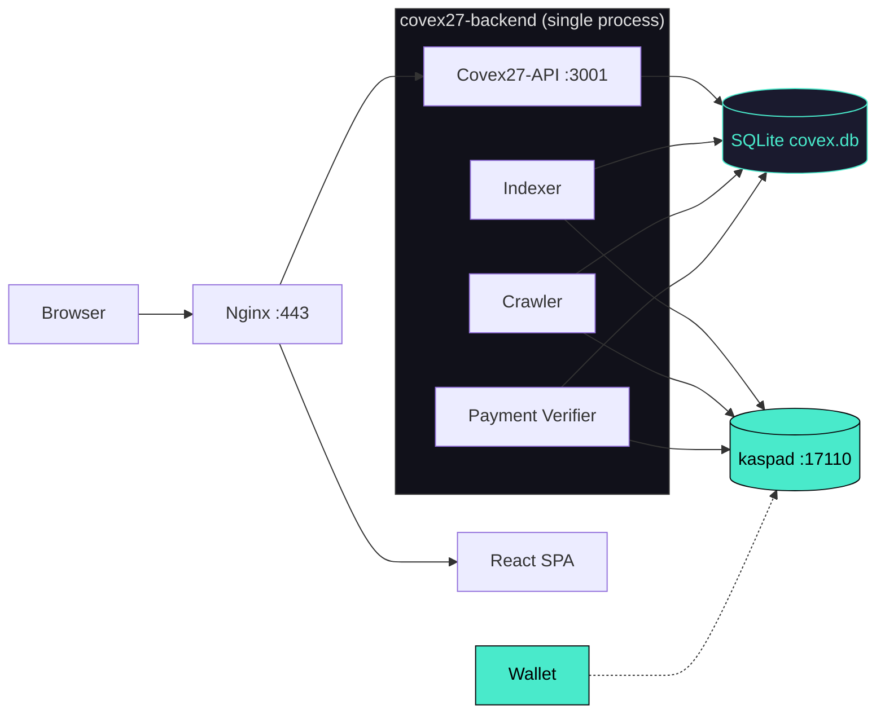
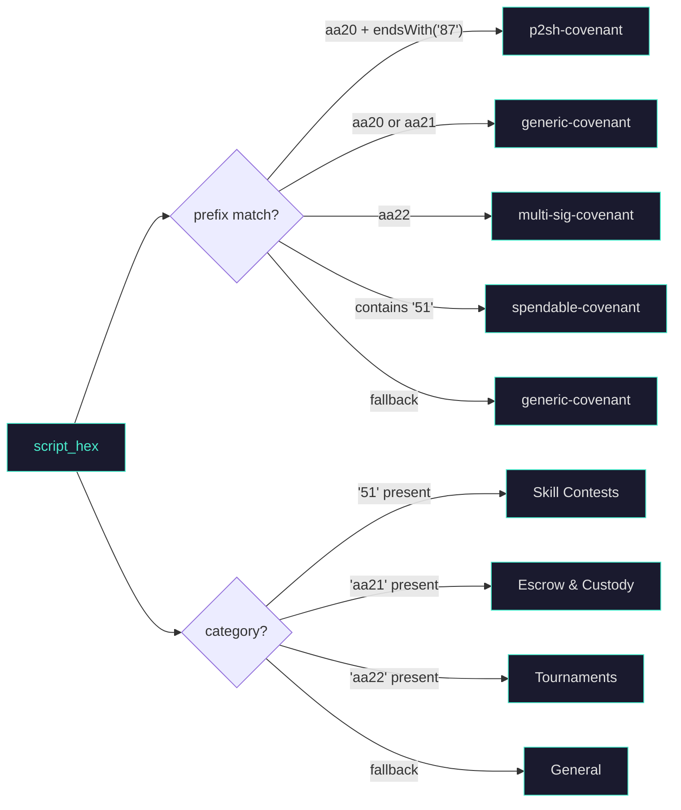

<div align="center">

<br>

```
 ▄▄▄▄▄▄▄▄▄▄▄  ▄▄▄▄▄▄▄▄▄▄▄  ▄               ▄  ▄▄▄▄▄▄▄▄▄▄▄  ▄       ▄
▐░░░░░░░░░░░▌▐░░░░░░░░░░░▌▐░▌             ▐░▌▐░░░░░░░░░░░▌▐░▌     ▐░▌
▐░█▀▀▀▀▀▀▀▀▀ ▐░█▀▀▀▀▀▀▀█░▌ ▐░▌           ▐░▌ ▐░█▀▀▀▀▀▀▀▀▀  ▐░▌   ▐░▌
▐░▌          ▐░▌       ▐░▌  ▐░▌         ▐░▌  ▐░▌            ▐░▌ ▐░▌
▐░▌          ▐░▌       ▐░▌   ▐░▌       ▐░▌   ▐░█▄▄▄▄▄▄▄▄▄    ▐░▐░▌
▐░▌          ▐░▌       ▐░▌    ▐░▌     ▐░▌    ▐░░░░░░░░░░░▌    ▐░▌
▐░▌          ▐░▌       ▐░▌     ▐░▌   ▐░▌     ▐░█▀▀▀▀▀▀▀▀▀    ▐░▌░▌
▐░▌          ▐░▌       ▐░▌      ▐░▌ ▐░▌      ▐░▌            ▐░▌ ▐░▌
▐░█▄▄▄▄▄▄▄▄▄ ▐░█▄▄▄▄▄▄▄█░▌       ▐░▐░▌       ▐░█▄▄▄▄▄▄▄▄▄  ▐░▌   ▐░▌
▐░░░░░░░░░░░▌▐░░░░░░░░░░░▌        ▐░▌        ▐░░░░░░░░░░░▌▐░▌     ▐░▌
 ▀▀▀▀▀▀▀▀▀▀▀  ▀▀▀▀▀▀▀▀▀▀▀          ▀          ▀▀▀▀▀▀▀▀▀▀▀  ▀       ▀
```
### The Stateful Kaspa Covenant Indexer and SaaS Platform

[](https://kaspa.org)
[](https://rust-lang.org)
[](https://github.com/tokio-rs/axum)
[](LICENSE)

<br>

> **DAG is the truth. Covex is the window.**
>
> Index, discover, customize, and deploy UTXO smart contracts on the Kaspa BlockDAG — with no custody, no token approvals, and no off-chain servers.

<br>

---
**Built by HIGH TABLE PROTOCOL**
<br>

</div>

---

## Overview

Covex is a high-performance, non-custodial indexer for Kaspa native UTXO smart contracts (Covenants). It connects to a local kaspad node via wRPC, discovers covenant deployments across the Testnet-10 BlockDAG, and automatically generates interactive HTML UIs for every detected contract. The entire system runs as a single Rust binary on a Hetzner VPS behind Nginx.

The backend spawns three concurrent background tasks on startup: a **historic crawler** that walks the selected-parent chain backward from the virtual tip to discover past covenants, a **live indexer** that polls seed addresses every 10 seconds for new UTXOs, and a **payment verifier** that monitors the treasury address for on-chain tier purchases. Every covenant record is stored in a local SQLite database with full script disclosure, tier metadata, and generated UI pages.

A separate React + Vite frontend provides the browser-facing covenant explorer, pricing page, dashboard, and wallet integration. The frontend and backend are independent — the backend is a pure JSON API, and the frontend is a static SPA served by Nginx alongside proxied `/api/*` requests.

### Network Support

| Network | Status | wRPC Port | Address Prefix |
|:---|:---|:---|:---|
| Testnet-10 | Active | `:17110` | `kaspatest:` |
| Mainnet | Planned | — | `kaspa:` |

---

## Architecture

Covex runs inside a single Rust process. The Axum HTTP server binds to `127.0.0.1:3001` and exposes five JSON endpoints. Three `tokio::spawn` background loops share a single `KaspaRpcClient` connection to the local kaspad node. All state lives in a SQLite database at the project root, protected by a `Mutex<Connection>` handed to every subsystem via `Arc`. Generated UIs are stored as HTML strings in the `generated_uis` table and served directly — no SSR, no hydration, no build step.



### Subsystem Detail

**Historic Crawler** (`crawler.rs`, 225 lines) — Polls `get_block_dag_info()` every tick to find the virtual tip DAA score. Walks the selected-parent chain backward up to `MAX_WALK_DISTANCE` blocks per tick (default 500), calling `get_block()` for each parent hash. Every transaction output is checked against `looks_like_covenant()`, which matches `aa20`/`aa21`/`aa22`/`aa23` script prefixes. Inserted covenants use a `UNIQUE` constraint so duplicate blocks are silently skipped. The checkpoint (`crawler_state.last_scanned_daa`) is persisted after every batch — the crawler resumes from that DAA on restart.

**Live Indexer** (`indexer.rs`, 170 lines) — Loops on a 10-second interval. Calls `get_utxos_by_addresses()` for each seed address configured in `COVENANT_SEED_ADDRESSES`. Every returned UTXO is classified by script opcodes (`classify_covenant`) and category (`CovenantCategory::from_script_ops`), then inserted into the `covenants` table. After insertion, a `tokio::spawn` fires off basic UI generation — the indexer loop continues immediately, never blocked on HTML rendering.

**Payment Verifier** (`payment_verifier.rs`, 151 lines) — Loops on a 15-second interval. Queries UTXOs for the treasury address. Each UTXO's `amount_sompi` is checked against `tier_from_amount()` thresholds (100/500/1,000 KAS). The `from_address` field is matched to a creator address in the covenants table. Once the DAA score delta reaches 6 confirmations, `upgrade_covenant_record()` sets `verified_tier`, `verified_payment_tx`, `full_logic_summary`, `receiving_addresses`, and `custom_ui_enabled`. An enhanced UI is then regenerated and saved to `generated_uis`, and a visibility record is created with priority based on tier (MAX=100, PRO=50, CREATOR=10).

**UI Generator** (`ui_generator.rs`, 187 lines) — Produces self-contained HTML pages with embedded CSS and JavaScript. Two modes: `generate_basic_ui()` (red danger banner, limited fields: tx_id, script_hash, amount, type) for FREE/EXPLORER tiers, and `generate_enhanced_ui()` (green verified banner, full disclosure including creator, receiving addresses, logic summary) for CREATOR/PRO/MAX. Both modes include wallet detection (KasWare, Kaspium, OneKey), amount and recipient form fields, and a `kaspa_sendTransaction` integration. The cyberpunk-styled CSS uses glass-panel backdrop-blur, neon green borders (`#49EACB`), and dark radial gradient backgrounds.

---

## Covenant Classification

Covex classifies every detected UTXO by analyzing its script public key hex. The classification pipeline runs in `crawler.rs` and `indexer.rs`:



The `CovenantCategory` enum defines nine categories. Four are currently detectable from script opcodes; the remaining five are reserved for future SilverScript features:

| Category | Opcode Pattern | Status |
|:---|:---|:---|
| Skill Contests | `51` in script body | Active |
| Escrow & Custody | `aa21` prefix | Active |
| Tournaments | `aa22` prefix | Active |
| General | No opcode match | Active (fallback) |
| Predictive Markets | — | Planned |
| Community Pools | — | Planned |
| Flash Covenants | — | Planned |
| Structured Settlement | — | Planned |
| Governance | — | Planned |

---

## Technology Stack

| Layer | Technology | Purpose |
|:---|:---|:---|
| Node | kaspad v0.15 | wRPC (Borsh encoding) — Testnet-10 full node with `--utxoindex` |
| Backend | Rust 1.80 · Axum 0.7 · Tokio 1 | Async HTTP server with three concurrent background tasks |
| wRPC Client | kaspa-wrpc-client 0.15 | Borsh-encoded WebSocket RPC to kaspad |
| Database | SQLite via rusqlite 0.31 | 6 tables, 15 indexes, `Mutex<Connection>` shared via `Arc` |
| Hashing | SHA-256 (sha2 0.10) | Script hash computation for covenant deduplication |
| Frontend | React 18 + Vite 5 | Static SPA — cyberpunk covenant browser and dashboard |
| Reverse Proxy | Nginx | SSL termination (certbot), `/api/*` proxy to `:3001`, static asset serving |
| Deployment | systemd + bash | Two service units (kaspad + covex27-api), unified deploy script |

---

## Database Schema

SQLite at `covex.db`. Auto-created on first startup by `db::open_db()`.

```
covenants              payments              accounts
├─ tx_id (PK)          ├─ id (PK, AUTO)      ├─ address (PK)
├─ address             ├─ tx_id (UNIQUE)     ├─ tier
├─ amount_kaspa        ├─ from_address       ├─ payment_tx_id
├─ script_hash         ├─ to_address         ├─ paid_at
├─ script_hex          ├─ amount_sompi       ├─ expires_at
├─ covenant_type       ├─ tier               ├─ is_active
├─ category            ├─ confirmations      └─ created_at
├─ creator_addr        ├─ status
├─ description         ├─ covenant_id (FK)
├─ verified_tier       └─ timestamp          crawler_state
├─ verified_payment_tx                       ├─ id (PK, CHECK=1)
├─ verified_at          generated_uis        └─ last_scanned_daa
├─ custom_ui_enabled    ├─ id (PK, AUTO)
├─ full_logic_summary   ├─ covenant_id       visibilities
├─ receiving_addresses  ├─ owner_address     ├─ covenant_id (PK)
├─ is_active            ├─ tier              ├─ tier
├─ block_daa_score      ├─ ui_html           ├─ featured
└─ timestamp            ├─ ui_config         ├─ priority
                        ├─ slug (UNIQUE)     └─ custom_domain
                        ├─ is_published
                        ├─ featured
                        └─ ui_generated_at
```

Crawl state is checkpointed to `crawler_state` (single row, id=1). The crawler reads `last_scanned_daa` on startup and updates it after every batch — no full rescan on restart.

---

## API Reference

Base URL: `https://hightable.pro/api` — Nginx proxies to `127.0.0.1:3001`.

| Method | Path | Response |
|:---|:---|:---|
| `GET` | `/` | `{"status":"ok","app":"Covex v1.0.0","network":"testnet-10"}` |
| `GET` | `/health` | `OK` (plain text, used by uptime monitors) |
| `GET` | `/covenants` | Array of all active covenant records with `tx_id`, `address`, `amount_kaspa`, `script_hash`, `script_hex`, `covenant_type`, `category`, `creator_addr`, `verified_tier`, `full_logic_summary`, `receiving_addresses`, `block_daa_score`, `timestamp` |
| `GET` | `/status` | `{"total_covenants":N,"active_covenants":N,"verified_covenants":N}` |
| `GET` | `/tiers` | Array of four tier definitions with `name`, `label`, `price_kas`, `price_sompi`, `features[]`, `color`, `featured` |

---

## SaaS Pricing Tiers

Covenant creators purchase verification and visibility by sending KAS to the Covex treasury address. The payment verifier detects the deposit, waits for 6 BlockDAG confirmations, and upgrades the account and covenant record.

| Tier | Price (KAS) | Price (sompi) | Color | Featured | Key Capabilities |
|:---|:---|:---|:---|:---|:---|
| `EXPLORER` | `0` | `0` | gray | No | Browse all covenants, basic UI with limited disclosure |
| `CREATOR` | `100` | `10,000,000,00` | blue | No | Full disclosure, verified badge, form builder, wallet integration |
| `PRO` | `500` | `50,000,000,00` | gold | Yes | Featured listing, priority indexing, custom images, higher search ranking |
| `MAX` | `1,000` | `100,000,000,00` | purple | — | Top placement, custom domain, premium branding, full UI design suite |

Tier detection threshold: `tier_from_amount()` checks `amount_sompi >= 100_000_000_00` for MAX, `>= 50_000_000_00` for PRO, `>= 10_000_000_00` for CREATOR.

Treasury address: `kaspatest:qpyfz03k6quxwf2jglwkhczvt758d8xrq99gl37p6h3vsqur27ltjhn68354m`

---

## Deployment

### Prerequisites

- Rust 1.80+ stable toolchain
- Node.js 20+ and npm
- kaspad synced to Testnet-10 with `--testnet --utxoindex --rpclisten-borsh=0.0.0.0:17110`
- Nginx with SSL (certbot)

### Quick Deploy (Hetzner VPS)

```bash
sudo bash deploy/deploy-hetzner.sh
```

This installs all system dependencies, builds both the Rust backend (release) and React frontend, installs Nginx config for `hightable.pro`, and creates the systemd service unit.

### Unified Deploy (production update)

```bash
sudo bash deploy/deploy_all.sh
```

Hard-resets to `origin/master`, rebuilds backend and frontend, reconfigures kaspad and covex27-api systemd services, updates Nginx, and runs a health report. Fully idempotent.

### Environment

```bash
KASPA_NETWORK=testnet-10
KASPA_WRPC_URL=ws://127.0.0.1:17110
BIND_ADDR=127.0.0.1:3001
DB_PATH=../covex.db
COVENANT_TREASURY_ADDRESS=kaspatest:qpyfz03k6quxwf2jglwkhczvt758d8xrq99gl37p6h3vsqur27ltjhn68354m
COVENANT_SEED_ADDRESSES=
CRAWL_START_DAA=1
RUST_LOG=covex27_backend=info,kaspa_wrpc=warn
```

### Manual Build

```bash
cd backend
cargo build --release
./target/release/covex27-backend
```

On startup the binary opens the SQLite database, connects to kaspad via wRPC, spawns three background tasks (indexer, crawler, payment verifier), then binds the HTTP server. The process is managed by systemd (`covex27-api.service`) on the production host:

```ini
[Unit]
Description=Covex27 Backend
After=network.target kaspad.service
Wants=kaspad.service

[Service]
Type=simple
User=root
WorkingDirectory=/home/kasparov/Covex27
ExecStart=/home/kasparov/Covex27/backend/target/release/covex27-backend
Restart=always
RestartSec=5
```

---

## Repository

```
Covex27/
├── backend/
│   ├── Cargo.toml                  # Rust dependencies (Axum, Tokio, kaspa-wrpc-client 0.15)
│   └── src/
│       ├── main.rs                 # Entry point, router, 5 JSON endpoints
│       ├── covenant_types.rs       # Enums, tiers, UI config structs, pricing logic
│       ├── crawler.rs              # Historic BlockDAG crawler (selected-parent chain walk)
│       ├── db.rs                   # SQLite schema, CRUD, crawler state, visibility
│       ├── indexer.rs              # Live UTXO poller + auto basic UI generation
│       ├── payment_verifier.rs     # Treasury monitor + tier upgrades + enhanced UI trigger
│       └── ui_generator.rs         # Basic & enhanced HTML UI rendering with wallet integration
├── frontend/
│   └── src/
│       ├── pages/
│       │   ├── Explorer.jsx        # Covenant discovery browser
│       │   ├── CreateCovenant.jsx  # Covenant deployment form with payment gate
│       │   ├── HostCovenant.jsx    # Covenant hosting interface
│       │   ├── CovenantInteractive.jsx  # Interactive covenant detail view
│       │   ├── Dashboard.jsx       # Creator dashboard
│       │   ├── Pricing.jsx         # Tier pricing page
│       │   └── Terms.jsx           # Terms of service
│       └── components/
│           ├── WalletContext.jsx    # Wallet state management (KasWare, Kaspium, OneKey)
│           ├── WalletButton.jsx    # Wallet connection UI
│           ├── WalletModal.jsx     # Wallet selection modal
│           ├── Hero.jsx            # Landing page hero section
│           └── DagBackground.jsx   # Animated BlockDAG background
├── deploy/
│   ├── .env.production             # Production environment template
│   ├── deploy-hetzner.sh           # Fresh Hetzner VPS deployment (deps, build, configure)
│   ├── deploy_all.sh               # Unified production update (reset, rebuild, restart)
│   ├── nginx-covex.conf            # Nginx site config (SPA + /api/* proxy)
│   └── covex-backend.service       # systemd unit for backend
├── scripts/
│   └── generate_covex_health_report.sh  # Production health diagnostic report
├── .env                            # Local environment variables
└── README.md
```

---

## License

MIT

---

**Covex** — Built by **HIGH TABLE PROTOCOL** for the Kaspa ecosystem.
