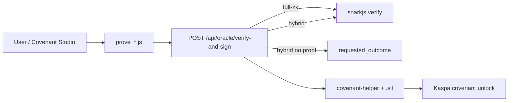

# Covex27 Master Completion Plan

**Goal:** Every ZK circuit works (full-ZK or honest hybrid), user-configurable time clocks, trivial covenant + oracle wiring.

**Workflow:** Execute phase-by-phase. Say **continue** to advance.

---

## Phase 1 — Stabilize & Unblock (IN PROGRESS)

| Task | Status |
|------|--------|
| Fix E2E hang (`auction_clearing` dummy proof) | ✅ Done |
| Real `turn_timer.circom` + dev zkey + proof | ✅ Done |
| Oracle registry: `basic_utxo_ownership`, `nullifier_set` → Hybrid | ✅ Done |
| Covenant schema v1: timelock + circuit enum + provingMode | ✅ Done |
| `covenant-helper.js` timelock CLI flags | ✅ Done |
| Chess `chess_v1.zkey` ceremony | ⏳ Running (~10.5h, ~1h left est.) |
| Commit + push + Hetzner triple-sync | Pending |
| Fix `outcome_defaults_and_clamp` test | Pending |

**Exit:** E2E 25+ pass / 0 fail / completes <3 min; chess zkey + vkey + demo proof; GitHub = Hetzner SHA.

---

## Phase 2 — Real Phase 1 Kaspa Circuits

- Implement real constraints in `basic_utxo_ownership`, `script_constraint`, `vrf_*`, `pot_split_math`
- Regenerate proofs via `prove_*.js` (not fixtures)
- Wire oracle Strict/Hybrid correctly for all Phase 1 IDs
- Expand `.sil` templates with parameterized witnesses

---

## Phase 3 — Flexible Clock UX

- Frontend UI: `max_delta_daa`, `lock_duration_daa`, `lock_threshold_daa`, dispute windows
- Unify `timelock_relative` label → `relative_timelock` circuit
- Chess clock params in terminal config → witness → public signals
- Covenant Studio reads `resolution.circuit.timelock` from schema

---

## Phase 4 — Chess + Games Full-ZK

- Complete chess zkey (pot17 MPC path)
- `finish_phase2.sh` → live E2E chess proof
- Flip `chess_v1` to `full-zk` in UI when artifacts exist
- Optional: separate hybrid/full circom (see `CHESS_PROVING_MODES.md`)

---

## Phase 5 — Production Ceremonies

- MPC for `range_proof`, `merkle_membership`, `chess_v1`, `privacy_mixer_v1`
- Replace `pot10` dev zkeys
- Per `docs/RANGE_PROOF_CEREMONY.md`

---

## Phase 6 — Oracle Hardening

- Real Schnorr/BLS (replace SHA256 stub)
- `GET /api/oracle/liveness` with `simulate` query param
- Multi-oracle threshold verification
- Mandatory `COVEX_ORACLE_KEY` on production

---

## Phase 7 — Covenant On-Chain

- Compile `.sil` via SilverScript
- `aa20–aa23` opcode binding
- End-to-end mainnet covenant deploy with oracle-signed unlock

---

## Phase 8 — RISC0 + Heavy Compute

- Build 2+ real guests (`chess_eval`, `poker_solver`)
- Receipt format in oracle verifier
- Graduation for `financial_formula`, `verifiable_poker_solver`

---

## Phase 9 — Production Polish

- SDK: prove → oracle → covenant-helper one-liner
- `circuit_registry.json` honesty pass (200+ inventory)
- Live verification on `hightable.pro`
- Privacy mixer deployment checklist

---

## Architecture (target state)

**Proving modes:** `full-zk` | `hybrid` | `oracle-attested` — selectable per covenant via schema `provingMode`.